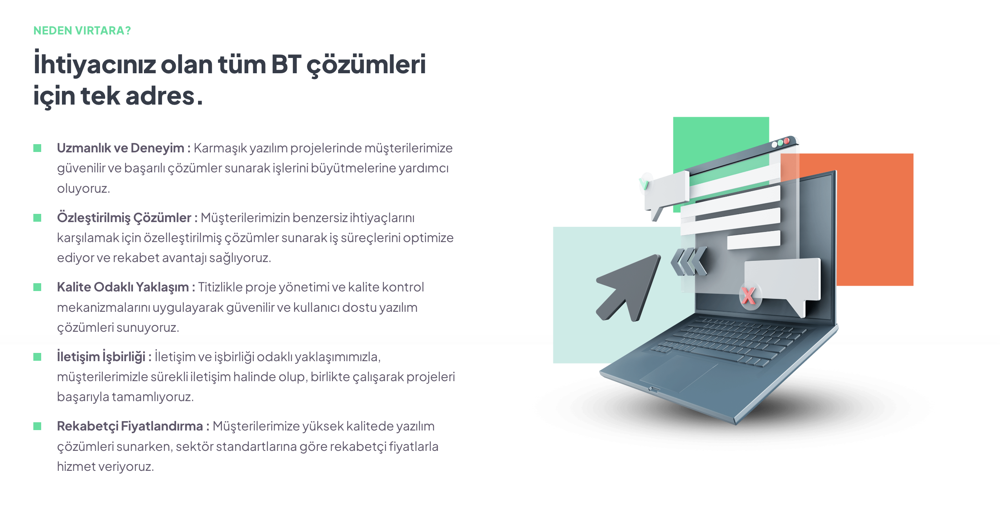

## Genel Bakış

> **Virtara Group Bilişim Teknolojileri olarak profesyonel ekibimizle, işletmelere üst düzey, ölçeklenebilir ve güvenli yeni nesil akıllı bulut çözümleri sunuyoruz.**
 
:::note
Virtara; son derece deneyimli, kendini işine adamış ve hevesli profesyonellerden oluşan bir ekipten oluşur. Ekibimizin her bir üyesi, her bir müşterimize kaliteli hizmeti ve etkili çözümleri sunmaya hep hazırdır.
:::

## İş Tanımı

_Yeni nesil teknolojileri kullandığımız işletmemize ait projelerimizde yer almak üzere İzmir, Ankara, Bolu veya Uzaktan tam zamanlı orta/ileri seviye Back-End geliştirici aramaktayız. Aşağıda yer alan nitelikleri sağladığınızı düşünüyorsanız başvurularınızı bekliyoruz._

:::caution Aranan Nitelikler
- Güncel teknolojileri takip etme ve kendini geliştirme konusunda tutkulu olan,
- Planlı ve disiplinli, sorumluluk alabilen,
- UI, UX, Back-End geliştiricileri ile iş birliği kurma konusunda problem yaşamayacak,
- İnsan ilişkileri kuvvetli ve ekip çalışmasına yatkın,
:::

## Teknik Gereksinimler

- **Versiyon kontrol sistemlerini kullanabilen,**
- **Performanslı ve tekrar kullanılabilir kodlar yazabilmeyi amaçlayan,**
- **PHP üzerinde minimum 4 yıllık deneyim ve Pure PHP kodlama yeteneğine sahip,**
- **PHP 7+ / MVC (Laravel 8+) / OOP / RESTful API / JSON teknolojilerini kullanabilen,**
- **SQL veri tabanlarında çalışacak normalizasyon ve trigger vb. konularında tecrübeye sahip,**
- **Uygulama koşturabilecek seviyede Unix & Bash bilgisine sahip,**
 
 

:::info Başvuru
Başvurular için bilgi@virtaragroup.com.tr e-posta adresine güncel Türkçe CV'nizi ön başvuru metniniz ile birlikte iletebilirsiniz.
:::

*__İlginiz için teşekkür eder, iyi çalışmalar dilerim.__*
