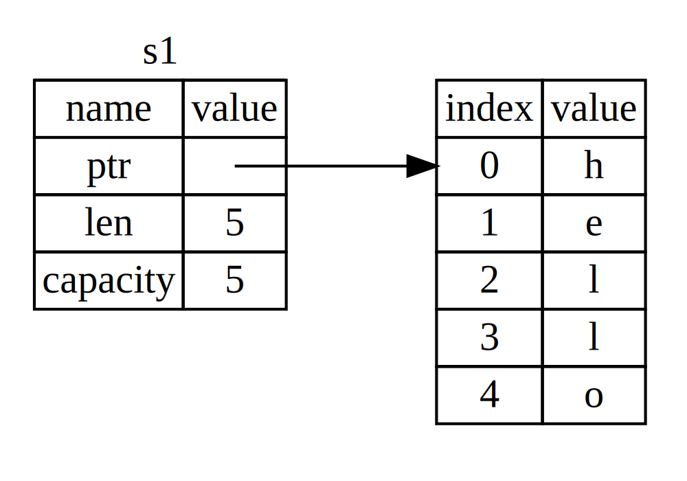

## Mülkiyet Nedir?

*Mülkiyet*, bir Rust programının belleği nasıl yönettiğine dair bir dizi kuruldur. Tüm programlar, çalışırken bir bilgisayarın belleğini nasıl kullandıklarını yönetmek zorundadır. Bazı diller, program çalışırken artık kullanılmayan belleği düzenli olarak arayan çöp toplama (garbage collection) sistemine sahiptir; diğer dillerde ise programcı, belleği açıkça ayırmak ve serbest bırakmak zorundadır. Rust, üçüncü bir yaklaşım kullanır: bellek, derleyicinin kontrol ettiği kurallar seti ile bir mülkiyet sistemi aracılığıyla yönetilir. Kurulardan herhangi biri ihlal edilirse, program derlenmez. Mülkiyet özelliklerinden hiçbiri, programınız çalışırken yavaşlamaz.

Mülkiyet, birçok programcı için yeni bir kavram olduğundan, alışmak biraz zaman alabilir. ***İyi haber şu ki*, Rust ile daha deneyimli hale geldikçe ve mülkiyet sisteminin kurallarını benimsedikçe, güvenli ve verimli kod doğal olarak geliştirmeyi o kadar daha kolay bulacaksınız. Devam edin!**

:::tip
Mülkiyeti anladığınızda, Rust'u benzersiz kılan özellikleri anlamak için sağlam bir temeliniz olacaktır.
:::

Bu bölümde, çok yaygın bir veri yapısı olan *string* (dizeler) üzerinde çalışarak mülkiyeti öğreneceksiniz. 

> ### Yığın ve Yığın Dışı Bellek
>
> Birçok programlama dili yığın ve yığın dışı bellek hakkında çok fazla düşünmenizi gerektirmez. Ancak Rust gibi bir sistem programlama dilinde, bir değerin yığında mı yoksa yığın dışı mı olduğu, dilin davranışını ve belirli kararları alma nedeninizi etkiler. Mülkiyetin bazı bölümleri bu bölümde yığın ve yığın dışı bellek ile ilişkilendirilecek, bu nedenle burada kısa bir açıklama yapmak faydalıdır.
>
> Hem yığın hem de yığın dışı bellek, kodunuzun çalışma zamanında kullanması için mevcut olan bellek parçalarıdır, ancak yapılandırmaları farklıdır. Yığın, değerleri geldiği sırayla saklar ve değerleri ters sırayla kaldırır. Bu duruma *son giren, ilk çıkar* denir. Bir yığın tabağı düşünün: daha fazla tabak eklediğinizde, onları yığının üzerine koyarsınız ve bir tabak almak istediğinizde, üstten bir tane alırsınız. Ortadan veya alttan tabak eklemek ya da kaldırmak o kadar etkili olmaz! Veri ekleme işlemine *yığının üstüne itme* (pushing onto the stack) denir ve veriyi çıkarma işlemine *yığından çıkarma* (popping off the stack) denir. Yığında saklanan tüm verilerin bilinen, sabit bir boyutu olmalıdır. Derleme zamanında bilinmeyen boyuttaki veriler veya boyutu değişebilecek veriler yığın dışına saklanmalıdır.
>
> Yığın dışı bellek daha az düzenlidir: Yığın dışına veri koyduğunuzda, belirli bir miktar alan talep edersiniz. Bellek ayırıcı (allocator), yığın dışında büyük bir boş alan bulur, onu kullanımda olarak işaretler ve o konumun adresi olan bir *puanters* (pointer) döner. Bu işlem *yığın dışına ayırma* (allocating on the heap) olarak adlandırılır ve bazen sadece *ayırma* (allocating) olarak kısaltılır (değerleri yığının üstüne itmek ayırma olarak sayılmaz). Yığın dışına işaretçi sabit, bilinen bir boyutta olduğundan, işaretçiyi yığında saklayabilirsiniz, ancak gerçek veriyi istediğinizde işaretçiyi takip etmeniz gerekir. Bir restoranda oturmaya benzetin. İçeri girdiğinizde, grubunuzdaki kişi sayısını belirtirsiniz ve misafirperver kişi, herkese yeterli bir boş masa bulur ve sizi oraya götürür. Grubunuzdan biri geç kalırsa, sizi bulmak için nerede oturduğunuzu sorabilir.
>
> Yığına itme işlemi, yığın dışına ayırmaktan daha hızlıdır çünkü ayırıcı yeni veriler saklamak için hiç yer aramak zorunda kalmaz; o konum her zaman yığının üstündedir. Karşılaştırıldığında, yığın dışına alan ayırmak daha fazla çalışmayı gerektirir çünkü ayırıcı önce verileri tutacak kadar büyük bir alan bulmalı ve ardından bir sonraki ayırma için hazırlık yapmak üzere hesaplama yapmalıdır.
>
> Yığın dışındaki verilere erişim, yığın üzerindeki verilere erişimden daha yavaştır çünkü oraya gitmek için bir işaretçiyi takip etmeniz gerekir. Çağdaş işlemciler, bellek içinde daha az sıçrama yaptıklarında daha hızlıdır. Benzer bir analojiyle, birçok masadan sipariş alan bir restorandaki garsonu düşünün. Tüm siparişleri almayı bir masadan tamamlamak, bir sonraki masaya geçmekten önce daha verimlidir. A masasında bir sipariş alıp, ardından B masasından bir sipariş alıp, sonra tekrar A’dan ve tekrar B’den sipariş almak çok daha yavaş bir süreç olacaktır. Aynı şekilde, bir işlemci, yığında olduğu gibi (yakın) veriler üzerinde çalıştığında daha iyi işini yapabilir, uzak veriler üzerinde değil (yığın dışı gibi).
>
> Kodunuz bir fonksiyonu çağırdığında, fonksiyona geçen değerler (bunun içinde, potansiyel olarak, yığın dışındaki verilere işaretçileri de dahil) ve fonksiyonun yerel değişkenleri yığına itilir. Fonksiyon bittiğinde, bu değerler yığından çıkarılır.
>
> Yığın dışındaki verileri neyin kullandığını takip etmek, yığın dışındaki tekrar eden veri miktarını en aza indirmek ve yığın dışındaki kullanılmayan verileri temizlemek, belleğin dolmasını engellemek mülkiyetin çözümlediği sorunlardır. Mülkiyeti anladığınızda, yığın ve yığın dışı belleği çok sık düşünmek zorunda kalmazsınız, ancak mülkiyetin ana amacının yığın dışı veriyi yönetmek olduğunu bilmek, neden çalıştığını açıklamada yardımcı olabilir.

---

### Mülkiyet Kuralları

Öncelikle mülkiyet kurallarına bir bakalım. Bu kuralları, onları gösteren örnekler üzerinden çalışırken aklınızda bulundurun:

* Rust'taki her değerin bir *sahibi* vardır.
* Aynı anda yalnızca bir sahip olabilir.
* Sahip kapsam dışına çıktığında, değer düşecektir.

### Değişken Kapsamı

Temel Rust söz dizimini geçtikten sonra, örneklerde `fn main() {` kodunu dahil etmeyeceğiz, bu nedenle, eğer örnekleri takip ediyorsanız, lütfen aşağıdaki örnekleri bir `main` fonksiyonu içerisine manuel olarak yerleştirin. Sonuç olarak, örneklerimiz biraz daha öz olacak ve asıl detaylara, gereksiz kodlardan ziyade odaklanmamızı sağlayacaktır.

:::note
Mülkiyetin ilk örneği olarak, bazı değişkenlerin *kapsamını* inceleyeceğiz. Kapsam, bir program içinde bir öğenin geçerli olduğu alanın aralığıdır.
:::

Aşağıdaki değişkeni ele alalım:

```rust
let s = "merhaba";
```

Değişken `s`, string bir literali ifade eder; burada stringin değeri programımızın metnine gömülmüştür. Değişken, bildirilmiş olduğu noktadan itibaren mevcut *kapsamın* sonuna kadar geçerlidir. Listing 4-1, değişken `s`'nin geçerli olduğu yerleri belirten bir program göstermektedir.


```rust
{{#rustdoc_include ../listings/ch04-understanding-ownership/listing-04-01/src/main.rs:here}}
```


Diğer bir deyişle, burada iki önemli zaman noktası vardır:

* `s` *kapsama* girdiğinde geçerlidir.
* *Kapsam dışına* çıktığında geçerliliği sona erer.

Bu noktada, kapsamlar ile değişkenlerin ne zaman geçerli olduğu arasındaki ilişki, diğer programlama dillerindekine benzer. Şimdi bu anlayışı, `String` türünü tanıtarak genişleteceğiz.

### `String` Türü

Mülkiyet kurallarını açıklamak için, daha önceki [“Veri Türleri”][data-types] Bölümü'nde kapsadığımız türlerden daha karmaşık bir veri türüne ihtiyacımız var. Önceden kapsanan türler, bilinen boyutlara sahip olup yığında saklanabilir ve kapsam sona erdiğinde yığından çıkarılabilir. Ayrıca başka bir kod parçasının aynı değeri farklı bir kapsamda kullanabilmesi için hızlı ve basit bir şekilde kopyalanabilir. Ancak, yığın dışı saklanan veriler ve Rust'ın bu verileri ne zaman temizleyeceğini keşfetmek istiyoruz ve `String` türü harika bir örnektir.

`String` ile ilgili mülkiyete dair öğelere yoğunlaşacağız. Bu unsurlar, standart kütüphane tarafından sağlanan veya siz tarafından oluşturulan diğer karmaşık veri türlerine de uygulanabilir. `String`'i daha ayrıntılı bir şekilde [Bölüm 8][ch8]'de tartışacağız.

Artık string literalleri gördük; bu, bir string değerinin programımıza gömüldüğü anlamına gelir. String literalleri kullanışlıdır, ancak metni kullanmak istediğimiz her durumda uygun değildir. Bunun bir nedeni, onların değişmez (immutable) olmasıdır. Diğer bir neden, kodumuzu yazarken her string değerinin bilinmeyebilmesidir: Örneğin, kullanıcı girdisi almak ve bunu depolamak isteyebiliriz. Bu durumlar için Rust'ın ikinci bir string türü vardır: `String`. Bu tür, yığın üzerinde ayrılan verileri yönetir ve bu nedenle, derleme zamanında bilmediğimiz bir metin miktarını saklayabiliriz. 

> Bir string literalsinden `String` oluşturabiliriz şöyle:
> 
> ```rust
> let s = String::from("merhaba");
> ```

Çift nokta `::` operatörü, belirli bu `from` fonksiyonunu `String` türü altında isimlendirmemizi sağlar. Bunun gibi bir isim kullanmaktansa, `string_from` gibi farklı bir isim kullanmak zorunda kalmayız. Bu sözdizimini [“Yöntem Söz Dizimi”][method-syntax] Bölümü'nde daha fazla tartışacağız ve [“Modül Ağacındaki Bir Öğeye Atıfta Bulunma Yolları”][paths-module-tree] Bölümü'nde modüllerle isim alanı kullanımı hakkında konuştuğumuzda daha ayrıntılı olarak ele alacağız.

:::info
Bu tür bir string *değiştirilebilir* (mutable):
:::

```rust
{{#rustdoc_include ../listings/ch04-understanding-ownership/no-listing-01-can-mutate-string/src/main.rs:here}}
```

Peki, burada fark nedir? Neden `String` değiştirilebilirken literaller değiştirilemez? Fark, bu iki türün bellekle nasıl başa çıktığıdır.

### Bellek ve Ayırma

String literali durumunda, içeriği derleme zamanında biliyoruz, bu nedenle metin doğrudan son yürütülebilir hale gömülmüştür. Bu, string literallerinin hızlı ve verimli olmasının nedenidir. Ancak, bu özellikler yalnızca string literallerinin değişmezliğinden gelir. Ne yazık ki, her parçanın boyutu derleme zamanında bilinmeyen ve program çalışırken değişebilen bir bellek parçasını ikili içine yerleştiremeyiz.

`String` türü ile, değiştirilebilir ve büyüyebilir bir metin parçasını desteklemek için, derleme zamanında bilinmeyen bir miktar bellek ayırmamız gerekir. Bu şu anlama gelir:

* Belleğe ihtiyaç duyulan bellek ayırıcısından (memory allocator) istememiz gereken bellek miktarı.
* `String`imizi kullandıktan sonra bu belleği ayırıcıya geri döndürmemiz için bir yöntem.

İlk kısım bizim tarafımızdan yapılır: `String::from`'u çağırdığımızda, uygulanması gereken belleği talep eder. Bu çoğu programlama dilinde evrensel bir durumdur.

Ancak, ikinci kısım farklıdır. *Çöp toplayıcı (GC)* olan dillerde, GC kullanılmayan belleği takip eder ve temizler, bu nedenle biz onu düşünmek zorunda değiliz. GC olmayan çoğu dillerde, belleğin artık kullanılmadığını tanımlamak ve onu açıkça serbest bırakmak için kod çağırmak, ister talep etmemiz gereken gibi, bizim yükümlülüğümüzdür. Bu konuda dikkatli olmalıyız ve bunu doğru bir şekilde yapmak tarihsel olarak zor bir programlama problemi olmuştur. Eğer unutur veya çok erken yaparsak, geçerli olmayan bir değişkenimiz olur; iki kere serbest bırakılırsa, bu da bir hata olarak değerlendirilir. Tam olarak bir `allocate` ile bir `free` eşleştirmemiz gerekir.

Rust farklı bir yol izler: Bellek, onu elinde bulunduran değişken kapsam dışına çıktığında otomatik olarak geri döndürülür. İşte Listing 4-1'de gördüğümüz kapsam örneğinin bir versiyonu, string literal yerine bir `String` kullanarak:

```rust
{{#rustdoc_include ../listings/ch04-understanding-ownership/no-listing-02-string-scope/src/main.rs:here}}
```

Bellek ayırıcıya `String`'in ihtiyacı olan belleği geri verme noktası doğal bir noktadır: `s` kapsam dışına çıktığında. Bir değişken kapsam dışına çıktığında, Rust otomatik olarak bizim için özel bir fonksiyonu çağırır. Bu fonksiyona [`drop`][drop] denir ve `String` için belleği geri döndürmek üzere yazarın kod yazabileceği yerdir. Rust, kapanış süslü parantezinde `drop`'ı otomatik olarak çağırır.

> Not: C++'da, bir öğenin yaşam döngüsünün sonunda kaynakların geri alınması kalıbına bazen *Kaynak Temin Edimi, Başlatmadır (RAII)* denir. Rust'taki `drop` fonksiyonu, RAII kalıplarını kullandıysanız tanıdık gelecektir.

Bu kalıbın, Rust kodunun yazım tarzı üzerinde derin bir etkisi vardır. Şu anda basit görünse de, daha karmaşık durumlarda, birden fazla değişkenin yığın dışındaki verileri kullanmasını istediğimizde kodun davranışı beklenmedik olabilir. Şimdi, bu tür durumların bazılarına göz atalım.


#### Değişkenler ve Veri Hareketi İle Etkileşim

Rust'ta birden fazla değişken aynı verilerle farklı şekillerde etkileşimde bulunabilir. Listing 4-2'de bir tamsayı kullanan bir örneğe bakalım.


```rust
{{#rustdoc_include ../listings/ch04-understanding-ownership/listing-04-02/src/main.rs:here}}
```


Muhtemelen bunun ne yaptığını tahmin edebiliriz: "değeri `5`'i `x`'e bağlayın; ardından `x`'teki değerin bir kopyasını alın ve `y`'ye bağlayın." Artık `x` ve `y` adlı iki değişkenimiz var ve ikisi de `5` değerine eşittir. Gerçekten de bu oluyor, çünkü tamsayılar bilinen, sabit boyutta basit değerlerdir ve bu iki `5` değeri yığına itilir.

Şimdi `String` versiyonuna bakalım:

```rust
{{#rustdoc_include ../listings/ch04-understanding-ownership/no-listing-03-string-move/src/main.rs:here}}
```

Bu çok benzer görünüyor, bu nedenle çalışmasının aynı olacağını varsayabiliriz: Yani, ikinci satır, `s1`'deki değerin bir kopyasını alacak ve onu `s2`'ye bağlayacak. Ancak bu tam olarak böyle olmaz.

:::warning
Şekil 4-1'e bakarak `String` üzerinde neler olduğunu göreceğiz. Bir `String` üç parçadan oluşur: içeriğin tutulduğu belleğe işaret eden bir işaretçi, bir uzunluk (length), ve bir kapasite. Bu veri grubu yığında saklanır. Sağda ise, içeriğin tutulduğu yığın dışı bellek vardır.
:::




Şekil 4-1: `s1` değişkenine bağlı olan `"merhaba"` değerinin bellekteki temsili

Uzunluk, `String`'in şu anda kaç byte bellekte yer kapladığını ifade eder. Kapasite, `String`'in ayırıcısından aldığı toplam bellek miktarıdır. Uzunluk ve kapasite arasındaki fark mühimdir, ancak bu bağlamda şimdilik kapasiteyi göz ardı etmekte sakınca yoktur.

`s1`'i `s2`'ye atadığımızda, `String` verileri kopyalanır; yani, yığında işaretçi, uzunluk ve kapasite kopyalanır. İşaretçinin işaret ettiği yığın dışındaki veriler kopyalanmaz. Diğer bir deyişle, bellek temsili Şekil 4-2 gibi görünmektedir.


Şekil 4-2: `s2` değişkeninin `s1`'in işaretçi, uzunluk ve kapasite kopyasına sahip olmasının bellekteki temsili

Temsil, eğer Rust işaretçi ile birlikte yığın dışındaki verileri kopyalasaydı, Şekil 4-3'ten farklı görünmemektedir. Eğer Rust bunu yapsaydı, `s2 = s1` işlemi, yığın dışındaki veriler büyükse çalışma süresi performansı açısından çok maliyetli olabilirdi.


Şekil 4-3: Eğer Rust yığın dışındaki verileri de kopyalasaydı, `s2 = s1` işleminin başka bir olasılığı

Daha önce, bir değişken kapsam dışına çıktığında, Rust'ın otomatik olarak `drop` fonksiyonunu çağırdığını ve o değişken için yığın dışı belleği temizlediğini söyledik. Ancak Şekil 4-2, her iki işaretçinin de aynı konuma işaret ettiğini gösteriyor. Bu bir problem: `s2` ve `s1` kapsam dışına çıktıklarında, aynı belleği serbest bırakmaya çalışacaklardır. Bu, *çift serbest bırakma* (double free) hatası olarak bilinir ve daha önce bahsettiğimiz bellek güvenliği hatalarındandır. Belleğin iki kez serbest bırakılması, bellek bozulmasına yol açabilir; bu durum potansiyel olarak güvenlik açıklarına neden olabilir.

::::: danger
Bellek güvenliğini sağlamak için, `let s2 = s1;` satırından sonra Rust, `s1`'i artık geçerli değil olarak kabul eder. Bu nedenle, `s1` kapsam dışına çıktığında bir şey serbest bırakmasına gerek yoktur. `s1`'den sonra `s2` oluşturulduğunda ne olacağını inceleyelim; çalışmayacaktır:
:::::

```rust,ignore,does_not_compile
{{#rustdoc_include ../listings/ch04-understanding-ownership/no-listing-04-cant-use-after-move/src/main.rs:here}}
```

Geçersiz referansı kullanmaya çalıştığınız için aşağıdaki gibi bir hata alırsınız:

```console
{{#include ../listings/ch04-understanding-ownership/no-listing-04-cant-use-after-move/output.txt}}
```

Diğer dillerde *sığ kopya* (shallow copy) ve *derin kopya* (deep copy) terimlerini duymuşsanız, verilerin kopyalanması ve uzunluk ile kapasitenin verilerin kopyalanmadan yapıldığı kavramı, muhtemelen sığ kopya yapmaya benzetilecek. Ancak Rust, ilk değişkeni geçersiz kıldığından, bu bir *hareket* (move) olarak adlandırılır. Bu örnekte, `s1`'in `s2`'ye *taşındığını* (moved) söyleyebiliriz. Yani, aslında olan Şekil 4-4'te gösterilmiştir.


Şekil 4-4: `s1` geçersiz olduğunda bellek içindeki temsili

Bu sorunlarımızı çözer! Sadece `s2` geçerli olduğundan, kapsam dışına çıktığında yalnızca o, belleği serbest bırakacaktır ve işimiz tamamdır.

Ayrıca, bunun arka planında yapılan bir tasarım kararı vardır: Rust verilerinizin "derin" kopyalarını otomatik olarak oluşturmayacaktır. Bu nedenle, herhangi bir *otomatik* kopyalama, çalışma süresi performansına göre pahalı olmayacağı varsayılabilir.

:::note
#### Kapsam ve Atama

Bu durumun tersine, kapsam, mülkiyet ve belleğin `drop` fonksiyonu ile serbest bırakılması arasındaki ilişki de doğrudur. Bir mevcut değişkene tamamen yeni bir değer atadığınızda, Rust, `drop`'ı çağıracak ve orijinal değerin belleğini hemen serbest bırakacaktır.
:::

Örneğin, şu kodu dikkate alalım:

```rust
{{#rustdoc_include ../listings/ch04-understanding-ownership/no-listing-04b-replacement-drop/src/main.rs:here}}
```

Öncelikle bir değişken `s` tanımlıyor ve onu `"merhaba"` değerine sahip bir `String` ile bağlıyoruz. Ardından hemen `"ahoy"` değerine sahip yeni bir `String` oluşturuyor ve bunu `s`'ye atıyoruz. Bu noktada, yığın dışındaki orijinal değere herhangi bir referans kalmamaktadır.


Şekil 4-5: Orijinal değerin tamamen değiştirildiği andaki bellek temsili.

Orijinal string hemen kapsam dışına çıkar. Rust, üzerinde `drop` fonksiyonunu çalıştırarak belleğini hemen serbest bırakacaktır. En sonunda değeri yazdırdığımızda `"ahoy, dünya!"` olacaktır.

#### Clone ile Değişkenler ve Veriler

Eğer `String`in heap verilerini, sadece stack verilerini değil, derinlemesine kopyalamak istiyorsak, yaygın bir yöntem olan `clone`'u kullanabiliriz. Yöntem sözdizimini Bölüm 5'te tartışacağız, ancak yöntemlerin birçok programlama dili için yaygın bir özellik olduğunu bildiğinizi düşünüyoruz, bu yüzden muhtemelen daha önce görmüşsünüzdür.

:::info
**Not**: `clone` yöntemi, bellek verimliliği ve program performansı üzerinde önemli etkilere sahip olabilir. 
:::

İşte `clone` yönteminin işleyişine dair bir örnek:

```rust
{{#rustdoc_include ../listings/ch04-understanding-ownership/no-listing-05-clone/src/main.rs:here}}
```

Bu gayet iyi çalışır ve Heap verisinin kopyalandığını gösteren Şekil 4-3'te gösterilen davranışı açıkça üretir.

:::warning
**Dikkat**: `clone` çağrısını gördüğünüzde, bazı keyfi kodların çalıştırıldığını ve bu kodun pahalı olabileceğini bilmelisiniz. Bu, farklı bir şeyin meydana geldiğini gösteren bir görsel gösterge.
:::

#### Sadece Stack Verisi: Kopyala

Henüz konuşmadığımız başka bir durum daha var. Tamamı Listing 4-2'de gösterilen bu tam sayı kullanan kod çalışır ve geçerlidir:

```rust
{{#rustdoc_include ../listings/ch04-understanding-ownership/no-listing-06-copy/src/main.rs:here}}
```

Ancak bu kod, öğrendiklerimizle çelişiyor gibi görünüyor: `clone` çağrımız yok, ancak `x` geçerli ve `y`'ye taşınmadı.

:::note
**İlginç Bilgi**: Bunun nedeni, derleme zamanında bilinen boyutlara sahip olan tam sayı gibi türlerin tamamen stack üzerinde saklanmasıdır, bu nedenle gerçek değerlerin kopyaları hızlı bir şekilde yapılır.
:::

Bu da şu anlama gelir: `y` değişkenini oluşturduktan sonra `x`'in geçerli olmasını engellemek için bir neden yoktur. Başka bir deyişle, burada derin ve sığ kopyalama arasında bir fark yok, bu nedenle `clone` çağrısı, sıradan sığ kopyalamadan farklı bir şey yapmayacaktır ve bunu dışarıda bırakabiliriz.

Rust, stack üzerinde saklanan türler için, tam sayılar gibi özel bir anotasyon olan `Copy` trait'ini koymamıza izin verir (türlerin etkileri hakkında daha fazla bilgiyi [Bölüm 10][traits]'da konuşacağız). Bir tür `Copy` trait'ini uyguluyorsa, onu kullanan değişkenler taşınmaz, bunun yerine sadece kopyalanır ve başka bir değişkene atandıktan sonra hala geçerli olurlar.

:::tip
**Öneri**: Rust, eğer tür veya onun herhangi bir parçası `Drop` trait'ini uyguluyorsa, bir türü `Copy` ile anotasyona izin vermez. 
:::

Eğer tür, değer kapsamdan çıktığında özel bir şeyin olması gerekiyorsa ve bu tür için `Copy` anotasyonunu eklersek, bir derleme zamanı hatası alırız. `Copy` anotasyonunu türünüze nasıl ekleyeceğinizi öğrenmek için [“Türetilebilir Traitler”][derivable-traits] bölümüne bakın.

Peki, hangi türler `Copy` trait'ini uygular? Verilen türün dokümantasyonuna bakarak emin olabilirsiniz, ancak genel bir kural olarak, basit skalar değerlerin bulunduğu herhangi bir grup `Copy`'yi uygulayabilir, ve herhangi bir tahsisata ihtiyaç duyan veya bir kaynak türü olan hiçbir şey `Copy`'yi uygulayamaz. İşte `Copy`'yi uygulayan bazı türler:

* `u32` gibi tüm tam sayı türleri.
* `true` ve `false` değerlerine sahip Boolean türü, `bool`.
* `f64` gibi tüm floating-point türler.
* Karakter türü, `char`.
* Sadece `Copy`'yi de uygulayan türleri içeren demetler. Örneğin, `(i32, i32)` `Copy`'yi uygular, ancak `(i32, String)` uygulamaz.

---

### Mülkiyet ve Fonksiyonlar

Bir değeri bir fonksiyona geçirme mekanikleri, bir değeri bir değişkene atamaya benzerdir. Bir değişkeni bir fonksiyona geçmek, atama gibi hareket eder veya kopyalar. Listing 4-3, değişkenlerin nerelerde kapsam içine ve dışına çıktığını gösteren bazı anotasyonlarla birlikte bir örnek içerir.


```rust
{{#rustdoc_include ../listings/ch04-understanding-ownership/listing-04-03/src/main.rs}}
```


Eğer `takes_ownership` çağrısından sonra `s`'yi kullanmaya çalışırsak, Rust bir derleme zamanı hatası verecektir. Bu statik kontroller hatalardan korunmamıza yardımcı olur. 

:::info
**Ek Bilgi**: `s` ve `x`'i kullanmanızı görebilmek için `main`'e kod eklemeyi deneyin ve mülkiyet kurallarının nerelerde izin verdiğini ve nerelerde engellediğini görün.
:::

### Dönüş Değerleri ve Kapsam

Değerleri döndürmek de mülkiyeti transfer edebilir. Listing 4-4, bir değer döndüren bir fonksiyonun örneğini, Listing 4-3'tekiyle benzer anotasyonlarla gösterir.


```rust
{{#rustdoc_include ../listings/ch04-understanding-ownership/listing-04-04/src/main.rs}}
```


Bir değişkenin mülkiyeti her zaman aynı kalıbı izler: başka bir değişkene bir değer atamak onu taşır. Heap'te veriler içeren bir değişken kapsamdan çıktığında, verilerin mülkiyeti başka bir değişkene aktarılmadığı sürece (`drop`) ile temizlenir.

:::tip
**Öneri**: Eğer bir fonksiyonun bir değeri kullanmasına ancak mülkiyeti almadan izin vermek istiyorsak, geçerli olan herhangi bir şeyi geçerken, tekrar kullanmak istediğimizde bunun belirtilmesi gereklidir.
:::

Rust, Listing 4-5'te gösterildiği gibi, bir demet kullanarak birden fazla değeri döndürmemize olanak tanır.


```rust
{{#rustdoc_include ../listings/ch04-understanding-ownership/listing-04-05/src/main.rs}}
```


Ama bu, yaygın bir kavram için aşırı bir merasim ve çok fazla iş. Neyse ki, Rust'ın, mülkiyeti aktarmadan bir değeri kullanma özelliği olan *referanslar* adlı bir özelliği var.

[data-types]: ch03-02-data-types.html#data-types  
[ch8]: ch08-02-strings.html  
[traits]: ch10-02-traits.html  
[derivable-traits]: appendix-03-derivable-traits.html  
[method-syntax]: ch05-03-method-syntax.html#method-syntax  
[paths-module-tree]: ch07-03-paths-for-referring-to-an-item-in-the-module-tree.html  
[drop]: ../std/ops/trait.Drop.html#tymethod.drop