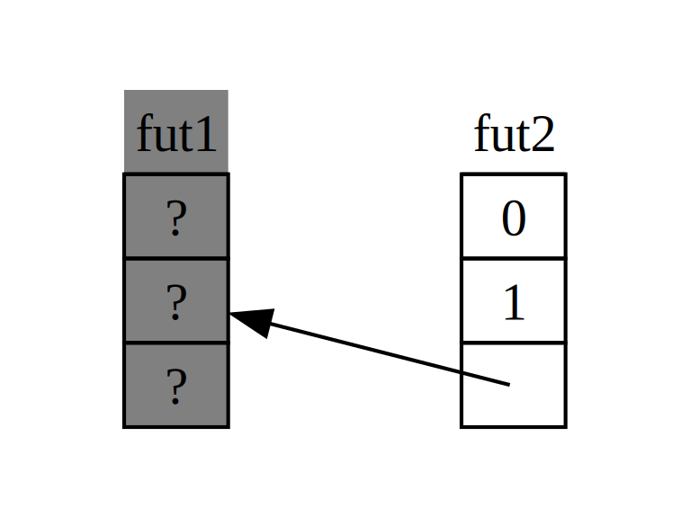

## Async için Özelliklere Derinlemesine Bakış

Bölüm boyunca, `Future`, `Pin`, `Unpin`, `Stream` ve `StreamExt` özelliklerini çeşitli şekillerde kullandık. Ancak şimdiye kadar bunların nasıl çalıştığına veya birbirleriyle nasıl uyumlu olduğuna derinlemesine bakmaktan kaçındık. Rust'ı günlük olarak yazarken çoğu zaman bu yeterli. Ancak bazı durumlarda, bu detaylardan birkaçını anlamak önem kazanır. Bu bölümde, bu durumlarla başa çıkmanıza yardımcı olmak için *yeterince* derinlemesine ineceğiz—ancak *gerçekten* derinlemesine bir dalış için diğer belgeleri bırakacağız!

### Future

:::info
[Futures and the Async Syntax][futures-syntax] bölümünde, `Future`’ın bir özellik olduğunu belirtmiştik. Şimdi nasıl çalıştığına daha yakından bakalım.
:::

Rust, `Future`’ı şöyle tanımlar:

```rust
use std::pin::Pin;
use std::task::{Context, Poll};

pub trait Future {
    type Output;

    fn poll(self: Pin<&mut Self>, cx: &mut Context<'_>) -> Poll<Self::Output>;
}
```

Bu özellik tanımı birçok yeni tür içerir ve daha önce görmediğimiz bir sözdizimini de barındırır, bu yüzden tanımı parça parça inceleyelim.

Öncelikle, `Future`’ın ilişkilendirilmiş türü `Output`, geleceğin neye çözüleceğini belirtir. Bu, `Iterator` özelliği için `Item` ilişkili türüne benzerdir. İkinci olarak, `Future` ayrıca, `self` parametresi için özel bir `Pin` referansı alan ve bir `Context` türüne mutlak bir referans alan `poll` yöntemine sahiptir ve `Poll` döner. `Pin` ve `Context` hakkında daha fazla bilgi vereceğiz, ancak şimdi yöntemin döndürdüğü `Poll` türüne bakalım:

```rust
enum Poll<T> {
    Ready(T),
    Pending,
}
```

Bu `Poll` türü, bir `Option`'a benzer: bir değer içeren bir varyantı (`Ready(T)`) ve içermeyen bir varyantı (`Pending`) vardır. Ancak çok farklı bir anlama gelir! `Pending` varyantı, geleceğin hâlâ yapılacak işi olduğunu belirtir, bu nedenle çağıran kişinin daha sonra tekrar kontrol etmesi gerekir. `Ready` varyantı, `Future`'ın işini tamamladığını ve `T` değerinin mevcut olduğunu belirtir.

> **Not:** Çoğu gelecek için, çağıran kişi geleceğin `Ready` döndükten sonra `poll` çağrısını yapmamalıdır. Birçok gelecek `Ready` oldu sonrasında tekrar polledildiğinde panik yapar! Tekrar polledilmeye güvenli olan gelecekler, belgelerinde açıkça belirtir. Bu, `Iterator::next`'ın davranışına benzer!

Arka planda, `await` kullanan bir kod gördüğünüzde, Rust bunu `poll` çağrılarına derliyor. Liste 17-4'e, bir URL'nin çözülmeden önce sayfa başlığını yazdırdığımız yere göz atarsanız, Rust onu şöyle bir şeye derliyor (tam olarak değil):

```rust,ignore
match page_title(url).poll() {
    Ready(page_title) => match page_title {
        Some(title) => println!("The title for {url} was {title}"),
        None => println!("{url} had no title"),
    }
    Pending => {
        // Buraya ne gelecek?
    }
}
```

`Future` hâlâ `Pending` olduğunda ne yapmalıyız? Tekrar ve tekrar denemenin bir yolunu bulmalıyız… ve tekrar, tekrar, nihayet geleceği hazırlanana kadar. Diğer bir deyişle, bir döngü:

```rust,ignore
let mut page_title_fut = page_title(url);
loop {
    match page_title_fut.poll() {
        Ready(value) => match page_title {
            Some(title) => println!("The title for {url} was {title}"),
            None => println!("{url} had no title"),
        }
        Pending => {
            // devam et
        }
    }
}
```

Ancak Rust bunu tam olarak bu koda derleyebilseydi, her `await` bloklayıcı olurdu—bu ise hedeflediğimizin tam tersidir! Bunun yerine, Rust, döngünün bu gelecekteki işlerin duraksamasına ve başka geleceklere geçmesine ve sonra tekrar kontrol etmesine izin vermesini sağlar. Bu "bir şey" bir asenkron çalışma zamanı olup, bu planlama ve koordinasyon işi, bir çalışma zamanının ana görevlerinden biridir.

:::tip
`rx.recv`'ye beklerken yaptığımız açıklamayı ([Counting][counting] bölümünde) hatırlayın. `recv` çağrısı bir `Future` döndürür ve ona beklemek, onu polled yapar.
:::

İlk tartışmamızda, bir çalışma zamanının geleceği, `Some(message)` veya kanal kapandığında `None` ile hazir olduğunda duraklatacağını belirtmiştik. `Future` hakkında daha derin bir anlayış ve özel olarak `Future::poll`’i anlayarak, bunun nasıl çalıştığını görebiliriz. Çalışma zamanı, `Poll::Pending` geri döndüğünde geleceğin hazır olmadığını bilmektedir. Tersine, `poll` `Poll::Ready(Some(message))` veya `Poll::Ready(None)` döndüğünde geleceğin hazır olduğunu ve onun ilerlemesine izin verir.

Bir çalışma zamanının bunu nasıl başardığına dair ince detayları, bu derinlemesine bölümde kapsayamayız. Buradaki anahtar, geleceği: bir çalışma zamanının, sorumlu olduğu her geleceği *poll* etmesidir; bu, henüz hazır değilse geri uykuya döndürür.

### Pinleme ve Pin ile Unpin Özellikleri

Listing 17-16'yı çalıştırırken pinleme fikrini tanıttığımızda, oldukça karmaşık bir hata mesajıyla karşılaştık. İşte bunun ilgili kısmı tekrar:


```text
error[E0277]: `{async block@src/main.rs:10:23: 10:33}` cannot be unpinned
  --> src/main.rs:48:33
   |
48 |         trpl::join_all(futures).await;
   |                                 ^^^^^ `Unpin` özelliği, `{async block@src/main.rs:10:23: 10:33}` için uygulanmamıştır, bu da `Box<{async block@src/main.rs:10:23: 10:33}>: Future` için gereklidir
   |
   = note: `pin!` makrosunu kullanmayı düşünün
           Eğer pinlenmiş bir değeri mevcut kapsam dışında erişmeniz gerekiyorsa `Box::pin` kullanmayı düşünün
   = note: `Box<{async block@src/main.rs:10:23: 10:33}>`'in `Future` uygulaması için gereklidir
note: `futures_util::future::join_all::JoinAll`'da bir sınır gereklidir
  --> file:///home/.cargo/registry/src/index.crates.io-6f17d22bba15001f/futures-util-0.3.30/src/future/join_all.rs:29:8
   |
27 | pub struct JoinAll<F>
   |            ------- bu yapıda bir kısıtlama gereklidir
28 | where
29 |     F: Future,
   |        ^^^^^^ bu kısıtlama için gereklidir `JoinAll`'da
```

Bu hata mesajını dikkatlice okuduğumuzda, yalnızca değerleri pinlemenin gerekli olduğunu söylemekle kalmaz, aynı zamanda pinlemenin neden gerekli olduğunu da belirtir. `trpl::join_all` fonksiyonu `JoinAll` adlı bir yapı döndürüyor. Bu yapı, `Future` özelliğini uygulaması gereken bir `F` türü üzerinde geneldir. Doğrudan `await` ile bir geleceği beklemek, geleceği dolaylı olarak pinler. Bu yüzden, geleceklere `await` yapmak istediğimiz her yerde `pin!` kullanmamıza gerek yoktur.

Ancak burada doğrudan bir geleceği beklemiyoruz. Bunun yerine, `join_all` fonksiyonuna bir koleksiyon geçerek yeni bir geleceği, `JoinAll`'ı oluşturuyoruz. `join_all`'ın imzası, koleksiyondaki öğelerin türünün hepsinin `Future` özelliğini uygulaması gerektiğini gerektirir ve `Box`, yalnızca sarılı olduğu `T` bir geleceği `Unpin` özelliği ile uyguluyorsa `Future` özelliğini uygulayabilir.

:::note
Bu çok şey! Ancak, *pinleme* çevresinde `Future` türünün nasıl çalıştığına biraz daha derinlemesine inersek bunu anlayabiliriz.
:::

`Future` tanımına tekrar bakalım:

```rust
use std::pin::Pin;
use std::task::{Context, Poll};

pub trait Future {
    type Output;

    // Gerekli yöntem
    fn poll(self: Pin<&mut Self>, cx: &mut Context<'_>) -> Poll<Self::Output>;
}
```

`cx` parametresi ve `Context` türü, bir çalışma zamanının herhangi bir geleceği ne zaman kontrol etmesi gerektiğini gerçekte bilmesinin anahtarıdır, yine de tembeldir. Bunun nasıl çalıştığına dair tüm detaylar bu bölümün kapsamının dışındadır: genellikle yalnızca özel bir `Future` uygulanması yazarken bununla ilgili endişelenmek gerekir.

Bunun yerine, `self` için türe odaklanacağız. Şu ana kadar bir yöntemde `self`'in bir tür açıklaması olan bir yöntem gördük. `self` için bir tür açıklaması, diğer işlev parametreleri için tür açıklamalarına benzer, ancak iki önemli farkla. İlk olarak, bu şekilde `self` türünü belirlediğimizde, Rust'a bu yöntemi çağırmak için `self`'in ne türü olması gerektiğini bildiriyoruz. İkincisi, `self` için bir tür açıklaması sadece herhangi bir tür olamaz. Bu, yalnızca yöntemin uygulandığı türde, o türü referans veya akıllı işaretçi olarak saran `Pin` türü olabilir. Bu sözdizimini Bölüm 18'de daha fazla göreceğiz. Şu anda, bir geleceği kontrol etmek (bir `Pending` veya `Ready(Output)` olup olmadığını kontrol etmek) istiyorsak, o türün bir `Pin`'de sarılmış bir mutmutable referansına ihtiyacımız vardır.

`Pin`, bir sarmalayıcı türdür. Bazı yönlerden, Bölüm 15'te gördüğümüz `Box`, `Rc` ve diğer akıllı işaretçi türlerine benzer, bunlar da diğer türleri sarar. Ancak, bu türler yalnızca *işaretçi türleriyle* çalışır, örneğin referanslar (`&` ve `&mut`) ve akıllı işaretçiler (`Box`, `Rc` vb.). Kesin olarak söylemek gerekirse, `Pin`, `Deref` veya `DerefMut` özelliklerini uygulayan türler ile çalışır. Bölüm 15'te bunları ele almıştık. Bu kısıtlamayı yalnızca işaretçilerle çalışmakla eşdeğer olarak düşünebilirsiniz, çünkü `Deref` veya `DerefMut` uygulamak, türünüzün işaretçi türü gibi davranması anlamına gelir. `Pin` ayrıca bir işaretçi değil ve `Rc` ile `Arc` gibi bir referans sayımıyla kendi davranışına sahip değildir. Tamamen, ilgili garantileri koruyacak şekilde işaretçileri sarmak için derleyici kullanabileceği bir araçtır.

:::warning
`await` çağrılarının `poll` çağrılarına uygulanmasıyla bu, yukarıda gördüğümüz hata mesajını açıklamaya başlamaktadır—ama bu `Unpin` açısından değil, `Pin` açısından. O halde tam olarak `Pin` ve `Unpin` nedir, bunlar nasıl ilişkilidir ve `Future` neden `self`'in `poll` çağrısını gerçekleştirmek için bir `Pin` türünde olmasını gerektirir?
:::

[İlk Asenkron Programımız][first-async] bölümünde, bir gelecekteki await noktalarının bir durum makinesine derlenme biçimini tarif ettik—ve derleyicinin bu durum makinesinin Rust'ın normal güvenlik kurallarını takip etmesini sağlamak için nasıl yardımcı olduğunu belirttik. Bunun çalışmasını sağlamak için Rust, her await noktasındaki verilerin neye ihtiyaç duyduğuna bakar ve sonrasındaki await noktasına veya asenkron bloğun sonuna gider. Ardından, oluşturduğu durum makinesinde karşılık gelen bir varyant oluşturur. Her varyant, kaynak kodunun o bölümünde kullanılacak verilere erişim ihtiyacı olan veriyi alır; bu ya bu verilere sahip olmayı ya da ona mutmutable veya immutable bir referans almayı içerir.

:::tip
Her şey bu kadar iyi: bir asenkron bloktaki sahiplik ya da referanslarla ilgili bir şeyi yanlış alırsak, borç kontrolü bize söyler. Geleceği, o bloğa karşılık gelen bir `Vec`'e taşımak istedikçe—`join_all` için bir veri yapısına iterek, [“Herhangi Bir Gelecek ile Çalışma”][any-number-futures] bölümünde yaptığımız gibi—işler karmaşıklaşır.
:::

Bir geleceği hareket ettirdiğimizde—ister bir veri yapısına iterek `join_all` ile bir iteratör kullanmak için, ister bir işlevden dönmek—bu gerçekten, Rust'ın bizim için oluşturduğu durum makinesini hareket ettirmek anlamına gelir. Ve Rust'ta çoğu türde olduğu gibi, Rust'ın oluşturduğu geleceklere, kendi alanlarında referanslar yer alabilir, bu şekilde karşımıza genel bir durumu belirtir (şekil 17-4). 


Şekil 17-4: Kendine referans veren bir veri türü.


Ancak varsayılan olarak, kendisine referans veren her nesne taşınması güvenli değildir çünkü referanslar, referans verdikleri şeyin gerçek bellek adresini işaret eder. Eğer veri yapısını kendisi hareket ettirirseniz, bu iç referanslar eski konumlarına işaret etmeye devam eder. Ancak, bu bellek alanı artık geçersizdir. Bir şey için, değişiklik yaptığınızda değerinin güncellenmeyeceği durumlar olacaktır. Diğer bir deyişle—ve daha da önemlisi!—bilgisayar artık o bellek alanını başka şeyler için yeniden kullanmaya hazırdır! Sonrasında tamamen alakasız verileri okuyabilme riskiniz vardır.




Şekil 17-5: Kendine referans veren bir veri türünün taşınmasının güvensiz sonucu.


Prensipte, Rust derleyicisi, her seferinde bir nesne taşındığında, her referansı güncellemeye çalışabilir. Bu muhtemelen performans üzerinde büyük bir yük olacaktır, özellikle de güncellenmesi gereken birçok referans ağının olabileceği göz önüne alındığında. Öte yandan, eğer ilgili veri yapısının *bellekte hareket etmediğinden emin olabiliyorsak*, hiçbir referansı güncellememize gerek kalmaz. İşte Rust'ın borç kontrolü bunun için gereklidir: güvenli kod kullanarak, aktif referansı olan bir öğeyi hareket ettiremezsiniz.

:::danger
`Pin`, tam olarak bu ihtiyacı karşılamak için geliştirilmiştir. Bir değeri, o değeri işaret eden bir pointer türünü `Pin` içinde sararak *pinlerseniz*, artık hareket ettiremez. Yani, `Pin>` varsa, aslında `SomeType` değerini *pinlemiş olursunuz*, *Box* pointerını değil. Şekil 17-6 bunu açıklamaktadır:
:::


Şekil 17-6: Kendine referans veren bir geleceği işaret eden bir Box'ın pinlenmesi.


Gerçekten, `Box` pointerı hâlâ serbestçe hareket edebilir. Unutmayın: işaret edilen verinin sonunda olduğu yeri koruyarak verinin yerinde kalmasını sağlamak bizim için önemlidir. Bir pointer hareket ederse ama işaret ettiği veri aynı yerde kalırsa, Şekil 17-7'deki gibi, hiçbir potansiyel sorun yoktur. (Bunu `Pin` ile saran bir `Box` ile nasıl yapmanız gerektiği, bu tartışmanın kapsamından fazlasını içeriyor, fakat güzel bir alıştırma olurdu! Bu türlerin belgelerine ve `std::pin` modülüne bakarsanız, bunun nasıl yapılacağını anlayabilirsiniz.) Anahtar, kendine referans veren türün kendisinin hareket etmemesi gerektiğidir, çünkü hala pinlenmiştir.


Şekil 17-7: Kendine referans veren bir gelecek türüne işaret eden bir Box'ın hareket ettirilmesi.


Ancak, çoğu tür hareket ettirmek için tamamen güvenlidir, hatta bir `Pin` pointerı arkasında bulunsalar bile. İç referansları olan öğeler için pinleme düşünmemiz gereklidir. Sayılar ve boolean gibi ilkel değerlerin iç referansları yoktur, bu yüzden açıkça güvenlidirler. Rust'ta genellikle çalıştığınız çoğu tür de böyle değildir. Örneğin, bir `Vec`'in, bu şekilde güncel tutulması gereken iç referansları yoktur, bu yüzden onu endişelenmeden hareket ettirebilirsiniz. Eğer bir `Pin>` varsa, ulaşılan pointerlar nedeniyle `Pin` tarafından sağlanan güvenli ama kısıtlayıcı API'lerle her şeyi yapmalısınız, ancak bir `Vec` başka referansları yoksa her zaman güvenlidir. Bazı durumlarda, öğelerin etraflarında hareket etmenin aslında sorun olmadığını belirtmenin bir yoluna ihtiyaç duyarız. Bunun için `Unpin`'i kullanıyoruz.

:::tip
`Unpin`, `Send` ve `Sync` özellikleriyle benzer olan bir işaretçi tipidir. İşaretçi türlerinin, kendi işlevsellikleri olmamasıyla hatırlayın. Sadece belirli bir bağlamda, verilen bir özelliği uygulayan türlerin kullanılmasının güvenli olduğunu derleyiciye bildirmek için vardır. `Unpin`, derleyiciye verilen bir türün, ilgili değerin taşınıp taşınmadığı konusunda *hiçbir özel garantiye* ihtiyaç duymadığını bildirmektedir.
:::

`Send` ve `Sync` ile olduğu gibi, derleyici, güvenli olduğunu kanıtlayabildiği tüm türler için `Unpin`'i otomatik olarak uygular. Özel durum, yine `Send` ve `Sync` benzeri, `Unpin`'in *uygulanmadığı* bir tür olmasıdır. Bunun için notasyon, `impl !Unpin for SomeType` şeklindedir; burada `SomeType`, bir pointerı `Pin` türünde kullanılırken güvenli olması için o garantileri tutması gereken bir türdür.

:::info
Başka bir deyişle, `Pin` ve `Unpin` arasındaki ilişki ile ilgili iki şeyi akılda tutmak gerekir. Birincisi, `Unpin` "normal" durumdur ve `!Unpin` özel durumdur. İkincisi, bir türün `Unpin` veya `!Unpin` uygulayıp uygulamadığı, yalnızca o tür gibi pinlenmiş bir pointer kullanıldığı zaman *önemlidir*.
:::

Bunu somut hale getirmek gerekirse, bir `String`: uzunluğu ve onu oluşturan Unicode karakterleri vardır. Bir `String`'i `Pin` içinde sarabiliriz, Şekil 17-8'de olduğu gibi. Ancak, `String` otomatik olarak `Unpin`'i uyguladığı için, Rust'taki çoğu tür gibi.


Şekil 17-8: Pinlenmiş bir String, `Unpin` özelliğinin dolu bir nokta ile gösterildiği durum.


Sonuç olarak, `String` `!Unpin` uygulasa yasaklanacak şeyleri yapabiliriz: örneğin, aynı bellek konumunda bir dizeyi başka bir dizeyle değiştirmek gibi, Şekil 17-9'daki gibi. Bu, `Pin` sözleşmesini ihlal etmez, çünkü `String`'in hareket etmesini gerektiren iç referansları yoktur! İşte bu nedenle `Unpin` uygular, `!Unpin` değil.

:::tip
Artık, Listing 17-17'deki `join_all` çağrısı için bildirilen hataları anlamak için yeterince bilgimiz var. Başlangıçta, asenkron bloklar tarafından üretilen gelecekleri bir `Vec>>` içine taşıyıp taşımaya çalıştık, ancak gördüğümüz gibi, bu geleceklere iç referanslar olabilir, bu nedenle `Unpin` uygulamazlar. Pinlenmeleri gerekmektedir ve ardından `Pin` türünü `Vec`'e geçebiliriz, geleceğin içindeki altta yatan verilerin *taşınmayacağını* güvenle bilerek.
:::

`Pin` ve `Unpin`, çoğunlukla daha düşük düzeyde kütüphaneler oluşturmada ya da bir çalışma zamanı inşa ederken önemlidir; günlük Rust kodu yazarken değil. Ancak bu özellikleri hata mesajlarında gördüğünüzde, kodu nasıl düzeltebileceğinize dair daha iyi bir fikriniz olacak!

> **Not:** `Pin` ve `Unpin`'in bir arada kullanımı, Rust'ta kendine referans veren karmaşık türlerin güvenli olmasına olanak tanır, aksi takdirde uygulaması zor olurdu. `Pin` gerektiren türler, günümüzde asenkron Rust'ta *en yaygın* olarak ortaya çıkar, ancak çok nadiren de olsa başka bağlamlarda da görebilirsiniz.
>
> `Pin` ve `Unpin`'in nasıl çalıştığı ve güvence altına almaları gereken kurallar, `std::pin` API belgelerinde geniş bir şekilde kapsanmıştır, bu nedenle daha derinlemesine anlamak isterseniz, harika bir başlangıç yeri olur.
>
> İşlerin "arka planda" nasıl çalıştığını daha da ayrıntılı anlamak isterseniz, resmi [_Rust'ta Asenkron Programlama_][async-book] kitabı sizi kapsamaktadır:
>
> - [Bölüm 2: Arka Planda: Gelecekleri ve Görevleri Çalıştırmak][under-the-hood]
> - [Bölüm 4: Pinleme][pinning]

### Akış Özelliği

Şimdi `Future`, `Pin` ve `Unpin` özelliklerine daha derin bir şekilde aşina olduğumuza göre, dikkatimizi `Stream` özelliğine çevirebiliriz. Akışları tanıtan bölümde belirtildiği gibi, akışlar, asenkron yineleyicilere benzer. Yazım anında standart kütüphanede bir `Stream` özelliği tanımı yoktur, ancak ekosistem boyunca kullanılan `futures` crate'inden çok yaygın bir tanım *vardır*.

:::info
`Iterator` ve `Future` özelliklerinin tanımlarını gözden geçirelim ki birleştiren bir `Stream` özelliğinin nasıl görünebileceğini anlayabilelim.
:::

`Iterator`'dan sıralama fikrini alıyoruz: `next` metodu bir `Option` sağlar. `Future`'dan zamanla hazır olma fikrini alıyoruz: `poll` metodu bir `Poll` sağlar. Zamanla hazır hale gelen öğelerin bir sırasını temsil etmek için, bu özellikleri bir araya getiren bir `Stream` özelliği tanımlıyoruz:

```rust
use std::pin::Pin;
use std::task::{Context, Poll};

trait Stream {
    type Item;

    fn poll_next(
        self: Pin<&mut Self>,
        cx: &mut Context<'_>
    ) -> Poll<Option<Self::Item>>;
}
```

`Stream` özelliği, akış tarafından üretilen öğelerin türü için ilişkili bir `Item` türü tanımlar. Bu, `Iterator`'la benzerdir: bunlardan sıfırdan fazlası olabilir ve `Future`'dan farklı olarak, her zaman tek bir `Output` vardır (birim türü `()` bile olsa).

:::tip
`Stream` ayrıca bu öğeleri almak için bir metod tanımlar. Bunu `poll_next` olarak adlandırıyoruz, çünkü `Future::poll` ile aynı şekilde polllamakta ve `Iterator::next` gibi bir öğe sırası üretmektedir.
:::

Dönüş tipi `Poll` ile `Option`u birleştirir. Dış tür `Poll`dir, çünkü bir gelecekte olduğu gibi, hazır olma durumunun kontrol edilmesi gerekir. İç tür ise `Option`dur, çünkü bir yineleyici gibi daha fazla mesaj olup olmadığını bildirmesi gerekir.

Buna benzer bir şeyin, muhtemelen Rust'ın standart kütüphanesinin bir parçası olarak standartlaştırılacağı muhtemeldir. Bu arada, çoğu çalışma zamanının aracıdır, bu nedenle buna güvenebilirsiniz ve aşağıda ele aldığımız her şey genel olarak geçerli olmalıdır!

:::warning
Ancak, akış bölümünde gördüğümüz örnekte, `poll_next` *veya* `Stream` kullanmadık, bunun yerine `next` ve `StreamExt` kullandık.
:::

Elbette, kendi `Stream` durum makinelerimizi yazarak `poll_next` API'si terimleriyle doğrudan çalışabilirdik; tıpkı `poll` metodu aracılığıyla doğrudan gelecekle çalışabileceğimiz gibi. Ancak `await` kullanmak çok daha hoş bir deneyimdir, bu nedenle `StreamExt` özelliği, tam olarak bunu yapabilmemiz için `next` metodunu sağlar.

```rust
{{#rustdoc_include ../listings/ch17-async-await/no-listing-stream-ext/src/lib.rs:here}}
```


> Not: Bölümün başında kullandığımız gerçek tanım bu, çünkü asenkron fonksiyonların özelliklerde kullanılmasını henüz desteklemeyen Rust sürümlerini destekliyor. Sonuç olarak, böyle görünmektedir:
>
> ```rust,ignore
> fn next(&mut self) -> Next<'_, Self> where Self: Unpin;
> ```
>
> `Next` türü, `Future`'ı uygulayan bir `struct` türüdür ve `await`in bu metodla çalışabilmesi için `self` referansının ömrünü `Next` ile adlandırmayı sağlar!

`StreamExt` özelliği ayrıca akışlarla kullanılabilir tüm ilginç metodların ev sahibidir. `StreamExt`, `Stream`'i uygulayan her tür için otomatik olarak uygulanır, ancak bu özellikler topluluğun temel özellik üzerinde, kullanım kolaylığı API'lerinden ayrı olarak iterasyon yapabilmesi için ayrı tanımlanmıştır.

:::note
`trpl` crate'indeki `StreamExt` sürümünde, bu özellik sadece `next` metodunu tanımlamakla kalmaz, aynı zamanda `Stream::poll_next`'u çağırmanın ayrıntılarını doğru bir şekilde işleyen bir `next` implementasyonu da sağlar.
:::

Bu, kendi akış veri türünüzü yazmanız gerektiğinde, sadece `Stream`'i uygulamanız gerektiği anlamına gelir ve böylece verilerinizi kullanan herkes otomatik olarak `StreamExt` ve onun metodlarından faydalanabilir.

Bu özellikler üzerinde daha düşük seviyeli ayrıntılarla ilgili ele alacağımız konular burada sona eriyor. Son olarak, geleceklerin (akışlar dahil), görevlerin ve iş parçacıklarının nasıl bir araya geldiğini düşünelim!

---

[futures-syntax]: ch17-01-futures-and-syntax.html  
[counting]: ch17-02-concurrency-with-async.html  
[async-book]: https://rust-lang.github.io/async-book/  
[under-the-hood]: https://rust-lang.github.io/async-book/02_execution/01_chapter.html  
[pinning]: https://rust-lang.github.io/async-book/04_pinning/01_chapter.html  
[first-async]: ch17-01-futures-and-syntax.html#our-first-async-program  
[any-number-futures]: ch17-03-more-futures.html#working-with-any-number-of-futures