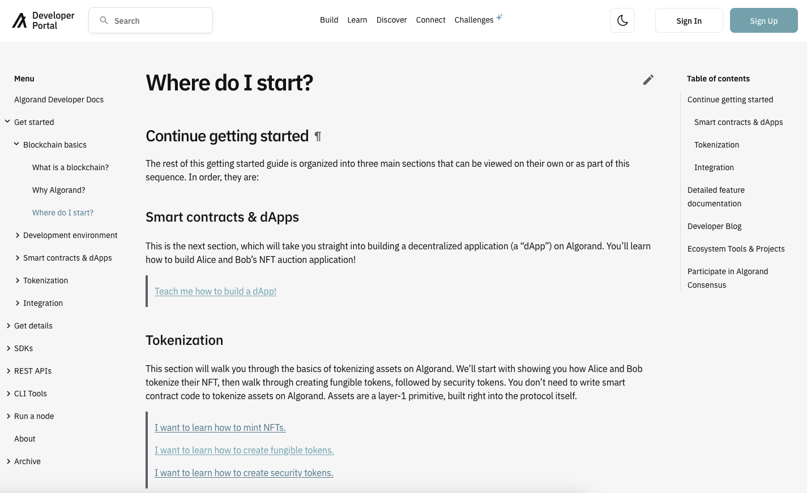

**Algorand Dokümantasyon:**

Algorand yapısı dahilinde geliştiricilere büyük önem vermektedir. Algorand Fundation vakfı bu anlamda protokol, açık kaynak, denetim ve eğitim gibi konularda çalışmaktadır. Blokzincir teknolojisi kısmen yeni gelişen bir teknolojidir. Bu nedenle teknolojiyi kullanmayı hedefleyen kişilerin kullanabileceği belgelendirmelerin bulunması gerekmektedir. Algorand vakfı bu duruma büyük önem vermektedir ve düzenli olarak güncellenen gelişen dokümantasyonlara sahiptir. Bu dokümantasyonların bir araya toparlandığı ve kullanıcılara sunulduğu site olan [https://developer.algorand.org/](https://developer.algorand.org/) sitesi kitap içerisinde de bolca kullanılacaktır.

_Şekil 1_

Şekil 1'de Algorand Developer Portal'ın kitabın yazılma tarihine bağlı görünümü ifade edilmiştir. Yan kısımda bulunan menülere göz gezdirildiğinde birçok başlık olduğu gözükmektedir. Algorand blokzinciri üzerinde büyük geliştirme yapmayı planlayan geliştiricilerin bu siteye büyük önem vermesi ve güncel olarak taraması gerekmektedir.
