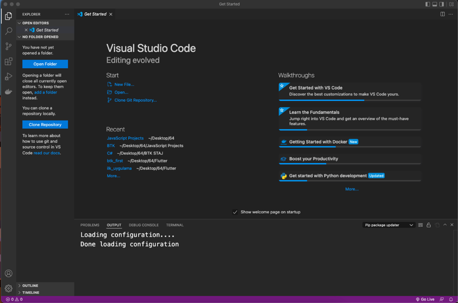
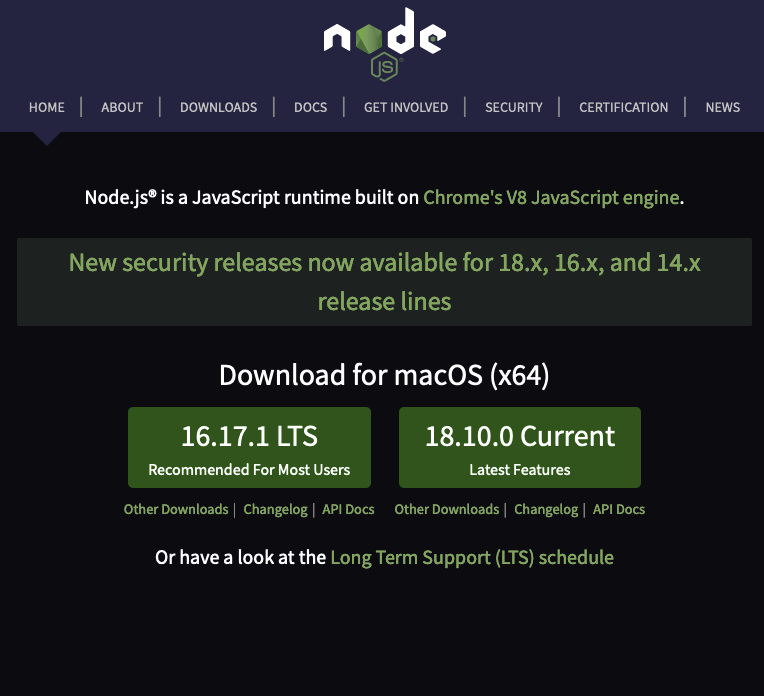
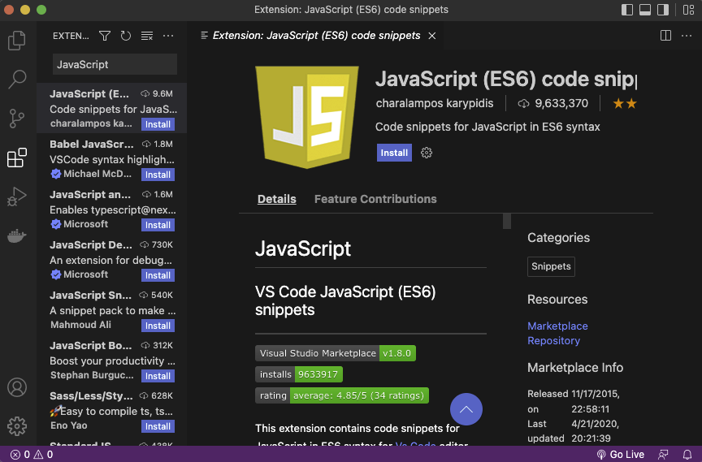
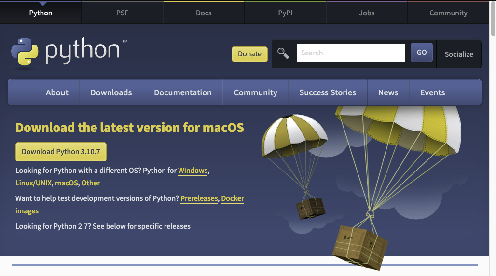
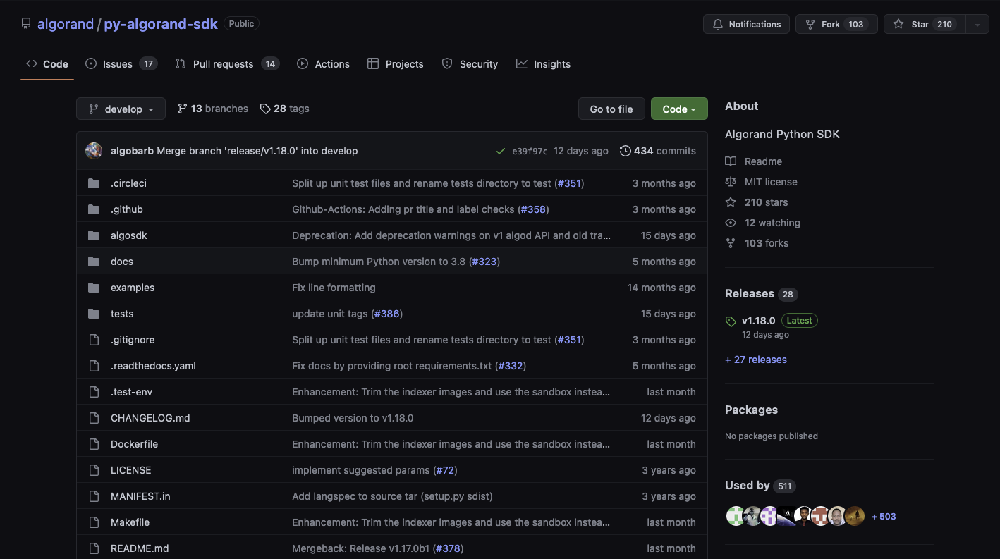

# Gerekli Ortamların Kurulması



_Şekil 2_

Projelerimiz için öncelikli olarak Python ve JavaScript dilleri kullanılacaktır. Bu nedenle bu diller ile ilgili bazı programların kurulması gerekmektedir.

Projemiz içerisinde hem JavaScript için hem de Python için VS Code IDE'si tercih edilmiştir. Bu IDE'yi indirmek için [https://code.visualstudio.com/](https://code.visualstudio.com/) sayfası ziyaret edilebilir. Kurulum dosyası indirildikten sonra işletim sistemine özgü kurulum aşamaları tamamlanır.

Kurulum tamamlandığında Şekil 2'da ifade edildiği şekilde bir arayüz bizi karşılamaktadır. Bu arayüz içerisinden sol kısımda bulunan biri kopuk dört karenin olduğu seçenek seçilmelidir. Bu seçenek içerisinden gerekli eklentiler VS Code içerisine eklenebilmektedir.

**JavaScript Ortamlarının Kurulması:**



_Şekil 3_

JavaScript üzerinde geliştirmeler yapılırken Node.js programına ihtiyaç duyulmaktadır. Node.js JavaScript kodlarını tarayıcı dışında çalıştırmamızı sağlayan bir çalıştırma ortamıdır. Kurulum için [https://nodejs.org/en/](https://nodejs.org/en/) adresi ziyaret edilmektedir.

Şekil 3'te ifade edildiği üzere site içerisine girdiğimizde iki adet indirme seçeneği karşımıza çıkmaktadır. Bu sürümler LTS ile ifade edilen (Long Term Support) uzun süreli desteklenen sürüm ile "Current" yani güncel sürümü ifade etmektedir. Her ikisi de bir sıkıntı çıkmadan kullanılabilse de projemiz için LTS sürümünü tavsiye etmekteyiz. Sürüm seçildikten sonra işletim sistemine uygun bir şekilde kurulumunun yapılması gerekmektedir.

Node.js kurulumu sonrasında VS Code üzerinden JavaScript ile ilgili bazı eklemeler yapılması gerekmektedir. Bu eklemeleri eklentiler sekmesinden yapmak mümkündür.



_Şekil 4_

İlk olarak eklenmesi gereken eklenti Şekil 4'te ifade edildiği üzere JavaScript dosyalarını daha doğru bir şekilde çalışmasını sağlayan "JavaScript (ES6)" eklentisidir. Eklentiler kısmından JavaScript aratılarak görüntülenebilir.

**JavaScript Üzerinde Gerekli Dosya ve Paketlerin Kurulması:**

Uygun geliştirme ortamının kurulmasından sonra bu geliştirme ortamı üzerinden erişilecek klasörün oluşturulması gerekmektedir. Bu klasör üzerinde tüm geliştirme işlemlerini yapacak olmaktayız.

İlk olarak istediğimiz konumda oluşturduğumuz klasörü kod editörü içerisinde "Open Folder" tuşuna basarak açmamız gerekmektedir. Bu sayede klasörümüz editörümüz içerisinden rahatça erişilebilecektir. Sonrasında bu klasöre terminal üzerinden de erişmemiz gerekmektedir. Bu işlem bazı durumlarda klasör ekleme ile anında VS Code içinde gerçekleşebilse de proje klasörünüz editör üzerinden açtığınız klasör içerisinde bulunan birçok klasörden biriyse otomatik olarak terminal klasöre bağlanmamaktadır. Bu durumda "cd", "ls" ve "cd .." komutları ile terminalden proje dosyanızı bulana kadar arama yapmanız gerekmektedir.

```JavaScript
 npm init -y 
```

_Tablo 1_

Terminalden klasör içerisine girildikten sonra Tablo 1'de ifade edildiği şekilde komut çalıştırılmalıdır. Bu komut klasörü bir node.js klasörü haline getirecek ve lokal olarak makinemizde JavaScript dosyalarını çalıştırabileceğimiz klasör haline gelecektir. Bu işlem sonrası "package.json" adında bir dosya oluştuğu dikkatinizi çekebilir. Bu dosya projemizde kullanılan JavaScript paketlerini içermektedir.

JavaScript içerisinde kullanacağımız bazı paketler bulunmaktadır. Bu paketleri yine node.js ile yüklememiz mümkün olmaktadır.

```JavaScript
 npm install algosdk 
```

_Tablo 2_

İlk ekleyeceğimiz paket Algorand zincire bağlanmamızı sağlayan ve kitap içerisinde öğrenimini gerçekleştireceğimiz "algosdk" paketi olmaktadır. Tablo 2'de ifade edilen komutu oluşturduğumuz proje klasörü içerisinde çalıştırmamız durumunda Algorand SDK paketine erişim sağlayabiliriz.

```JavaScript
 npm install dotenv 
```

_Tablo 3_

Ekleyeceğimiz son paket proje klasörü içerisinde gizli bilgileri güvenli bir şekilde tutmamızı sağlayan paket olan "dotenv" paketinin eklenmesidir. Tablo 3'de ifade edilen komutu oluşturduğumuz proje klasörü içerisinde çalıştırmamız durumunda ".env" ismine sahip dosyalara projemiz içerisinde erişim sağlayabiliriz.

Projemizde kullanılacak paketlerin kurulumu tamamlanmıştır. Bu paketleri kullanarak Algorand Blokzinciri üzerinde hesap oluşturacak, bakiye sorgulayacak, transfer yapacak ve token oluşturacağız.

**Python Ortamlarının Kurulması:**



_Şekil 5_

Kitabımız üzerinde öğrenimini sağlayacağımız Pyteal ve Python Algosdk ortamlarının çalışması için bilgisayarımız üzerinde Python'ın kurulu olması gerekmektedir. Bu kurulumu [https://www.python.org/downloads/](https://www.python.org/downloads/) adresi üzerinden gerçekleştirebiliriz.

_Şekil 6_

Şekil 5'de ifade edildiği üzere uygun işletim sistemi sürümüne göre Python'ı indirmek ve kurmak gerekmektedir.

Python'ın kurulması sonrasında seçtiğimiz editör olan VS Code içerisinde Şekil 6'da ifade edildiği üzere Python dosyaları yazmamız için "Python" eklentisini kurmamız gerekmektedir. Bu eklenti sayesinde VS Code içerisinde Python dosyalarını otomatik tamamlama ve benzeri özellikler ile kullanabiliriz.

**Python'da Gerekli Ortamların Kurulması:**

Python üzerinde geliştirmeye başlamak için ilk olarak proje dosyalarının bulunacağı bir klasörün oluşturulması gerekmektedir. Bu işlem terminal üzerinden veya kod üzerinden yapılabilir. Klasör oluşturulduktan sonra klasörün içerisine istediğimiz ismi verebileceğimiz "main.py" dosyası oluşturulmalıdır. Ayrıca Python içerisinde "pip" yapısı ile gelmektedir. Bu yapı Python dosyası üzerinde erişilebilecek kütüphanelerin oluşmasına imkân vermektedir.

```JavaScript
 pip install algosdk 
```

_Tablo 4_



_Şekil 7_

Python üzerinden Algorand SDK'ye erişebilmek için kütüphanenin indirilmesi gerekmektedir. Bu işlem Tablo 4'de ifade edildiği üzere "pip install" komutu ile gerçekleştirilebilir. Bazı durumlarda kütüphane ekleme işlemi düzgün gerçekleşmeyebilir. Bu gibi durumlarda kütüphane manuel olarak indirilebilir.

Manuel ekleme işlemi Şekil 7'de ifade edildiği üzere Github klasörü üzerinden gerçekleşebilmektedir. Bu klasöre [https://github.com/algorand/py-algorand-sdk](https://github.com/algorand/py-algorand-sdk) linki üzerinden erişmek ve "pip install [dosya-yolu]" komutu ile yüklemek mümkün olmaktadır.
