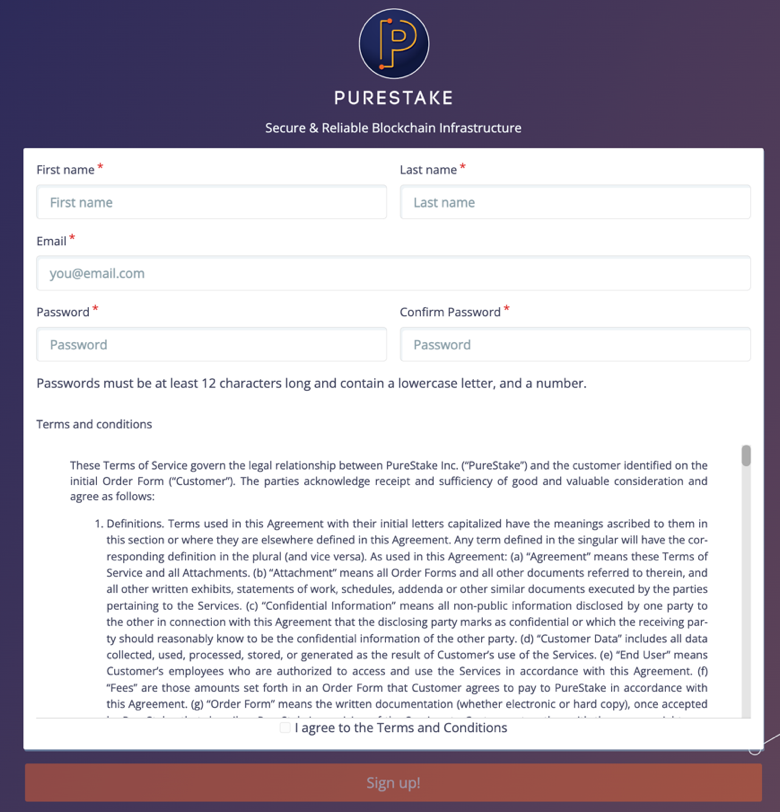
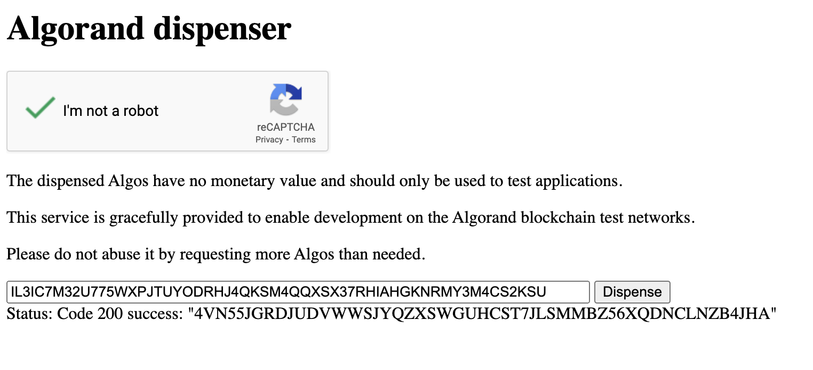

# JavaScript ve Algorand ile Hesabın Bakiyesini Kontrol Etme

Var olan bir hesabın bakiyesini kontrol etmek aslında Algorand SDK ile mümkün olmaktadır. Ancak bu işlemi gerçekleştirmek için bir Algorand zincirinde verileri erişmemize olanak sağlayan API anahtarı gerekmektedir. Bu anahtarı [https://developer.purestake.io/](https://developer.purestake.io/) sitesinden temin edeceğiz. Site içerisine girdikten sonra "Sign Up for Free" tuşuna basmamız gerekmektedir. Bu tuş bizi şekil 8'de gözüken [https://developer.purestake.io/signup](https://developer.purestake.io/signup) sitesine götürecektir.



_Şekil 8_

Gerekli bilgileri girmemiz ve "Sign up" tuşuna basmamız halinde site bizi "dashboard" adını verdiği ve birçok bilginin bulunduğu sayfaya yönlendirecektir. Bu sayfa içerisinde en üstte "Your API key" başlığı altında bulunan metin bizim API anahtarımız olacaktır. Bu anahtarı şimdilik kopyalayabiliriz.

Kodlama kısmına geçmeden önce bu API anahtarını güvenli bir şekilde kullanmak için birkaç ayar yapmamız gerekmektedir. Bu bağlamda index.js dosyamızın da bulunduğu klasör statüsüne terminal içerisinden girmemiz gerekmektedir.

```JavaScript
 npm install dotenv 
```

_Tablo 16_

Klasör içerisine girdiğimizde Tablo 16'de gösterilen komut ile "dotenv" paketini eklemekteyiz. Bu paket gizli klasör olan ".env" klasörüne erişimimizi sağlayacaktır. ".env" klasörleri dosya paylaşımlarında paylaşılmayan kişisel ve gizli bilgilerin bulunduğu dosyadır. Bu dosya içerisine gizlemek istediğimiz dosyaları girebiliriz.

```JavaScript
 API = "EiSw8baM0m1bAZsKDi8ID3vpsRcr6arl8wVuOktH" 
```

_Tablo 17_

Dosyanın içerisine API anahtarımızı Tablo 17'de görüldüğü üzere API anahtar kelimesi ile ekleyebiliriz.

Anahtarımızı oluşturduktan sonra hesap oluşturma kodunda yaptığımıza benzer bir şekilde yeni bir JavaScript dosyası oluşturmak projenin organizasyonu ve düzeni için büyük önem arz etmektedir. "index.js" dosyasının bulunduğu klasöre sağ tıklayarak balance.js adında yeni bir JavaScript dosyası oluşturuyoruz.

```JavaScript
 const Algosdk = require("algosdk") 
```

_Tablo 18_

Dosya içerisine girdiğimizde Tablo 18'de ifade edildiği üzere diğer JavaScript kodlarında yaptığımıza benzer şekilde "require()" komutu ile Algosdk sabiti içerisine paketimizi eklemekteyiz. Bu sayede Algorand SDK'e tanımladığımız sabit ile kodumuzun içerisinden istediğimiz şekilde erişebileceğiz.

```JavaScript
 let bakiyeKontrolEt = ()=\>{
} 
```

_Tablo 19_

Bakiye kontrol işlemlerini gerçekleştirecek kodların yer alacağı bir fonksiyon tanımlamamız gerekmektedir. Bu tanımlamayı Tablo 19'da ifade edildiği üzere "Arrow Funtion" adı verilen tanımlama işlemi ile gerçekleştireceğiz. Arrow fonksiyonları yapıları ötürü bir değişkene veya sabite tanımlanmak isterler. Bu nedenle tanımlama yaparken değişken verilerin kontrolünü sağlamak amacıyla "let" anahtar kelimesi kullanılmıştır. Fonksiyonun adı tamamen kişisel tercihe bağlı olmaktadır ancak anlatım kolaylığı ve düzenlilik açısından "bakiyeKontrolEt()" isimlendirilmesi seçilmiştir. Fonksiyon parametresi olarak parantez içerisine herhangi bir değer girilmemiştir. Bu durumun nedeni fonksiyonun herhangi bir girdiye ihtiyaç duymamasıdır. Ancak farklı bir senaryoda kişiler fonksiyona kendi API anahtarlarını fonksiyon çağırımı sırasında besleyebilir.

```JavaScript
 const port="" 
```

_Tablo 20_

Fonksiyonun içerisine girdiğimizde birkaç değişken tanımlamamız gerekmektedir. Bu değişkenlerden ilki Tablo 20'de ifade edildiği üzere "port" değeri olmaktadır. Port değeri kantrolünün gerçekleşeceği bağlantı portunu ifade etmektedir. Bu işlemin içi boş bırakılabilir veya 4001 değeri girilebilir.

```JavaScript
 const token={"x-api-key": process.env.API} 
```

_Tablo 21_

Tanımlanması gereken bir sonraki değişken ise "Purestake" sitesinden elde ettiğimiz API anahtarıdır. Tablo 21'de görüldüğü üzere bu anahtarı kullanarak sorgularımızı gerçekleştireceğiz. Token değeri içerisine anahtarımızı kaydederken obje halinde kaydetmemiz gerekmektedir. Bu objenin içerisine anahtar olarak "x-api-key" string değeri girilmelidir. Bu sayede sonradan çağıracağımız fonksiyon tam olarak hangi değerin anahtar olduğunu anlar. Tanımlamanın diğer tarafına da API anahtarımız gelmektedir. API anahtarımızı ".env" dosyası içerisine kaydettik ancak henüz herhangi bir şekilde dosyaya erişmemiştik. Erişimi gerçekleştirmek için "process.env" metotlarını çağırırız. Son noktanın devamında ".env" dosyasından hangi veriyi elde etmek istiyorsak o verinin kaydederken kullandığımız anahtarını girmemiz gerekmektedir. Biz dosya içerisinden API değerine erişmek istediğimiz için "process.env.API" komutu ile bu işlemi gerçekleştirebiliriz.

```JavaScript
 const TestSunucusu= "https://testnet-algorand.api.purestake.io/ps2" 
```

_Tablo 22_

Tanımladığımız değişkenleri birleştirmeden önce son bir parametre tanımlaması yapmamız daha gerekmektedir. Bu tanımlama sorguyu gerçekleştireceğimiz testnetin adresi olmaktadır. Tablo 22'de ifade edildiği üzere bu adresi API anahtarını aldığımız "PureStake" sitesi üzerinden Algorand Testnet başlığı altında görüntülemek mümkündür.

```JavaScript
 let Kullanıcı = new Algosdk.Algodv2(token,TestSunucusu,port) 
```

_Tablo 23_

Daha öncesinde tanımladığımız parametreleri "Kullanıcı" değişkeni üzerinde birleştirmekteyiz. İlk olarak "let" ile bir değişken tanımlamaktayız. Tablo 23'te gösterildiği üzere bu değişkene kodumuz içerisinde anlaşılırlığın artması amacıyla Kullanıcı adını verdik ancak yabancı kaynaklarda "client" olarak geçtiğini de görebilirsiniz. Devamında tanımın diğer tarafında "new" anahtar kelimesini görüyoruz. Bu anahtar kelime değişkenin yeni boş bir obje oluşturup içerisine parametreler almasını sağlamaktadır. SDK içerisinden "algosdk.Algodv2()" metodu ile obje oluşturma koduna erişmekteyiz. Bu metot içerisine önceden oluşturduğumuz "port, token ve TestSunucu" değişkenlerini almaktadır.

```JavaScript
 let Hesap = "IL3IC7M32U775WXPJTUYODRHJ4QKSM4QQXSX37RHIAHGKNRMY3M4CS2KSU"; 
```

_Tablo 24_

Kullanıcı oluştuktan sonra incelenmesini istediğimiz hesabın bilgilerinin girilmesi gerekmektedir. Tablo 24'te görüldüğü üzere herhangi bir adres "let" anahtar kelimesi ile tanımlanan değişkenin içerisine kaydedilir. İsteğe göre bu değer fonksiyon girdisi olarak da alınabilir. Bu sayede fazlaca adresi "for" döngüleri ile kısa değişiklikler ile taramak mümkün olabilir.

```JavaScript
 (async()=\>{}) 
```

_Tablo 25_

Tanımlamalar bittikten sonra fonksiyon içinde asıl sorgu işlemini yapacağımız kod yapısı yerini almalıdır. Ancak bu işlem bir miktar zaman gerektirmektedir. Bu kısımda JavaScript 'in en büyük nimetlerinden olan asenkron kodlama yapısı kurtarıcı rol oynamaktadır. Asenkron işlemler yapısı bakımından fonksiyon içerisinde yer almalıdır. Bu nedenle Tablo 25'te gösterildiği üzere boş ve anında çalışan bir "Arrow Funtion" yapısı oluşturulabilir. Bu fonksiyonun tanımlanmasında asenkron yapıyı sağlayan anahtar kelime "async" olmaktadır. JavaScript'e bu satırda fonksiyonun asenkron çalışacağını bildirmiş oluruz.

```JavaScript
 let hesapBilgisi = await kullanıcı.accountInformation(Hesap).do()console.log("Bakiye: ", JSON.stringify(hesapBilgisi)); 
```

_Tablo 26_

Asenkron fonksiyonun içerisine girildikten sonra Tablo 26'da gösterildiği gibi "let" ile tanımladığımız "hesapBilgisi" değişkeni içerisine hesap bilgisi kaydedilir. Tanımlanmanın karşı tarafında asenkron yapıda satırda beklenmesini ifade eden "await" anahtar kelimesi bu satırın zaman alacağını JavaScript üzerinde ifade etmektedir. Sonrasında oluşturduğumuz kullanıcı üzerindeki "accountInformation()" metodunu çağırırız. Bu metot içerisine bakiyesini sorgulamak istediğimiz Hesap değişkenini almaktadır. Son olarak ".do()" ile işlemi başlatırız ve console.log() ile bakiyeyi ekrana yazdırırız. Ekrana yazdırdığımız bilgi verisi JSON formatında olmaktadır. Bu veriyi daha okunur bir şekilde görüntüleyebilmek için "JSON.stringify" işlemini gerçekleştiririz.

```JavaScript
 ().catch((err)=\>{console.log(err);}) 
```

_Tablo 27_

Tablo 27'de ifade edildiği üzere "async foksiyonunun" bitiş parantezinin yanına olası hataları yakalayarak ekrana yazdıran bir kod bloğu eklenebilir. Bu mekanizma ".catch" anahtar kelimesi ile çalışıyor olmaktadır.

```JavaScript
 module.exports = bakiyeKontrolEt 
```

_Tablo 28_

Son olarak JavaScript kodunu farklı dosyalarda kullanmak için fonksiyonumuzu dışarı "export" eden bir yapı gerekmektedir. Tablo 28'de gösterildiği üzere "module.exports" işlemi ile istediğimiz fonksiyonu kod dosyası dışarısına çıkarabilmekteyiz.

```JavaScript
 const Algosdk = require("algosdk")let bakiyeKontrolEt = ()=\>{const port=""const token={"x-api-key": process.env.API};const TestSunucusu= "https://testnet-algorand.api.purestake.io/ps2"
const kullanıcı = new Algosdk.Algodv2(token,TestSunucusu,port)let Hesap = "IL3IC7M32U775WXPJTUYODRHJ4QKSM4QQXSX37RHIAHGKNRMY3M4CS2KSU";(async()=\>{let hesapBilgisi = await kullanıcı.accountInformation(Hesap).do()console.log("Bakiye: ",JSON.stringify(hesapBilgisi));})().catch((err)=\>{console.log(err);})}module.exports = bakiyeKontrolEt 
```

_Tablo 29 balance.js Tamamı_

Tablo 29'da kod bloğunun tamamı ifade edilmiştir. Yazdığımız sırasıyla neler yaptığına bakarsak:

- İlk olarak SDK ile bağlantımızı sağlayan algosdk paketini değişken ile dosya içerisinde erişilebilir yaparız.
- İşlemlerin yer alacağı fonksiyon tanımlamasını "Arrow Funtion" yapısı ile oluştururuz.
- İçi boş bir port değişkeni tanımlarız.
- API anahtarımızı ".env" dosyasından kodumuz içerisine getiren bir değişken tanımlanır.
- Hangi zincirde arama yapacağımız ile ilgili bir bağlantı değişkeni kaydederiz.
- Tanımladığımız değişkenleri SDK üzerindeki Algov2 fonksiyonunda doğru sıralama ile birleştirir ve kullanıcı objesini oluştururuz.
- Tarama yapacağımız adresi değişkene kaydederiz.
- Asenkron bir fonksiyon tanımlarız.
- Fonksiyon içerisine kullanıcı bilgileri ile tarama yapmayı sağlayan metodu await yapısı ile çağırırız.
- Değişkene kaydettiğimiz "hesapBilgisi" değişkenini string formatına çevirerek ekrana yazdırırız.
- Hataları yakalayıp ekrana yazdırması için ".catch()" fonksiyonunu çağırırız.
- Dosya çıktısı olarak "bakiyeKontrolEt()" fonksiyonunu dosya dışına export ederiz.

Dosyamızı balance.js adı altında yazdıktan sonra bu dosyaya index.js içerisinde erişmemiz ve gerekli paketler ile birleştirmemiz gerekmektedir.

```JavaScript
 const bakiyeSorgula = require("./balance") 
```

_Tablo 30_

Hesap oluştururken yaptığımız dosya ekleme işlevinin aynısını balance.js dosyası için de gerçekleştirmekteyiz. Tablo 30'da görüldüğü üzere istediğimiz ismi verdiğimiz değişkene "require()" işlevi ile balance.js dosyasını adeta bir paketmiş gibi dosyamıza eklememiz mümkündür.

```JavaScript
 require("dotenv").config() 
```

_Tablo 31_

Oluşturduğumuz balance.js dosyası içerisinde ".env" dosyasına erişim sağlasak da bu işlemi gerçekleştirecek paketi ister balance.js dosyası içerisinde ister index.js dosyası içerisinde Tablo 31'de gösterildiği üzere ekleyebiliriz.

```JavaScript
 bakiyeSorgula() 
```

_Tablo 32_

Gerekli kütüphaneleri ekledikten sonra dosyamızı kaydettiğimiz değişken adı ile fonksiyonu Tablo 32'de ifade edildiği üzere index.js dosyasında çalıştırabiliriz.

```JavaScript
 Bakiye: {"address":"IL3IC7M32U775WXPJTUYODRHJ4QKSM4QQXSX37RHIAHGKNRMY3M4CS2KSU","amount":0,"amount-without-pending-rewards":0,"apps-local-state":[],"apps-total-schema":{"num-byte-slice":0,"num-uint":0},"assets":[],"created-apps":[],"created-assets":[],"min-balance":100000,"pending-rewards":0,"reward-base":27521,"rewards":0,"round":24131895,"status":"Offline","total-apps-opted-in":0,"total-assets-opted-in":0,"total-created-apps":0,"total-created-assets":0} 
```

_Tablo 33_

Dosyaların bulunduğu klasör içerisinden terminalde "node index.js" kodunu çalıştırdığımızda karşımıza Tablo 33'te ifade edilen çıktı çıkmaktadır. Bu çıktının içerisinde birçok önemli değer bulunmaktadır. Bu değerlerin bazılarına daha ayrıntılı bakılması gerekirse:

- **Address:** Sorgunun gerçekleştiği adresi ifade etmektedir.
- **Amount:** Sorgulanan hesabın içerisindeki bakiyeyi miktar olarak ifade etmektedir.
- **Amount-without-pending-rewards:** Beklemede olan ödüller hesaba geçirilmeden önceki bakiyeyi ifade etmektedir.
- **Apps-local-state:** Adres üzerinde local çalışan uygulamalar olup olmadığını kontrol etmektedir. Layer 2 mimarisinde büyük önem arz etmektedir.
- **Apps-total-schema:** Adres üzerinde tüm zaman birimlerinde çalışmış olan uygulamaların şemasını ifade etmektedir.
- **Assets:** Adres üzerinde yer alan varlıkları ifade etmektedir. Bu varlıklar NFT ve benzeri varlıklar olabilir.
- **Created-apps:** Sorgulanan hesap üzerinde yaratılan uygulamaların bilgilerini göstermektedir.
- **Created-assets:** Sorgulanan hesap üzerinde yaratılmış varlıkların bilgilerini ifade etmektedir.
- **Min-balance:** Hesabın aktif olarak kalması için gerekli olan minimum bakiyeyi göstermektedir. Minialgo üzerinden hesaplanır.
- **Pending-rewards** : Beklemede olan ödüllerin miktarını ifade etmektedir.
- **Round:** Bakiyenin hangi birimde yuvarlandığını ifade etmektedir.
- **Status:** Hesabın zincirde aktif veya de aktif olma durumunu ifade etmektedir.



_Şekil 9_

Hesabımızı kontrol ettiğimizde içerisinde herhangi bir miktar olmadığını görüntüledik. Ancak işlemlerimizde kullanmayı istediğimiz testnet coinlerine ihtiyaç duymaktayız. Test coinlerini almak için [https://bank.testnet.algorand.network/](https://bank.testnet.algorand.network/) sitesini ziyaret etmemiz gerekmektedir.

Şekil 9'da ifade edildiği üzere gerekli bilgileri sağlayarak istediğimiz adrese test coinlerini göndermek mümkün olmaktadır.

```JavaScript
 Bakiye: {"address":"IL3IC7M32U775WXPJTUYODRHJ4QKSM4QQXSX37RHIAHGKNRMY3M4CS2KSU","amount":10000000,"amount-without-pending-rewards":10000000,"apps-local-state":[],"apps-total-schema":{"num-byte-slice":0,"num-uint":0},"assets":[],"created-apps":[],"created-assets":[],"min-balance":100000,"pending-rewards":0,"reward-base":27521,"rewards":0,"round":24132247,"status":"Offline","total-apps-opted-in":0,"total-assets-opted-in":0,"total-created-apps":0,"total-created-assets":0} 
```

_Tablo 34_

Tablo 34'te ifade edildiği üzere "dispense" işlemi sonrasında bir kez daha dosyamızı çalıştırdığımızda artık adresimizin içerisinde 10000000 Test Coini bulunduğunu görebiliriz. Her bir "dispence" işlemi hesap içerisine 10000000 test coini eklemektedir. Bu coinlerin hiçbir değeri yoktur ve tamamen test amacıyla kullanılmaktadırlar.

