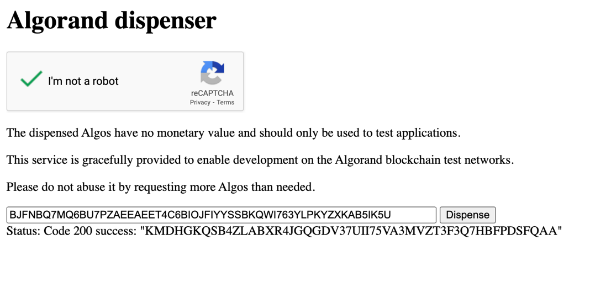
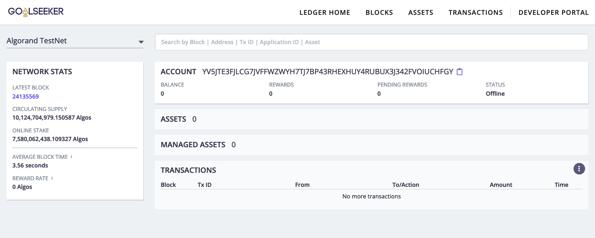
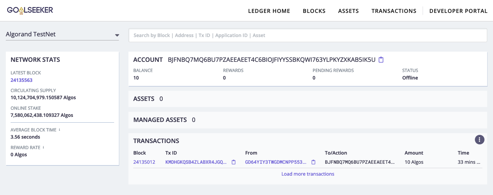
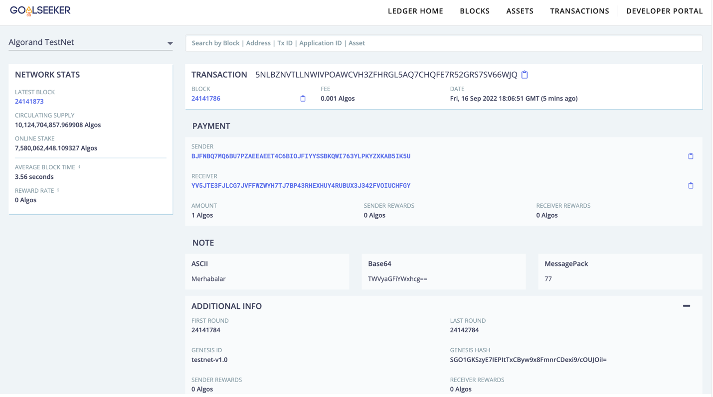

# JavaScript ve Algorand ile Transfer İşlemi Gerçekleştirme

Coin veya varlık transferleri iki hesap arasında gerçekleşmektedir. Bu hesapların adresleri ve gönderici hesabın anahtarı bilinirse işlem herhangi bir sıkıntı olmadan gerçekleşebilir. Kullanılacak iki hesabın gerekmesinden ötürü ilk olarak iki hesap oluşturulması gerekmektedir. Bu işlemi index.js dosyamız içerisinde "AdresYarat()" adı ile tanımladığımız address.js fonksiyonunu çağırarak gerçekleştirebiliriz.

```JavaScript
 AdresYarat()
 AdresYarat() 
```

_Tablo 35 index.js_

Tablo 35'de görüldüğü üzere iki adet adres yaratmak için fonksiyonu iki kez alt alta çağırabiliriz. İsteğe bağlı olarak tek fonksiyon çağırımı yapılıp iki kez kod baştan sona çalıştırılabilir.

```JavaScript
 Hesap Adresi: {addr: 'YV5JTE3FJLCG7JVFFWZWYH7TJ7BP43RHEXHUY4RUBUX3J342FVOIUCHFGY',sk: Uint8Array(64) [73, 210, 193, 126, 210, 247, 243, 185, 29, 63, 146,220, 184, 208, 166, 165, 97, 179, 152, 195, 51, 14,91, 100, 214, 228, 239, 239, 211, 56, 112, 42, 197,122, 153, 147, 101, 74, 196, 111, 166, 165, 45, 179,108, 31, 243, 79, 194, 254, 110, 39, 37, 207, 76,114, 52, 13, 47, 180, 239, 154, 45, 92]}Mnemonic Şifre: empty also disorder large tree hover wedding mutual breeze drill square bottom grocery tower own athlete merge flower venue year pond athlete fatal ability anxietyHesap Adresi: {addr: 'BJFNBQ7MQ6BU7PZAEEAEET4C6BIOJFIYYSSBKQWI763YLPKYZXKAB5IK5U',sk: Uint8Array(64) [102, 2, 203, 55, 191, 81, 93, 114, 62, 116, 30,157, 170, 69, 223, 94, 136, 38, 195, 210, 176, 226,76, 18, 56, 131, 169, 193, 233, 48, 167, 143, 10,74, 208, 195, 236, 135, 131, 79, 191, 32, 33, 0,66, 79, 130, 240, 80, 228, 149, 24, 196, 164, 21,66, 200, 255, 183, 133, 189, 88, 205, 212]}Mnemonic Şifre: error clown orbit brief rival orient peanut bunker father birth hurry magnet escape radio make tired end theory screen box squeeze slow large above fruit 
```

_Tablo 36_

Kod çıktısı Tablo 36'da verildiği üzere birçok veriye sahiptir. Bu veriler içerisinden Mnemonic Şifreler ve Adresler aktif olarak kullanılacaktır.



_Şekil 10_

Hesapları oluşturma süreci tamamlanmış olsa da bu hesaplar arasında transfer yapılacak bakiyelere ihtiyaç olmaktadır. Bu durumu [https://bank.testnet.algorand.network/](https://bank.testnet.algorand.network/) sitesi ile gerçekleştirebiliriz. Şimdilik sadece transferi gönderecek hesaba bakiye yüklemesi yapmak yeterlidir. İlk işlem için B harfi ile başlayan "BJFNBQ7MQ6BU7PZAEE…B5IK5U" adresi gönderici konumunda olacaktır. Y harfi ile başlayan "YV5JTE3FJLCG7…X3J342FVOIUCHFGY" adresi ise alıcı konumunda olacaktır. Kolay anlatım amacıyla bu adreslere baş harflerine karşılık gelecek şekilde Baran ve Yenal adı verilebilir.

Baran Hesabına Şekil 10'da ifade edildiği üzere Algorand dispenser üzerinden bakiye ekleme işlemini gerçekleştirdik. Bu işlemin gerçekleşip gerçekleşmediğini gözlemlemek amacıyla bakiye sorgulama kodumuzu çalıştırabiliriz. Ancak gözlemleme kolaylığı açısından bu kodda birkaç düzenleme yapabiliriz.

```JavaScript
 Bakiye: {"address":"IL3IC7M32U775WXPJTUYODRHJ4QKSM4QQXSX37RHIAHGKNRMY3M4CS2KSU","amount":10000000,"amount-without-pending-rewards":10000000,"apps-local-state":[],"apps-total-schema":{"num-byte-slice":0,"num-uint":0},"assets":[],"created-apps":[],"created-assets":[],"min-balance":100000,"pending-rewards":0,"reward-base":27521,"rewards":0,"round":24132247,"status":"Offline","total-apps-opted-in":0,"total-assets-opted-in":0,"total-created-apps":0,"total-created-assets":0} 
```

_Tablo 37 balance.js Örnek Çıktı_

Şu anda balance.js dosyasını çalıştırdığımızda Tablo 37'de görüldüğü üzere sorgulamak istediği adresin birçok verisini obje formatında ekrana yazdırmaktadır. Ancak bu veriler içerisinden sadece "amount" anahtar kelimesine sahip bakiyesini görmek istemekteyiz.

```JavaScript
 console.log("Bakiye: ",JSON.stringify(hesapBilgisi.amount)); 
```

_Tablo 38 balance.js_

Hazırladığımız balance.js dosyası üzerinde ekrana yazdırma komutunda "hesapBilgisi" objesinin içeresinden nokta operatörü ile istediğimiz anahtar kelimeyi alabiliriz. Bu durumda biz sadece amount parametresini almak istiyoruz. Bu nedenle Tablo 38'de ifade edildiği üzere "hesapBilgisi.amount()" ile istediğimiz veriye erişebiliriz.

Tamamladığımız balance.js dosyası üzerinde yapmamızın faydalı olacağı son değişiklik ise parametresiz bir fonksiyon olan bu değişkeni içerisine "hesapAdresi" parametresini isteyen hale getirmek olacaktır.

```JavaScript
 let bakiyeKontrolEt = (hesapAdresi)=\>{ …let Hesap = hesapAdresi; …} 
```

_Tablo 39_

Tablo 39'da görüldüğü üzere gerekli modifikasyonları yapmak için balance.js içerisinde tanımladığımız fonksiyon olan "bakiyeKontrolEt()" fonksiyonunun parametrelerinin bulunduğu parametre alanına istediğimiz adı verdiğimiz değişken gelir. Bu ad görsel açıdan kolaylık sağlaması amacıyla "hesapAdresi" olarak belirlenmiştir. Devamında Hesap değişkeni tanımlamasında karşılık gelecek şekilde "hesapAdresi" değişkeni atanmıştır.

```JavaScript
 bakiyeSorgula("IL3IC7M32U775WXPJTUYODRHJ4QKSM4QQXSX37RHIAHGKNRMY3M4CS2KSU") 
```

_Tablo 40 index.js_

Yaptığımız değişiklikler ile index.js içerisinde Tablo 40'da gösterildiği üzere fonksiyonun içerisine hesap adresi girilerek fonksiyon çağırılabiliriz.

```JavaScript
 bakiyeSorgula("BJFNBQ7MQ6BU7PZAEEAEET4C6BIOJFIYYSSBKQWI763YLPKYZXKAB5IK5U")bakiyeSorgula("YV5JTE3FJLCG7JVFFWZWYH7TJ7BP43RHEXHUY4RUBUX3J342FVOIUCHFGY") 
```

_Tablo 41 index.js_

Tablo 41'de gösterildiği üzere Baran ve Yenal hesaplarının bakiyelerine kolaylıkla erişim sağlanılır.

```JavaScript
 Bakiye: 10000000Bakiye: 0 
```

_Tablo 42 index.js Çıktı_

Dosyayı bulunduğu klasördeki terminalden "node index.js" komutu ile çalıştırdığımızda karşımıza Tablo 42' de bulunan çıktı gelmektedir. Baran adresine yükleme yapıp Yenal adresine yükleme yapmadığımız için bu sonuç beklenen bir sonuçtur.

Ayrıca bakiyelere sadece kodlama içerisinden erişilmemektedir. Explorer adı verilen siteler üzerinden de hesap bakiyeler kontrol edilebilmektedir. Bu sitelerden biri olan [https://goalseeker.purestake.io/algorand/testnet/](https://goalseeker.purestake.io/algorand/testnet/) sitesini kullanacağız.


 

_Şekil 11 Yenal Hesabı_

_Şekil 12 Baran Hesabı_

Testnet içerisinde olduğumuza emin olduktan sonra taramamızı gerçekleştirdiğimizde Şekil 11'de yer alan Baran hesabının içerisinde 10 Algo olduğunu görüntülemekteyiz. Yenal hesabını Şekil 11'de olduğu şekilde kontrol ettiğimizde isteğimiz doğrultusunda boş olduğunu gözlemlemekteyiz.

Kodlama kısmına daha önce kullandığımız fonksiyonları birbirleri ile birleştirmemiz gerekmektedir. Yine aynı şekilde işlem kolaylığı olması açısından "index.js" dosyasının bulunduğu klasöre gidilerek "transection.js" dosyası oluşturulur. Transfer işlemleri bu dosya içerisinde yer alacaktır.

```JavaScript
 const Algosdk = require("algosdk")require("dotenv").config() 
```

_Tablo 43_

Başlangıçta her kod dosyamıza başladığımız gibi Tablo 43'de ifade edildiği üzere yani paket ekleme ile başlarız. JavaScript içerisindeki "require()" fonksiyonunu kullanarak çağırdığımız paketi istediğimiz adı vereceğimiz sabite kaydederiz. Şu anlık bu sabitin adı Algosdk olarak belirlenmiştir. Devamında ".env" klasörlere erişimimizi sağlayan dotenv paketinin eklenmesi gerekmektedir.

```JavaScript
 const port=""const token={"x-api-key": process.env.API};const TestSunucusu= "https://testnet-algorand.api.purestake.io/ps2" 
```

_Tablo 44_

Paket eklemesini gerçekleştirdikten sonra Tablo 44'te ifade edildiği üzere zincir üzerinde işlem yapabilmemizi sağlayan değerlerin girilmesi gerekmektedir. Bu değerler sırasıyla:

- Port: İşlemin gerçekleşeceği bağlantı portunu ifade etmektedir. Kullanım amacımızdan dolayı boş olarak bırakılabilir.
- Token: API anahtarımızı ifade etmektedir. "Purestake" sitesinden aldığımız API anahtarını güvenlik nedenleriyle .env klasörü içerisinden "process.env" metodu ile erişilmektedir.
- TestSunucusu: İşlemin gerçekleşmesini istediğimiz ağı ifade etmektedir. Bu işlemin test sunucusunda gerçekleşmesini istediğimizden ötürü "Purestake" sitesinde bulabileceğimiz zincir adresini yazmaktayız.

```JavaScript
 const kullanıcı = new Algosdk.Algodv2(token,TestSunucusu,port); 
```

_Tablo 45_

İşlemleri yapacağımız özellikleri tanımladıktan sonra bu özellikleri birleştiren bir fonksiyon gerekmektedir. Tablo 45'te ifade edildiği üzere istediğimiz ismi kullanarak tanımladığımız değişkene "new" metodu ile boş bir obje oluşturup içerisine Algosdk kütüphanesinde bulunan Algodv2 metodu ile obje özellikleri ekleriz. Bu özellikler parantez içerisinde ifade edildiği üzere API anahtarı, sunucu adresi ve port bilgisi olmaktadır. Bu parametrelerin sıralaması son derece önemli olmaktadır.

```JavaScript
 ( async ( ) =\> {
}) 
```

_Tablo 46_

Gerekli parametreleri birleştirmemizden sonra işlemlere başlamak için asenkron bir yapı gerekmektedir. Bu yapıyı oluşturmak için boş bir "async" fonksiyonu oluşturulabilir. Tablo 46'da ifade edildiği şekilde tanımlanan asenkron "arrow funtion" yapısı içerisine herhangi bir değişken almaz ve çağrılamayı beklemeden kod satırı ulaşır ulaşmaz çalışır.

```JavaScript
 let parametreler = await kullanıcı.getTransactionParams().do(); 
```

_Tablo 47_

Asenkron fonksiyonun içerisine girdiğimizde ilk olarak elde etmemiz gereken parametrelerin tanımlandığı bir değişken oluşturulması gerekmektedir. Bu değişkeni istediğimiz ad ile tanımlayabiliriz. Tablo 47'de görüldüğü üzere tanımın karşı tarafında "await" ile başlandığı görüntülenmektedir. Bu durumun nedeni sonrasında gelecek fonksiyonun uzun zaman alması ihtimaline karşılık kodun beklemeye alınmasıdır. Alacağımız parametrelerin kullanıcı olarak tanımladığımız obje içerisinde olması nedeniyle obje içerisinden nokta operatörü ile "getTransactionParams()" metodu çağrılır. Bu metodun çalışması amacıyla satır sonuna .do(); metodu eklenir.

```JavaScript
 let mnemonic = "error clown orbit brief rival orient peanut bunker father birth hurry magnet escape radio make tired end theory screen box squeeze slow large above fruit" ;let çevrilenhesap = Algosdk.mnemonicToSecretKey (mnemonic) ; 
```

_Tablo 48_

Parametreleri aldıktan sonra veya almadan önce gönderim yapacağımız hesabın erişimine sahip olmamız için birkaç tanımlama yapmamız gerekmektedir. Bu işlem için Tablo 48'de ifade edildiği üzere mnemonic adını verdiğimiz değişkene gönderim işlemini yapacak olan hesabın anahtarını girmemiz gerekmektedir. Gönderme işlemini Baran yapacağı için, yani paranın çıkış yapacağı hesap Baran'ın hesabı olacağı için bu değişkene Baran hesabının anahtarı kaydedilir. Mnemonic olarak kaydedilen değişken insanlar tarafından okunabilir formattadır ancak makine tarafından anlamsız olmaktadır. Bu nedenle bu anahtarı Mnemonic değerden Secret Key değerine çevirmemiz gerekmektedir. Bu işlemi yaparken Algosdk paketi içerisinde bulunan "mnemonicToSecretKey" metodunu kullanmamız gerekmektedir. Bu değişken içerisine parametre olarak mnemonic değerini almaktadır ve "çevrilenhesap" adı altıda kodumuz içerisinde kullanılmak üzere kaydedilebilir.

```JavaScript
 let miktar = 1000000;const enc = new TextEncoder(); 
```

_Tablo 49_

Transfer işlemi içerisinde bazı değişkenleri tanımlamamız gerekmektedir. Bu değişkenleri tanımlamadan da kodumuz sıkıntısız şekilde çalışır ancak Tablo 49'da görüldüğü üzere anlatım kolaylığı açısından kodumuzda bu şekilde yer alacaktır. İlk tanımladığımız değişken miktar olmaktadır. Yapacağımız transfer bu miktar kadar olacaktır. Büyük bir sayı gibi görünsede bu durum ondalık sistemden kaynaklanmaktadır. 1000000 birim 1 Algo'ya denk gelmektedir. Sonrasında tanımladığımız "enc" değişkeni yazacağımız "string" değerini zincire yazılabilir hale getirmektedir. Bu işlemi gerçekleştirirken "new" işlemi ile bir obje oluşturmaktadır.

```JavaScript
 let transferİşlemi = {"from": çevrilenhesap.addr ,"to" : " YV5JTE3FJLCG7JVFFWZWYH7TJ7BP43RHEXHUY4RUBUX3J342FVOIUCHFGY " ,"fee" : 1,"amount" : miktar ,"firstRound" : parametreler.firstRound ,"lastRound" : parametreler.lastRound ,"genesisID" : parametreler.genesisID ,"genesisHash" : parametreler.genesisHash ,"note" : enc.encode("Merhabalar"),} 
```

_Tablo 50_

Transferi gerçekleştirmek için bu transferin özelliklerini gösteren bir değişken tanımlanmaktadır. Bu değişkene istenilen isim verilebilir. Şimdilik anlam karışıklığı yaratmaması amacıyla Tablo 50'de görüldüğü üzere "transferİşlemi" isimlendirmesi verilmiştir. Aldığı parametrelere teker teker bakılması gerekirse:

- **From:** Hangi adresten miktarın gönderileceğini belirtmektedir. Daha öncesinde "Secret-Key" ile hesaba dönüştürdüğümüz "çevrilenhesap" değişkeninin "addr" anahtarına erişerek işlemi tamamlar. Baran hesabının adresi olmaktadır.
- **To:** Miktarın hangi adrese gönderileceğini belirtmektedir. 64 karakterden oluşan hesap adresini almaktadır. Bu adres dışında miktarın gönderileceği hesabın anahtarı ve benzeri herhangi veriye ihtiyaç duyulmaz. Yenal hesabının adresi olmaktadır.
- **Fee:** İşlem ücretini ifade etmektedir. Yapılacak transfer sonucunda ne kadar bir işlem ücreti kesileceğini belirtmektedir. Sıfır değerine sahip olmamak koşulu ile herhangi değere sahip olabilir. Testnet dışına çıkıldığında farklı değerler alabilir. İnteger girdi istemektedir.
- **Amount:** Gönderilecek olan miktarı ifade etmektedir. Bu değeri miktar olarak üst satırlarda tanımladığımız için karşılığına amount değerini yazabiliriz. İçerisine integer değeri almaktadır.
- **firstRound:** İşlemin geçerli olduğu ilk tur olmaktadır. İşlem bu turdan önce gönderilirse ağ tarafından reddedilecektir. Parametreler objesi içerisinden "firstRound" anahtarı ile erişilip anahtara eklenebilir.
- **lastRound:** İşlemin geçerli olduğu bitiş tur olmaktadır. Bu turdan sonra işlem ağ tarafından reddedilecektir. Parametreler objesi içerisinden "lastRound" anahtarı ile erişilip transfer objesi içerisinde ilgili anahtara kayıt edilebilir.
- **GenesisID:** İşlemin gerçekleşeceği ağı insanlar tarafından okunabilir şekilde ifade eden değişken olmaktadır. Parametreler içerisinden "genesisID" anahtarı ile erişilip transfer içerisinde ilgili anahtara kaydedilebilir.
- **GenesisHash:** İşlemin gerçekleşeceği ağın makine tarafından okunabilir hash değerine karşılık gelmektedir. Parametreler içerisinden "genesisHash" değeri ile erişilip transfer objesi içerisinde ilgili anahtara kaydedilebilir.
- **Note:** İşlemi gerçekleştirirken eklemek istediğimiz notu ifade etmektedir. Uzun olmamak koşuluyla istediğimiz notu bu anahtar içerisine ekleyebiliriz. Eklemeyi gerçekleştirirken notumuzu uygun şifreleme metodu ile düzenlememiz gerekmektedir. Bu nedenle daha önce tanımlamasını gerçekleştirdiğimiz "enc" değişkeni üzerinden "encode" metodunu çağırabilir, içerisine parametre olarak istediğimiz notu girebiliriz.

```JavaScript
 let imzalanmışTransfer = Algosdk.signTransaction(transferİşlemi, çevrilenhesap.sk); 
```

_Tablo 51_

Transfer objesini oluşturduktan sonra bu objeyi gönderici kişinin imzalaması gerekmektedir. Tablo 51'de görüldüğü üzere istediğimiz isim ile değişkenimizi kaydederiz. Algorand SDK içerisinden eriştiğimiz "signTransection()" metodu ile bu işlem imzalanır. Bu metot içerisine iki adet parametre almaktadır. Bu parametreler:

- **Transferİşlemi:** Transferin değişkenlerinin girildiği objeyi ifade etmektedir.
- **Çevrilenhesap.sk:** Gönderimin yapılacağı adresin Secret Key değerini yani gizli anahtarını ifade etmektedir. Bu anahtar ile işlemi imzalarız ve mümkün kılarız.

```JavaScript
 let gönderilenTransfer = await kullanıcı.sendRawTransaction(imzalanmışTransfer.blob).do();console.log("Transfer : ", gönderilenTransfer.txId) 
```

_Tablo 52_

İmzalanan transferi gerçekleştirmek için zincire göndermemiz gerekmektedir. Bu işlemi gerçekleştirmek amacıyla Tablo 52'de görüldüğü üzere istediğimiz isim ile kaydettiğimiz değişkenimizi asenkron yapı kazandıran "await" anahtarı ile tanımlarız. "Await" fonksiyonda bu kısımda durulup işlemin beklenmesi gerektiğini söylemektedir. Sonrasında kullanıcı objesi üzerindeki "sendRawTransaction()" metoduna erişilerek gönderilme hedeflenir. Bu metot içerisine "imzalananTransfer" değişkeninin alır. Ancak bu değişken yalın hali ile parametre olamaz. Bu değerin "blob" adını verdiğimiz metoda sokulması gerekmektedir. Blob metodu değerin herhangi bir program tarafından okunabilen "binary" haline getirilmesini sağlamaktadır. Bu sayede zincir içerisine kolaylıkla işleme alınabilir. Son olarak da metodu çalıştırmak için ".do()" ibaresi gerekmektedir. Bu sayede metot çalışır ve "gönderilenTransfer" değişkeni içerisine kaydedilir. Son olarak bu değişken "console.log()" fonksiyonu ile ekrana yazdırılır.

```JavaScript
 ().catch(err =\>{console.log(err);}) 
```

_Tablo 53_

Asenkron fonksiyonunun tam çıkış parantezine gelindiğinde Tablo 53'de verildiği üzere bir hata yakalama fonksiyonu eklenebiliniz. Bu sayede fonksiyonda oluşabilecek hatalar ekrana yazdırılır. Bu durumu sağlamak içim "().catch" Arrow Fonksiyonu ile yakaladığımız hatalar "console.log()" fonksiyonu ile ekrana yazdırılır.

```JavaScript
 const Algosdk = require("algosdk")require("dotenv").config()const port=""const token={"x-api-key": process.env.API};const TestSunucusu= "https://testnet-algorand.api.purestake.io/ps2"
const kullanıcı = new Algosdk.Algodv2(token,TestSunucusu,port);
( async ( ) =\> {let parametreler = await kullanıcı.getTransactionParams().do();
let mnemonic = "error clown orbit brief rival orient peanut bunker father birth hurry magnet escape radio make tired end theory screen box squeeze slow large above fruit" ;let çevrilenhesap = Algosdk.mnemonicToSecretKey (mnemonic) ;let miktar = 1000000;const enc = new TextEncoder();let transferİşlemi = {"from": çevrilenhesap.addr ,"to" : "BJFNBQ7MQ6BU7PZAEEAEET4C6BIOJFIYYSSBKQWI763YLPKYZXKAB5IK5U" ,"fee" : 1,"amount" : miktar ,"firstRound" : parametreler.firstRound ,"lastRound" : parametreler.lastRound ,"genesisID" : parametreler.genesisID ,"genesisHash" : parametreler.genesisHash ,"note" : enc.encode("Merhabalar"),}
let imzalanmışTransfer = Algosdk.signTransaction(transferİşlemi, çevrilenhesap.sk);let gönderilenTransfer = await kullanıcı.sendRawTransaction(imzalanmışTransfer.blob).do();
console.log("Transfer : ", gönderilenTransfer.txId)})().catch(err =\>{console.log(err);}) 
```

_Tablo 54 transection.js Tamamı_

Kod bloğumuz tamamlanmıştır ve Tablo 54'de ifade edilmiştir. Kodun işlevinden adım adım bahsedilmesi gerekirse:

- İlk olarak gerekli paketler require fonksiyonu ile istenilen değişkenlere eklenir ve kod içerisinde kullanıma hazır hale gelir.
- Sonrasında kullanıcıyı oluşturacak port, token ve sunucu adresi gibi değişkenler ilgili yerelden farklı değişkenlere kaydedilir.
- Kaydedilen değişkenlerden SDK kullanılarak bir kullanıcı objesi oluşturulur.
- Asenkron bir fonksiyon tanımlanır.
- Fonksiyon içerisinde işlemi gerçekleştirecek parametreler kullanıcı objesinden türetilir.
- Gönderici hesabın yani Baran hesabının mnemonic anahtarın tanımlanması yapılır ve bu anahtardan hesabın kendisine erişilir.
- Transfer edilecek miktar değişken olarak kaydedilir.
- "Transferİşlemi" adlı bir obje oluşturularak yapılacak transferin tüm parametreleri uygun formatta ve anahtarlar ile kaydedilir.
- Gönderimi sağlayan Baran Hesabı tarafından işlem imzalanır ve değişkene kaydedilir.
- Transfer ağa kullanıcı objesi tarafından asenkron bir şekilde gönderilir.
- Yapılan transferin adresi konsola yazdırılır.
- Olası hatalar ".catch()" fonksiyonu ile yakalanarak ekrana yazdırılır.

```JavaScript
 Transfer : 5NLBZNVTLLNWIVPOAWCVH3ZFHRGL5AQ7CHQFE7R52GRS7SV66WJQ 
```

_Tablo 55 balance.js çıktısı_

Kodun bulunduğu klasöre terminalden erişim sağlanıp "node transection.js" komutunun çağırılması sonucunda hatasız bir şekilde bağlantı kurulursa Tablo 55'te ifade edilen şekilde işlem adresi ekrana yazdırılmış olacaktır. Bu işlem adresini explorerlarda aratmamız mümkündür.



_Şekil 13_

Şekil 13'de ifade edildiği üzere [https://goalseeker.purestake.io/algorand/testnet](https://goalseeker.purestake.io/algorand/testnet) sitesi üzerinde tesnette olduğumuza emin olarak gerçekleştirdiğimiz transfer aramasında hesaplar yazdığımız not işlem ücreti tarih ve benzeri açıklamaların yer aldığı görünmektedir.

Transferi gerçekleştirmemiz sonrasında yazdığımız balance.js kodunu yeniden çalıştırarak kontrol edebiliriz.

```JavaScript
 bakiyeSorgula("BJFNBQ7MQ6BU7PZAEEAEET4C6BIOJFIYYSSBKQWI763YLPKYZXKAB5IK5U")bakiyeSorgula("YV5JTE3FJLCG7JVFFWZWYH7TJ7BP43RHEXHUY4RUBUX3J342FVOIUCHFGY") 
```

_Tablo 56 index.js_

Tablo 56'da verildiği şekilde index.js içerisinde "bakiyeSorgula" fonksiyonunu farklı adresler için iki kez çağırabiliriz.

```JavaScript
 Bakiye: 8999999Bakiye: 1000000 
```

_Tablo 57 index.js Çıktı_

Fonksiyonu bulunduğu klasörden terminal üzerinden "node index.js" komutu ile çağırdığımızda her iki adresin de bakiyesi Tablo 57'de görüldüğü şekilde karşımıza çıkmaktadır. Baran Hesabının bakiyesi 1000001 azalırken Yenal Hesabının bakiyesi 1000000 artmıştır. Bu iki değer arasındaki fark işlem ücretinden kaynaklanıyor olmaktadır.