# JavaScript ve Algorand ile ASA Token İşlemleri

Algorand yapısı dahilinde üzerinde token oluşturmaya izin veren bir blokzincirdir. Algorand bu Tokenlara ASA (Algorand Standard Assets) adını vermiştir. Algorand blokzinciri üzerinde bir ASA oluşturmak için ekstra bir akıllı kontrat oluşturmaya gerek bulunmamaktadır. Bu başlığımızda Algorand SDK ile JavaScript dili ile ASA'lar oluşturacağız, transfer edeceğiz ve yok edeceğiz.

**ASA Oluşturulması İçin İlgili Hesapların ve Araçların Kurulması:**

JavaScript üzerinde daha öncesinden oluşturduğumuz index.js dosyasını içeren dosya üzerinde işlemlerinizi yapacağız. İlk olarak transfer ve token oluşturma işlemlerini yapacağımız adresleri oluşturmamız gerekmektedir.

```JavaScript
 AdresYarat()AdresYarat() 
```

_Tablo 58_

Bu kısımda Tablo 58'de ifade edildiği üzere daha önceden yazdığımız ve index.js dosyasına eklediğimiz "address" kodunu tanımladığımız değişken adı ile çağırabiliriz. İki adres tanımlanacağı için fonksiyonu art arda iki kez çağırabiliriz.

```JavaScript
 Hesap Adresi: {addr: 'IOIBYZPBAISY636GLWF2PRFXZCPVN2DKXKCCOUCANPA2BROUKV2UTOPVYA',sk: Uint8Array(64) [139, 85, 95, 75, 240, 65, 212, 43, 186, 198, 11,75, 183, 95, 166, 243, 95, 248, 208, 247, 18, 196,175, 233, 96, 145, 172, 111, 208, 171, 171, 95, 67,144, 28, 101, 225, 2, 37, 143, 111, 198, 93, 139,167, 196, 183, 200, 159, 86, 232, 106, 186, 132, 39,80, 64, 107, 193, 160, 197, 212, 85, 117]}Mnemonic Şifre: ramp later certain business possible memory cupboard armed truly learn spring you vague vintage nut series curious lonely emerge width patch turtle wool able rice
Hesap Adresi: {addr: 'BDG7MLDNCHDJH4XV7FS3YRQN2NTIUMWM4FKFF5Z5YQ4JZGQRXNEFD5L4TQ',sk: Uint8Array(64) [128, 169, 78, 245, 32, 229, 73, 96, 12, 225, 255,27, 152, 252, 69, 16, 11, 254, 250, 62, 86, 115,253, 223, 0, 250, 80, 166, 224, 228, 162, 201, 8,205, 246, 44, 109, 17, 198, 147, 242, 245, 249, 101,188, 70, 13, 211, 102, 138, 50, 204, 225, 84, 82,247, 61, 196, 56, 156, 154, 17, 187, 72]}Mnemonic Şifre: copy deny kingdom faith need blossom anchor zoo address venue carry rain winter salt rapid infant zero address laptop govern scout rice escape absorb stove 
```

_Tablo 59_

Index.js dosyasını oluşturduğumuzda karşımıza Tablo 59'da ifade edilen çıktı gelmektedir. Bu çıktı içerisinde bizlere sadece Mnemonic Şifre ve Adres değerleri gerekmektedir ve bu nedenle sonradan kullanmak üzere kaydedilmelidir. Secret Key adını verdiğimizi "sk" değeri Mnemonic şifre içeresinden istenilen vakit oluşturulabildiği için ayrıca kaydetmeye gerek olmamaktadır.

Çıktıda ifade edilen 'IOIBYZPB…A2BROUKV2UTOPVYA' ve 'BDG7ML…Z5YQ4JZGQRXNEFD5L4TQ' adresleri projemizde kullanacağımız adresler olacaktır. Anlatım kolaylığı açısından bu adreslere anlatım içerisinde baş harflerine denk gelen isimler kullanılacaktır. 'IOIBYZPB…A2BROUKV2UTOPVYA' adresi için İrem adı kullanılacak olunurken 'BDG7ML…Z5YQ4JZGQRXNEFD5L4TQ' adresi için Beren adı kullanılacaktır. Transfer ve coin işlemleri belirli bir işlem ücreti (fee) gerektirmektedir. Bu nedenle oluşturulduğumuz hesaplara [https://bank.testnet.algorand.network/](https://bank.testnet.algorand.network/) adresi üzerinden Test coinleri eklemek mümkündür.

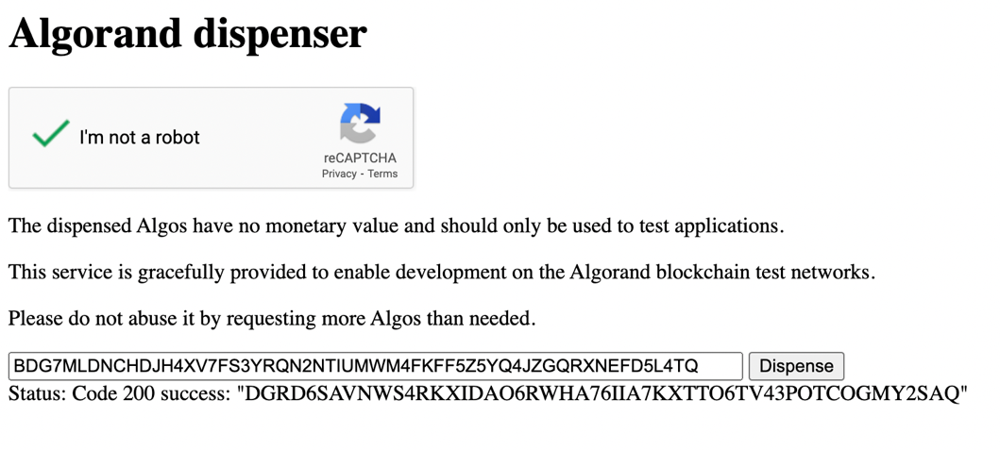

_Şekil 14 Beren Hesabı Bakiye Ekleme_

_Şekil 15 İrem Hesabı Bakiye Ekleme_

Şekil 14 ve 15'de görüldüğü üzere ilgili hesaplara site içerisinden "dispense" butonu sayesinde bakiye ekleme yapılır. Aralarında farklılık olması amacıyla İrem hesabına iki kez dispense yapılmıştır.

Bu adreslere bakiye eklenip eklenmemesi durumuna farklı yöntemler ile bakılması mümkündür. İlk olarak önceki bölümlerde yazdığımız bakiye sorgulama kodu ile bu işlemi gerçekleştirebiliriz.

```JavaScript
 const bakiyeSorgula = require("./balance")require("dotenv").config()
bakiyeSorgula("IOIBYZPBAISY636GLWF2PRFXZCPVN2DKXKCCOUCANPA2BROUKV2UTOPVYA")bakiyeSorgula("BDG7MLDNCHDJH4XV7FS3YRQN2NTIUMWM4FKFF5Z5YQ4JZGQRXNEFD5L4TQ") 
```

_Tablo 60_

Kod içerisinden bakiye sorgulamak için index.js üzerinde require ile çağırdığımız bakiye sorgulama dosyasını istediğimiz isimle kaydederiz ve bu değişkene parametre olarak bakiyelerini sorgulamak istediğimiz adresleri gireriz. İki adres inceleyeceğimizden dolayı Tablo 60'ta ifade edildiği üzere bu işlemi iki farklı adres için iki kere alt alta gerçekleyebiliriz.

```JavaScript
 Bakiye: 20000000Bakiye: 10000000 
```

_Tablo 61_

İlgili kodu bulunduğu dosya konumu üzerinden terminalden "node index.js" komutu ile çalıştırabiliriz. Bu kodun çalışması sonrasında Tablo 61'de ifade edildiği gibi bir çıktı ile karşılaşılmaktadır. Daha önce de bahsedildiği gibi 20000000 Milialgo yani 20 Algo 'ya sahip hesap iki kez "dispense" işlemi yapılan İrem hesabı olmaktadır. 10000000 Milialgo yani 10 Algo'ya sahip olan hesap ise Beren hesabı olmaktadır.

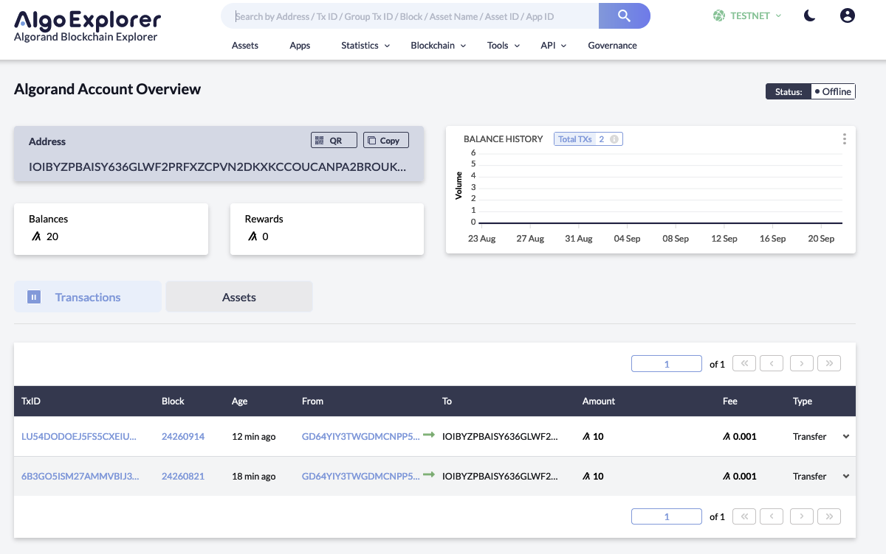

_Şekil 16 İrem Hesabı_

Bakiye sorgu işlemini aynı zamanda [https://algoexplorer.io/](https://algoexplorer.io/) sitesinden de gerçekleştirebiliriz. Bu siteden aynı zamanda transferin kendini de görüntüleyebiliriz.

_Şekil 17 Beren Hesabı_


Şekil 17 ve 18'de görüldüğü üzere "algoexplorer" sitesinden de sağ üst köşede testnette olduğumuza emin olarak adres sorgusu gerçekleştirilir. Bu sitede yapılan transferin hangi adres üzerinden geldiği de görsel olarak kullanıcılara sunulmaktadır. Transferlerde iki transferin de ortak hesaptan yapıldığı göze çarpmaktadır. Bu Algorand'ın geliştiricilere test coini yolladığı "GD64YIY3TWGDMCNPP553DZPPR6LDUSFQOIJVFDPPXWEG3FVOJCCDBBHU5A" adresi olmaktadır.

Oluşturulan hesapların görsel bir şekilde takibi için bir sıcak cüzdan kullanabiliriz. Bu işlem için Algosigner adlı eklenti kullanılabilir. Bu eklenti Chromium tabanlı tarayıcılarda [https://chrome.google.com/webstore/detail/algosigner/kmmolakhbgdlpkjkcjkebenjheonagdm](https://chrome.google.com/webstore/detail/algosigner/kmmolakhbgdlpkjkcjkebenjheonagdm) ile tarayıcıya eklenir. Bu kitabın yazıldığı tarihte Firefox için henüz Algosigner eklentisi bulunmamaktadır.

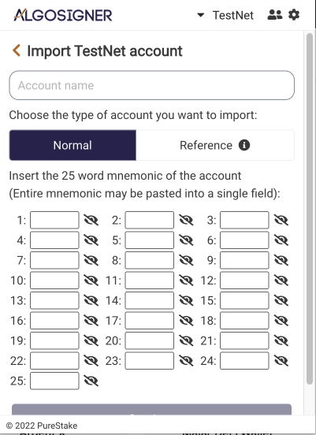
_Şekil 18_

Eklenti eklendikten sonra eklenilen tarayıcı içerisinde yapboz parçası ile erişilebilir. Açıldıktan sonra ilk kez açılıyorsa bir hoş geldin ekranı ile karşılaşmaktayız. Bu ekrandan "get started" seçeneğini seçerek ilerlememiz gerekmektedir. Sonrasında eklenti bu cüzdan içerisinde bulunacak tüm adresler için ortak kullanılacak bir şifre talep etmektedir. Bu şifre en az 8 karakterden oluşmaktadır. Şifreleri oluşturduktan ve "Create wallet" butonuna basıldıktan sonra karşımıza "Add account" yazısının olduğu bir ekran gelmektedir. İlk olarak bu ekranın sağ üst köşesinde bulunan "MainNet" yazısına basarak "Testnet" seçeneğini seçmemiz gerekmektedir. Sonrasında altında bulunan "Add account" düğmesine basmaktayız. Burada karşımıza 3 adet seçenek çıkmaktadır. Bu seçenekler arasından "Import existing account" seçeneği ile işlemlerimize devam edeceğiz.

Açılan ekranda Şekil 18'de ifade edildiği şekilde bir ekran karşımıza çıkmaktadır. İlk olarak "Account name" kısmında cüzdanımıza bu cüzdanı tanımlayacak bir isim vermemiz gerekmektedir. Bu isim adres ile doğrudan bağlanmayacak olup sadece Algosigner üzerinde görsel olarak var olacaktır. Bu nedenle istenilen bir isim tercih edilebilir. İsmin eklemesi gerçekleştikten sonra hemen altında bulunan cüzdan tipi seçeneğinin "Normal" seçeneğinde olduğundan emin oluruz. Son olarak 25 karakterden bulunan Mnemonic anahtarı cüzdan içerisine girmemiz gerekmektedir. Bu anahtarı kelime kelime her satıra ekleye ekleye gitmemiz gerekmektedir. Ekleme işlemi tamamlandıktan sonra alt kısma kaydırarak "Continue" tuşuna basılarak devam edilir. Algosigner son adım olarak eklenti kurulumunda girilen şifreyi istemektedir.

_Şekil 20_

Şekil 20'de ifade edilen şekilde doldurulan bilgiler ile cüzdanlar Algosigner üzerinde eklenmiş hal almaktadır.

**ASA Token Oluşturma:**

Hesapların oluşumu sonrasında bu hesaplar içerisinden biri seçilip bu adres üzerinden token oluşturulabilir. Şimdilik İrem hesabından token üreteceğiz. Bu nedenle index.js dosyasının bulunduğu klasöre gidilerek "asa\_irem\_create.js" adlı dosya oluşturulabilir. Token oluşturma kodları bu dosya içerisinde gerçekleştirilecektir.

```JavaScript
 const Algosdk = require('algosdk');require("dotenv").config() 
```

_Tablo 62_

Her JavaScript dosyasında başlamamız gereken şekliyle Tablo 62'da belirtildiği gibi bu dosyada da paketlerin tanımlanması ile başlamamız gerekmektedir. Paketleri "require" fonksiyonu ile JavaScript içerisinde istediğimiz değişkene atayarak kullanabiliriz. Token oluşturma işlemi için şu anlık iki adet paket eklemekteyiz. Bu paketler:

- **Algosdk:** Algorand blokzincirine bağlanmamızı sağlayan SDK paketidir.
- **Dotenv:** Kodumuzu paylaşırken saklamak istediğimiz değerleri içeresinde sakladığımız .env dosyasına erişimi sağlayan bir pakettir.

```JavaScript
 const server="https://testnet-algorand.api.purestake.io/ps2";const port="";const token={ "x-api-key": process.env.API }; 
```

_Tablo 63_

Paketlerin tanımlanmasından sonra işlemin gerçekleşeceği özellikleri tanımlamak gerekmektedir. Bu nedenle birtakım değişkenler oluşturulmaktadır. Tablo 63'te ifade edilen bu değişkenleri biraz daha ayrıntılı anlatmak gerekirse;

- **Server:** İşleminin yapılacağı ağı göstermektedir. Token oluşturma işlemini testnet üzerinden oluşturacağımızdan dolayı "Purestake" üzerinden alınan URL ile tanımlama yapılmaktadır.
- **Port:** İşlemin yapılacağı bağlantı portuna denk gelmektedir. Bazı uygulamalar için 4001 değeri de kullanılabilir. Şimdilik boş bırakılacaktır.
- **Token:** API anahtarını ifade etmektedir. Bu anahtar öncesinde de detaylı şekilde anlatıldığı üzere "Purestake" sitesinden elde edilmekte olup zincir üzerinde yapılan işlemlerin hesabımıza bağlanmasını sağlar. Obje olarak tanımlanır ve "x-api-key" anahtarını alan bir değer atanır. Bu değer içerisine direkt olarak API anahtarını string olarak girmek mümkündür. Ancak güvenlik ve profesyonellik açısından son derece önemli olan bu API anahtarını paylaşıma gizli olan ".env" dosyasından almak daha işlevsel olacaktır. Önceden eklediğimiz paket üzerinden "process.env" fonksiyonu içerisinden API değişkenine erişmek için "process.env.API" şeklinde yazmamız gerekmektedir. Bu şekilde yazıldıktan sonra anahtar ile obje içerisine token değişkeni olarak değişken kaydedilebilir.

```JavaScript
 let kullanıcı = new Algosdk.Algodv2(token, server, port); 
```

_Tablo 64_

İşlem değişkenlerinin tanımlanmasından sonra bu değişkenlerin birleştirilmesi gerekmektedir. Bu işlemi Tablo 64'te ifade edildiği üzere Algosdk paketinin "Algodv2" metodu ile gerçekleştirmek mümkün olmaktadır. Değişkenlerin bir araya gelmesinden bir obje ortaya çıktığından dolayı fonksiyon çağırılmadan önce başına "new" ibaresi eklenmelidir. Fonksiyon içerisine öncesinde tanımladığımız token, server ve port değerlerini almaktadır. Sıralamaya dikkat edilmesi gerekmektedir. Yanlış sıralama ile parametreler çağırılırsa fonksiyon doğru bir şekilde çalışmayacaktır.

```JavaScript
 var irem\_mnemonic = "ramp later certain business possible memory cupboard armed truly learn spring you vague vintage nut series curious lonely emerge width patch turtle wool able rice"; var iremHesap = Algosdk.mnemonicToSecretKey(irem\_mnemonic); 
```

_Tablo 65_

Token'ların bir hesaptan türetilmesi gerekmektedir. Bu nedenle bu hesaba tokenlar bağlı hale gelmektedirler. Tablo 65'de ifade edildiği üzere kodumuza tokenların oluşturulacağı hesabın eklenmesi gerekmektedir. İlk olarak daha öncesinde oluşturduğumuz İrem hesabının mnemonic anahtarını bir değişkene kaydetmemiz gerekmektedir. Bu değişkenin adı tamamen tercihe bağlıdır ancak anlatım kolaylığı amacıyla "irem\_mnemonic" isimlendirilmesi kullanılacaktır. Değişken tanımlanması yapıldıktan sonra bu anahtarın hesabın kendisine dönüştürülmesi yani "SecretKey" değerinin oluşturulması gerekmektedir. Bu işlemi gerçekleştirmek için Algosdk paketi içerisinden "mnemonicToSecretKey" metodu çağırılabilir. Bu metot içerisine mnemonic anahtarı almaktadır. Çıktı olarak da hesabı obje olarak ifade etmektedir.

```JavaScript
 (async () =\> {}) 
```

_Tablo 66_

Hesap ve kullanıcının oluşması sonrasında Token'ın içeriğini tanımlayacağımız fonksiyona geçiş yapılabilir. Token'ı oluşturacak parametreler zincir üzerinden elde edilirken belirli miktarlarda beklenmesi gerektiği için fonksiyon "async" olarak tanımlanacaktır. Tablo 66'da ifade edildiği üzere fonksiyon herhangi bir çağırım beklemeden çalıştırma satırı gelir gelmez işleme geçecektir. Bu nedenle isim tanımlanmamıştır. Ayrıca fonksiyonun içerisine herhangi bir parametre almamasından dolayı parantezler boş bırakılmıştır. Tanımlarımız ve token oluşumumuz bu asenkron fonksiyon içerisinde yer alacaktır.

```JavaScript
 let params = await kullanıcı.getTransactionParams().do();let note = undefined; let adres = iremHesap.addr;let defaultFrozen = false;let decimals = 0;let totalIssuance = 1000000;let unitName = "JSCOİN";let assetName = "JS Coin";let assetURL = " https://www.linkedin.com/in/aybarsayan/ ";let assetMetadataHash = "01234567890123456789012345678901";let manager = iremHesap.addr;let reserve = iremHesap.addr;let freeze = iremHesap.addr;let clawback = iremHesap.addr; 
```

_Tablo 67_

Token oluşturulurken belirli parametrelere ihtiyaç duyulmaktadır. Bu parametreler Token'ı tanımlayan ve yapılandıran özellikler olmaktadır. Tablo 67'de ifade edildiği üzere birçok parametre Token'ı tanımlayan değişkenler içerisinde yer alabilir. Bu değişkenler transfer bilgilerini içerebilmektedir. Bu durumun nedeni Token oluşturma işleminin temelinde bir transfer işlemi olmasıdır. Bu değişkenlerin tanımlarına bakılacak olunursa;

- **Params:** Kullanıcı ile türetilen işlem parametrelerini oluşturan parametredir. "getTransactionParams()" metodu ile çalıştırılır ve fonksiyon olmasından dolayı .do() eklentisi ile çalıştırılır. İstenilen isim ile kayıt edilebilir.
- **Note:** Transferin gerçekleşirken içermesi istenilen not değişkenidir. Undefined yani boş olarak bırakılabilir. İçerisine girilecek değer transfer örneğinde de ifade edildiği üzere "TextEncoder" ile şifrelenmelidir. Bu şifreleme sayesinde zincirde okunabilen bir hal alacaktır. İstenilen isim ile değişken üzerinde kaydedilebilir.
- **Adres:** Token oluşturma işleminin gerçekleşeceği hesabın adresini ifade etmektedir. Öncesinde mnemonic kullanarak hesaba eriştiğimiz değişken içeresindeki ".addr" anahtarı ile erişilebilir. İstenilen isim ile değişken kaydedilebilir.
- **DefultFrozen** : Oluşturulan Tokenların başlangıç durumunda dondurulmuş olup olmadığını ifade etmektedir. "Bool" değer almaktadır. Şu anda projemizde dondurulmuş olmasını istemediğimizden dolayı False olarak atanılabilir. İstenilen değişken ismi ile kaydedilir.
- **Decimals** : Parametre tanıtımı içerisinde bakiye parametresinde yer alacak değerin ondalık değerinin ne olacağını ifade etmektedir. İçerisine integer değeri almaktadır. Eğer projemizde kullanacağımız değeri olarak 0'değerinde bırakırsak herhangi bir basamak tanımlaması yapmaz ve yazdığımız arz aynı şekilde aktarılır. İstediğimiz değişken isimlendirmesi ile kaydedilebilir.
- **TotalIssuance:** Oluşması istenen toplam arz'ı ifade etmektedir. İçeresine integer değerler almaktadır. Projemizde toplam 1 milyon Token oluşmasını istememizden dolayı 1000000 değeri atanabilir. İstenilen değişken ismi ile kaydedilebilir.
- **UnitName:** Token'ın tanımlanma birimi olmaktadır. Oluşturulurken belirlenir. Maksimum 8 byte değer alabilmektedir. İstenilen isim ile kaydedilebilmektedir.
- **AssetName** : Token'ın ismini belirtmektedir. 32 byte'a kadar istenilen isim verilebilir. İstenilen değişken isimlendirmesi ile kaydedilebilir.
- **URL:** Token hakkında daha fazla bilgi alınabilecek sitenin URL'sini ifade etmektedir. Maksimum 96 byte büyüklüğünde veri kaydedilebilmektedir. İstenilen isim ile kaydedilebilir.
- **MetaDataHash:** Varlığınızla ve/veya varlık sahipleriyle ilgili bazı meta verilerin 32 baytlık bir karma olması amaçlanmıştır. Bu meta verinin formatı uygulamaya bağlıdır. İstenilen değer verilebilmektedir. İstenilen değişken ismi ile kaydedilir.
- **Manager:** Token'ı bir bakıma yönetecek kişinin adresini ifade etmektedir. Bu hesap Token'ı inşa edebilir ve gerekli şartlar sağlandığında Token'ı yok edebilir. Uygulamamızda İrem hesabının Token'ı oluşturmasından dolayı yönetim de İrem adresine verilecektir. İstenilen değişken ismi ile kaydedilir.
- **Reserve:** Oluşması muhtemel token rezervlerinin hangi hesapta toplanacağını ifade etmektedir. Bu hesap tek başına zincir üzerinde herhangi bir yüküme sahip değildir. Dosya içerisinde İrem hesabının adresine bağlanabilir. İstenilen değişken ismi ile kaydedilir.
- **Freeze:** Dondurulan varlıkların tutulması istenilen adres olmaktadır. Boş bırakılırsa dondurma işlemine izin verilmez. Olası dondurulan varlıkların hesapta durmasını istediğimizden dolayı İrem hesabının adresi girilebilir. İstenilen değişken ismi ile kaydedilir.
- **Clawback:** Geri alma işlemlerinin gerçekleşebileceği hesabı ifade etmektedir. Boş bırakılırsa geri alma işlemine izin verilmez. İstenilen değişken ismi ile kaydedilir.

```JavaScript
 let txn = Algosdk.makeAssetCreateTxnWithSuggestedParams(adres, note,totalIssuance, decimals, defaultFrozen, manager, reserve, freeze,clawback, unitName, assetName, assetURL, assetMetadataHash, params); 
```

_Tablo 68_

Parametrelerin tanımlanmasından sonra bu parametrelerin birer girdi olarak transfer fonksiyonuna eklenmesi gerekmektedir. Bu nedenle Tablo 68'de ifade edildiği üzere istediğimiz isimle kaydettiğimiz değişken içerisinde Algosdk Kütüphanesini kullanarak "makeAssetCreateTxnWithSuggestedParams()" metodunu çağırabiliriz. Bu metot içerisine sırasıyla tüm Token parametrelerini almaktadır. Ancak sıralama çok önemlidir. Sıralamada yanlışlık yapılması halinde fonksiyon istenilen şekilde çalışmayacaktır.

```JavaScript
 let rawSignedTxn = txn.signTxn(iremHesap.sk); 
```

_Tablo 69_

Transfer kaydedildi ancak İrem hesabı ile henüz imzalanmadı. İmzalama işlemini gerçekleştirmek için Tablo 69'da ifade edildiği üzere daha öncesinde kaydettiğimiz transferin signTxn() metodu ile imzalanması gerekmektedir. Bu fonksiyon içeresinde daha öncesinde mnemonic anahtar içerisinden türetilen "iremHesap.sk" değerini almaktadır.

```JavaScript
 let tx = (await kullanıcı.sendRawTransaction(rawSignedTxn).do());console.log("Transfer: : " + tx.txId); 
```

_Tablo 70_

İmzalanan transfer gönderime hazır hale gelmektedir. Gönderim işleminin yapılması için Tablo 70'de ifade edildiği gibi asenkron olarak "await" anahtar kelimesi ile kullanıcı "sendRawTransaction" metodunu kullanarak zincire gönderim yapmaktadır. Metotun çalıştırılması gerektiği için sonuna ".do()" metodu eklenmelidir. Zincire gönderilen transfer geri dönüt olarak bir transfer numarası döndürmektedir. Bu değeri "console.log" ile terminale yazdırabiliriz.

```JavaScript
 ().catch(e =\> {console.log(e);}); 
```

_Tablo 71_

Asenkron fonksiyondan çıkıldıktan sonra Tablo 71'de ifade edildiği üzere olası hataların yazdırılması amacıyla ".catch()" metodu ile hatalar yakalanır ve console.log ile terminale yazdırılır. Bu şekilde kod tamamlanmış bir hal alır.

```JavaScript
 Transfer : HCKTPKBF2YEGDWOUUY22A7M2YILY6G3G73AXMDBXYKBL4JGRVRRA 
```

_Tablo 72 asa\_irem\_create.js Çıktısı_

Kod dosyası bulunduğu klasörden "node asa\_irem\_create" komutu ile çalıştırıldığında karşımızda Şekil 72'de bulunan ifade çıkmaktadır. Bu şekilde transfer numarası çıktısı veriliyorsa kodumuz başarılı bir şekilde çalışmış demektir. Transfer işlemine Algoexplorer'dan veya Goalseeker siteleri üzerinden bakılması mümkün olmaktadır.

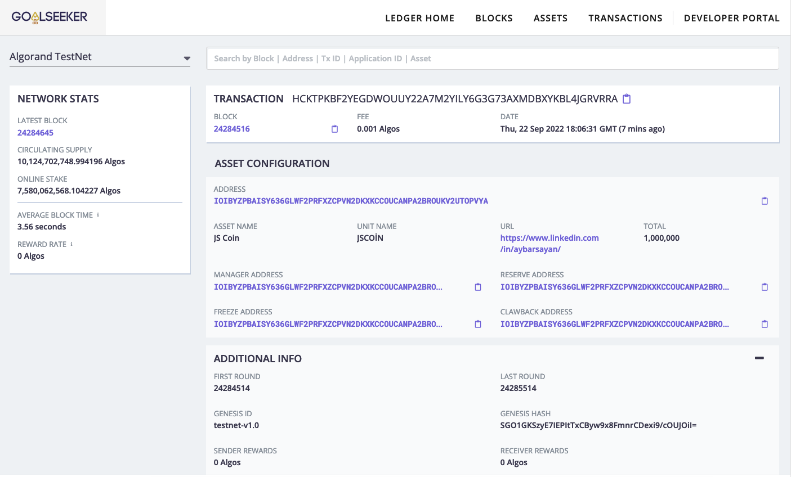

_Şekil 21 Transfer Kontrolü_

Şekil 21'de ifade edildiği üzere testnet üzerinde emin olunarak transfer detaylarına bakılırsa parametre olarak kaydettiğimiz arz, "asset name" gibi değerlerin Token içerisinde bulunduğu gözükmektedir.

```JavaScript
 const Algosdk = require('algosdk');require("dotenv").config()
const server="https://testnet-algorand.api.purestake.io/ps2";const port="";const token={ "x-api-key": process.env.API };let kullanıcı = new Algosdk.Algodv2(token, server, port);
var irem\_mnemonic = "ramp later certain business possible memory cupboard armed truly learn spring you vague vintage nut series curious lonely emerge width patch turtle wool able rice"; // fill in yoursvar iremHesap = Algosdk.mnemonicToSecretKey(irem\_mnemonic);
(async () =\> {let params = await kullanıcı.getTransactionParams().do();let note = undefined; let adres = iremHesap.addr;let defaultFrozen = false;let decimals = 0;let totalIssuance = 1000000;let unitName = "JSCOİN";let assetName = "JS Coin";let assetURL = " https://www.linkedin.com/in/aybarsayan/ ";let assetMetadataHash = "01234567890123456789012345678901";let manager = iremHesap.addr;let reserve = iremHesap.addr;let freeze = iremHesap.addr;let clawback = iremHesap.addr;
let txn = Algosdk.makeAssetCreateTxnWithSuggestedParams(adres, note,totalIssuance, decimals, defaultFrozen, manager, reserve, freeze,clawback, unitName, assetName, assetURL, assetMetadataHash, params);
let rawSignedTxn = txn.signTxn(iremHesap.sk);let tx = (await kullanıcı.sendRawTransaction(rawSignedTxn).do());console.log("Transfer : " + tx.txId);})().catch(e =\> {console.log(e);}); 
```

_Tablo 73 asa\_irem\_create.js Tamamı_

Tablo 73'de yazmış olduğumuz asa\_irem\_create.js dosyasının tamamı bulunmaktadır. Bu kodun bir bütün olarak aşamaları ile neler yaptığına bakılırsa:

- İlk olarak gerekli kütüphaneler tanımlanır.
- Sonrasında sorguların yapılacağı kullanıcının API anahtarı portu ve ağ adresi değişkenler üzerinde kaydedilir.
- Kaydedilen kullanıcı değerleri "kullanıcı" adlı obje oluşturularak kaydedilir.
- Token'ın oluşacağı adresin mnemonic adresi değişkene atanır.
- Mnemonic anahtardan hesabın kendisi SDK kullanılarak türetilir.
- Asenkron fonksiyon oluşturulur.
- Fonksiyonun içerisinde Token parametreleri tanımlanır.
- Tanımlanan Token parametreleri uygun sıra ile transfere hazırlanmak üzere SDK ile "txd" değişkeni üzerinde kaydedilir.
- Transfer işlemi Token'ı oluşturan hesabın Secret-Key'i tarafından imzalanır.
- İmzalanan transfer kullanıcı tarafından zincire gönderilir.
- Gerçekleşen transferin adresi ekrana yazdırılır.
- Olası hatalar ".catch()" metodu tarafından yakalanarak terminale yazdırılır.

_Şekil 23_

Tamamlandıktan sonra Algosigner üzerinden hesaptaki ASA Şekil 23'te ifade edildiği üzere görüntülenebilir.

**Farklı bir Hesaba ASA Ekleme ve Çıkarma:**

Token oluşturma başarılı bir şekilde tamamlansa da bu tokeni farklı hesaplara atmadığımız sürece aslında çok bir işlevi bulunmamaktadır. Bu işlevin birçok yöntemi bulunmaktadır ancak projemiz dahilinde Algosigner ve JavaScript kullanarak bu ekleme işini gerçekleştireceğiz. Bu işleme aynı zamanda Opt-in denilmektedir.

İlk olarak ekleme işlemini gerçekleştirirken bu Token'i tanımlayan bir tanımlayıcı olması gerekmektedir. Bu işlevi Algorand üzerinde AssetID'ler ile gerçekleştirmekteyiz. Bu AssetID'leri Algosigner üzerinde eklediğimiz hesaplardan gözlemleyebiliriz.


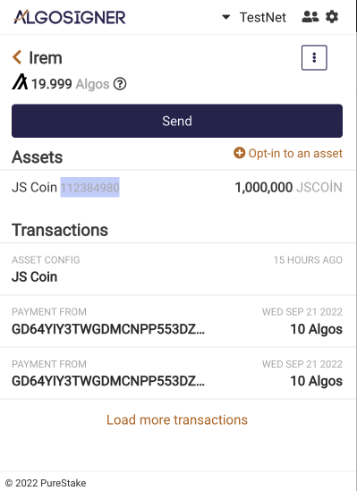

_Şekil 24_

Şekil 24'te ifade edildiği üzere Token'ı içeren hesabımıza Algosigner ile eriştiğimizde Assets kısmının altında belirlediğimiz Token adı yanında "AssetID" yer almaktadır. Bu değer zincir tarafından Token oluşturulurken atanmaktadır. Bu nedenle Token'ı oluşturan hesap bu değeri değiştiremez. Ayrıca Token bilgilerinin üzerine basıldığında açılan "Popup" ekranda Token adımızın hemen altında aynı değer yer almaktadır. Bu değer oluşturduğumuz token için "112384980" olmaktadır.

Algosigner üzerinden ekleme yapılacakken ilk olarak eklenim yapılacağı adresi seçmemiz gerekmektedir. Bu işlem için Beren adresini seçeceğiz. Algosigner'ın her browser açıldığında yeniden şifre istediği göz önünde bulundurulmalıdır. Ayrıca eklenti açıldığında önceden eklediğiniz hesapların görünmemesi ile karşı karşıya kalabilirsiniz. Bu durumun nedeni adreslerin testnet üzerinde yer almasıdır ve cüzdanın başlangıcında kendini otomatik olarak mainnet'de göstermesidir. Sağ üst kısımdan testnet kısmına basıldığında hesaplar önceden olduğu gibi karşımıza çıkacaktır.

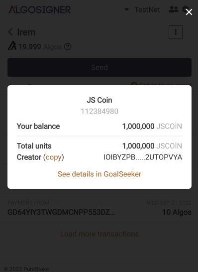

_Şekil 25_


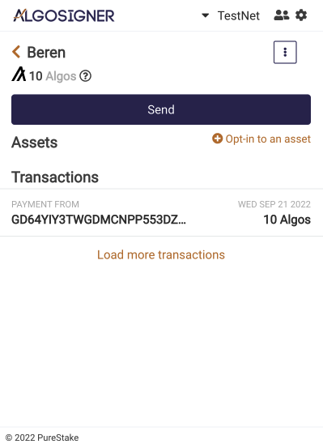

_Şekil 26_

Açılan hesap sayfasında ilk olarak şekil 25'te ifade edildiği üzere turuncu ile yazılı "Opt-in to an asset" seçeneğini seçmemiz gerekmektedir. Sonrasında karşımıza bir arayüz çıkmaktadır. Bu arayüz içerisinde iki alt sekme bulundurmaktadır. İlk alt sekme Algorand tarafından doğrulanan Asset'leri gösterirken ikinci sekme ağ üzerindeki tüm Assetler'i ifade etmektedir. Oluşturduğumuz Token henüz doğrulanmadığı için "All" kategorisinde yer almaktadır. Kategori içerisine girildiğinde isim ile arama mümkün olsa da karışıklık olmaması amacıyla "AssetID" ile arama gerçekleştirebiliriz.

Eklenmek istenen Token seçildikten sonra Şekil 26'de de ifade edildiği üzere "Opt-in to asset!" seçeneği seçilir ve hesap şifresi girilmesinden sonra Token Hesaba eklenmiş olunur.

Bazı durumlarda bakiyesi bitmiş olan Tokenlar'ı adresimizde yer kaplamaması için çıkartmak durumunda kalabiliriz. Bu işlemi de hem JavaScript hem de Algosigner ile gerçekleştirebiliriz.

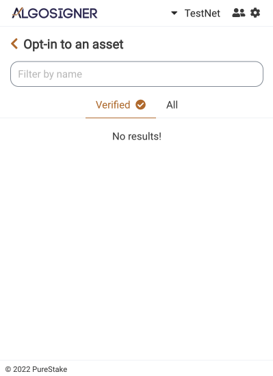

_Şekil 27_


Token'ı hesaptan çıkarma işlemine "Opt-out" işlemi denilmektedir. Bu işlemi Algosigner'da yapmak için Şekil 27'de ifade edildiği üzere haraket edilecektir. İlk olarak hesabından çıkarılmak istenilen istenilen adrese giriş yapılarak Assets kısmından çıkarılacak Token veya Asset seçilir. Bu assest'in seçilmesinden sonra açılan Pop-up ekrandan en alttaki seçenek olan "Opt-out of this asset" seçeneği seçilir. Algosigner bu kısımda şifre talep etmektedir. Şifrenin girilmesinden ve "Continue" seçeneğinin seçilmesi sonrasında Asset'den başarılı bir şekilde çıkılmış olur. Eklentiye çık gir yaparak bu işlemin gerçekleşip gerçekleşmediğini kontrol etmek mümkündür.

Algosigner üzerinden "Opt-in" ve "opt-out" işlemleri yapıldıktan sonra bu işlemlerin nasıl JavaScript ile yapılacağına bakabiliriz. Önceki sayfalarda Beren Hesabından Token'ı çıkardığımız için yeniden ekleme işlemini JavaScript ile yapabiliriz. Bu işlemi yapmak için index.js dosyasının bulunduğu dosyaya girip beren\_opt\_in.js dosyası oluşturabiliriz.

```JavaScript
 const Algosdk = require('algosdk');require("dotenv").config() 
```

_Tablo 74_

Kod içerisine girdiğimizde ilk olarak diğer tüm JavaScript dosyalarında yapıldığı üzere paketlerin tanımlanması gerekmektedir. Tablo 74'te ifade edilen şekilde JavaScript içerisinde kütüphaneler "require" fonksiyonu ile çağırılabilirler. Sırasıyla eklenen paketlere bakılması gerekirse:

- **Algosdk:** Algorand blokzinciri ile bağlantı kurmamızı sağlayan SDK paketidir. İstenilen isimlendirme ile kod içerisine eklenebilir.
- **Dotenv:** Paylaşmak istenilmeyen gizli verilerin ".env" dosyasından çekilmesini sağlayan pakettir.

```JavaScript
 const server="https://testnet-algorand.api.purestake.io/ps2";const port="";const token={"x-api-key": process.env.API};let kullanıcı = new Algosdk.Algodv2(token, server, port); 
```

_Tablo 75_

Paketlerin eklenmesi sonrasında zincir üzerinde işlemlerin yapılabilmesi için bazı özelliklerin tanıtılması gerekmektedir. Bu özelliklere bakılacak olunursa:

- **Server:** Yazdığımız kodun hangi zincir üzerinde çalışacağını ifade etmektedir. Testnet üzerinde çalışacağımız için "Purestake" sitesinden elde edilen testnet adresi bu değişken içerisine kaydedilebilir. String değeri almaktadır.
- **Port:** Bağlantının yapılacağı portu ifade etmektedir. Bu port bilgisi ile kodu farklı yerlerde çalıştırmak mümkündür. Kod içerisinde şimdilik boş bırakılacaktır ancak 4001 değeri girilerek de bazı durumlarda kullanılabilir. String değeri almaktadır.
- **Token:** Algorand blokzincirine bağlanırken tanımlandığımız API anahtarıdır. Bu anahtar önceki bölümlerde ifade edildiği üzere Purestake sitesinden elde edilebilir. Obje değeri almaktadır. Obje içerisine "x-api-key" anahtarı içerisine API anahtarı yazılmalıdır. Ancak güvenlik ve profesyonellik açısından bu değeri "process.env" fonksiyonu ile ".env" dosyası içerisinden çekebilmemiz mümkündür.

```JavaScript
 let kullanıcı = new Algosdk.Algodv2(token, server, port); 
```

_Tablo 76_

Tanımların yapılmasından sonra bu değişkenlerin bir kullanıcı objesinde bir araya getirilmesi gerekmektedir. Bu durumu gerçekleştirmek için Tablo 76'da ifade edildiği üzere istediğimiz ad ile tanımladığımız değişken içerisine "new" anahtar kelimesi ile yeni bir obje oluştururuz ve bu obje içeresine gerekli bilgileri gireriz. Gerekli bilgileri Algosdk paketi içerisinde bulunan "Algodv2" metodu ile elde edebiliriz. Metot içeresine önceden tanımladığımız değişkenler belirli sıra ile eklenmelidir. Aksi taktirde fonksiyon istenilen şekilde çalışmayacaktır.

```JavaScript
 var beren\_mnemonic = "copy deny kingdom faith need blossom anchor zoo address venue carry rain winter salt rapid infant zero address laptop govern scout rice escape absorb stove"; var berenHesap = Algosdk.mnemonicToSecretKey(beren\_mnemonic); 
```

_Tablo 77_

Token ekleme görevi için token eklemek istediğimiz hesabın bilgileri gerekmektedir. Daha önce de belirttiğimiz üzere Mnemonic anahtarlar hesabı nitelendiren şifreler olmaktadır. Bu şifreler tek başına insan tarafından algılanabilir olsa da zincir için anlamsızdır. Bu nedenle Mnemonic anahtarın SecretKey değerine çevrilmesi gerekmektedir. Bu nedenle Tablo 77'de ifade edildiği üzere ilk olarak mnemonic anahtar bir değişken içerisinde kaydedilir. Sonrasında kaydedilen bu değişken Algosdk içerisindeki "mnemonicToSecretKey()" metodu içerisine eklenerek hesap oluşturulur. Hesap içerisinde Adresi, Secret Key değerini ve mnemonic anahtarı tutmaktadır. Bu hesap kullanılarak işlemler yapılacaktır.

```JavaScript
 (async () =\> {
}) 
```

_Tablo 78_

Gerekli tanımlamaların yapılması sonrasında eklenecek Token varlığının değerlerini içerecek fonksiyonun tanımlanması gerekmektedir. Bu kısımda zincir ile iletişime geçilecektir. Bu nedenle sistemde oluşabilecek beklemeleri karşılamak amacıyla asenkron fonksiyon tanımlanmaktadır. Bu fonksiyon Tablo 78'de ifade edildiği üzere "async" anahtar kelimesi ile tanımlanmakta olup içerisine herhangi bir parametre istememektedir. Ayrıca herhangi bir tanımlama ismi kullanılmadığı için fonksiyon çağırıldığı zaman değil çalıştırma satırı ulaştığı an çalışacaktır.

```JavaScript
 let params = await kullanıcı.getTransactionParams().do(); let assetID = 112384980; let sender = berenHesap.addr;let recipient = sender;let revocationTarget = undefined;let closeRemainderTo = undefined;let note = undefined;let amount = 0; 
```

_Tablo 79_

Asenkron fonksiyon içerisine girildiğinde bazı tanımlanmaların yapılması gerekmektedir. Token ekleme yani "Opt-in" işlemi aynı zamanda bir transfer işlemi olduğu için bazı transfer parametrelerinin eklenmesi de gerekmektedir. Tablo 79'da ifade edilen bu parametrelere daha yakından bakılacak olunursa:

- **Params:** Kullanıcı olarak tanımladığımız zincir üzerinde işlemler yapabilen değişkenin transferler ile ilgili parametrelerini almaktadır. Bu bilgileri zincir üzerinden elde etmesinden dolayı zaman almaktadır bu nedenle "await" anahtar kelimesi ile çağırılmaktadır. Kullanıcı içerisinden bir metot çağırılacağı için ".do()" metodu ile fonksiyon çalıştırılır ve gerekli değişkenler istenilen isim ile kaydedilen değişken içerisine eklenir.
- **AssetID:** Eklenmek istenilen Token'ın zincir üzerinde tanımlandığı numarayı ifade etmektedir. Bu numara Token'ı oluşturan hesap tarafından belirlenmemiş olunup otomatik olarak zincir tarafından tanımlanmıştır. Her Token'ın kendine özel bir "AssetID" değeri bulunmaktadır. İnteger değeri almaktadır. İstenilen isim ile kaydedilebilir.
- **Sender:** Eklenilecek hesabı ifade etmektedir. Token ekleme işleminin aslında bir transfer olması nedeniyle tanımlanır. Eklenen Token'ı hesabın kendi kendisine göndermesi gibi düşünülebilir.
- **Recipient:** Token ekleme işleminin hangi adrese yapılacağını ifade eder. İçerisine bir önceki tanımladığımız "Sender" değişkenini alır. Kendi kendine gönderme işlemini tamamlar. İstenilen isim ile kaydedilebilir.
- **RevocationTarget:** Beklenmedik bir olay karşısında Tokenların gitmesini istediğimiz hesapları ifade etmektedir. Kodumuz içerisinde "undefined" yani tanımlanmamış olarak bırakılacaktır. İstenilen isim ile kaydedilebilir.
- **CloseRemainderTo:** Bazı işlemlerde oluşması muhtemel kalan değerlerin transfer edilmesi istenilen adresi ifade etmektedir. Kodumuz içerisinde "undefined" yani tanımlanmamış olarak bırakılacaktır. İstenilen isim ile kaydedilebilir.
- **Note:** Transfer işlemi yapılırken tanımlanmak istenilen notu ifade etmektedir. Zincir içerisine kaydedilebilmek için doğru bir şekilde "encode" fonksiyonlarına sokulup şifrelenmelidir. Şimdilik "undefined" yani tanımsız olarak bırakılacaktır.
- **Amount:** Kaç varlık ekleneceğini ifade etmektedir. Token'dan kaç birim ekleneceğini ifade etmemektedir. İnteger değer almaktadır. Harici bir varlık eklemememiz dolayısıyla 0 değeri girilecektir.

```JavaScript
 let txn = Algosdk.makeAssetTransferTxnWithSuggestedParams(sender, recipient, closeRemainderTo , revocationTarget,amount, note, assetID, params); 
```

_Tablo 80_

Token eklenmesi için eklenen gerekli parametreler sonrasında bu değişkenlerin bir transfer içerisinde buluşması gerekmektedir. Bu nedenle istediğimiz isimlendirme ile tanımladığımız fonksiyon içerisine Algosdk paketi içerisinde bulunan "makeAssetTransferTxnWithSuggestedParams()" metodu girilerek bu tanımlama yapılabilir. Fonksiyon içerisine daha öncesinde tanımladığımız transfer parametrelerini almaktadır. Bu parametrelerin sırası önemli olmaktadır. Yanlış sıralama girilmesi halinde kod istenilen şekilde çalışmayacaktır.

```JavaScript
 let rawSignedTxn = txn.signTxn(berenHesap.sk)let tx = (await kullanıcı.sendRawTransaction(rawSignedTxn).do());console.log("Transfer : " + tx.txId); 
```

_Tablo 81_

Transferin oluşturulması sonrasında bu transferin imzalanması ve zincire gönderilmesi gerekmektedir. Bu işlem için Tablo 81'de ifade edildiği üzere ilk olarak transfer içerisinde bulunan "signTxn()" metodu içerisine Token'in ekleneceği hesap olan Beren hesabının Secret Key değerini alarak imzalı bir değişken oluşturulmalıdır. Sonrasında bu işlem asenkron olarak "await" anahtar kelimesi ile kullanıcı objesinde bulunan "sendRawTransaction()" metodu sayesinde zincire gönderilir. Obje içerisinde bulunan bir metoda erişim sağlanmasından ötürü ".do()" metodu kullanılmaktadır. Son olarak bu transfer ekrana "console.log()" fonksiyonu ile yazdırılmaktadır.

```JavaScript
 ().catch(e =\> {console.log(e);}); 
```

_Tablo 82_

Asenkron fonksiyon içerisinden çıkılması sonrasında oluşacak muhtemel sorunları çözmek için ".catch()" fonksiyonu kullanılmaktadır. Bulunan hatalar Tablo 82'de ifade edildiği üzere "console.log()" ile ekrana yazdırılacaktır.

```JavaScript
 Transfer : 43O7X47DII4C23IBZKI7VA3C4PTSCRC6F4BCHNPUYV6BMCMWXPUQ 
```

_Tablo 83 beren\_opt\_in.js Kod Çıktısı_

_Şekil 28_

Yazdığımız kod tamamlandıktan sonra bulunduğu klasörde terminal aracılığı ile "node beren\_opt\_in.js" komutu ile çalıştırılabilir. Çalışma sonrasında terminalde Tablo 83'te ifade edilen çıktı gibi bir çıktı ile karşılaşılacaktır. Bu çıktı oluşan transferin adresini ifade etmektedir ve AlgoExplorer gibi sitelerde kontrol edilebilir.

Şekil 28'de ifade edildiği üzere Algoexplorer'da transfer incelenebilir. Bu transfer içerisinde parametre olarak girdiğimiz birçok değer bulunmaktadır.

```JavaScript
 const Algosdk = require('algosdk');require("dotenv").config()
const server="https://testnet-algorand.api.purestake.io/ps2";const port="";const token={"x-api-key": process.env.API};let kullanıcı = new Algosdk.Algodv2(token, server, port);
var beren\_mnemonic = "copy deny kingdom faith need blossom anchor zoo address venue carry rain winter salt rapid infant zero address laptop govern scout rice escape absorb stove"; var berenHesap = Algosdk.mnemonicToSecretKey(beren\_mnemonic);

(async () =\> {let assetID = 112384980; let params = await kullanıcı.getTransactionParams().do();let sender = berenHesap.addr;let recipient = sender;let revocationTarget = undefined;let closeRemainderTo = undefined;let note = undefined;let amount = 0;
let txn = Algosdk.makeAssetTransferTxnWithSuggestedParams(sender, recipient, closeRemainderTo, revocationTarget,amount, note, assetID, params);
let rawSignedTxn = txn.signTxn(berenHesap.sk)let tx = (await kullanıcı.sendRawTransaction(rawSignedTxn).do());console.log("Transfer : " + tx.txId);})().catch(e =\> {console.log(e);}); 
```

_Tablo 84 beren\_opt\_in.js Kodu Tamamı_

Tablo 84'te "Opt-in" işlemini gerçekleştirmek için gerekli olan tüm kod satırları bütün olarak verilmiştir. Kodun işlevine parça parça bakılacak olunursa:

- İlk olarak gerekli paketler kod içerisine kaydedilmektedir.
- Sonrasında zincir üzerinde işlem yapılabilmesini sağlayan server, token ve port değişkenleri tanımlanır.
- Tanımlanan işlem parametreleri yeni bir kullanıcı objesinde bir araya getirilir.
- Token'ın ekleneceği hesap mnemonic şifresinden türetilerek kullanıma hazır hale getirilir.
- Asenkron fonksiyon tanımı yapılır.
- Eklenecek Token'ın değerleri değişkenlere kaydedilir. Bu değerlerden biri de Token'ı zincir üzerinde tanımlayan "AssetID" değeri olmaktadır.
- Tanımlanan değişkenler bir transfer olarak kaydedilmek üzere txn değişkenine SDK fonksiyonu tarafından kaydedilir.
- Yapılan transfer eklenecek hesap üzerinde bulunan Secret Key kullanılarak imzalanır.
- İmzalanan transfer kullanıcı tarafından zincire gönderilir ve "transferId" terminale yazdırılır.
- Olası hatalar ".catch()" metodu kullanılarak kaydedilir.

**Token Bakiye Kontrolü:**

_Şekil 29_

Önceki bölümlerde nasıl Algo bakiyesine bakılacağı ifade edilmişti. Ancak bu bakiye sadece Algorand'ın kendi coini için çalışmaktaydı. Bir hesapta hangi Tokenların ve varlıkların bulunduğunu kontrol etmek için Algosigner'ı veya JavaScript ile yazacağımız kod mekanizmaları kullanılabilir.

Sorgu işlemini AlgoSigner üzerinde gerçekleştirmek istememiz durumunda Şekil 29'de ifade edildiği üzere Testnet'de olduğumuza emin olarak bu işlemi gerçekleştirebiliriz. Assets başlığı altında hesabın sahip olduğu bütün Tokenlar ve varlıklar gözüyor olacaktır.

Bu işlemi JavaScript ve Algosdk ile de gerçekleştirmek mümkündür. İlk olarak index.js dosyasının bulunduğu dosyaya giriş yaparak belirlediğiniz isme sahip bir JavaScript dosyası oluşturulması gerekmektedir. Anlatım kolaylığı açısından aynı anda hem İrem hem de Beren hesabının kontrolünün sağlayacak kod dosyasına ikili\_kontrol.js ismi verilmiştir.

```JavaScript
 const Algosdk=require('algosdk');require("dotenv").config() 
```

_Tablo 85_

İlk olarak diğer JavaScript dosyalarına başlandığı gibi kütüphaneleri ekleyerek başlamamız gerekmektedir. Bu paketleri Tablo 85'te ifade edildiği üzere "require" yapısı ile eklemekteyiz. Eklenen paketlere bakılırsa:

- **Algosdk:** Algorand blokzinciri ile bağlantı kurulmasını sağlayan kütüphane olmaktadır. İstenilen isim ile kaydedilebilir.
- **Dotenv:** Saklanmasını istediğimiz paylaşmak istemediğimiz belgelerin bulunduğu ".env" dosyası içerisinden verilere erişim yapılmasını sağlayan kütüphanedir. Herhangi bir değişken ile çağırılması gerekmez. Çağırıldıktan sonra ".config()" yapısı ile kurulumu yapılmaktadır.

```JavaScript
 const server="https://testnet-algorand.api.purestake.io/ps2";const port="";const token={"x-api-key": process.env.API}; 
```

_Tablo 86_

Paketlerin çağırılmasından sonra zincir üzerinde işlem yapılması için gerekli parametrelerin tanımlanması gerekmektedir. Tablo 86'da ifade edildiği üzere bu değişkenler "const" yapısı ile sabit olarak tanımlanabilirler. Her bir parametrenin yaptıklarına ayrıntılı bakılırsa:

- Server: Sorgulama işleminin hangi zincir üzerinde gerçekleşeceğini ifade etmektedir. Purestake sitesinden alınmaktadır ve mainnet üzerinde işlem yapılmak istenilirse farklı bir adres kullanılmalıdır. String değeri kabul etmektedir.
- Port: Bağlantının yapılacağı portu ifade etmektedir. Bu değişken değerini değiştirerek zincir üzerinde bulunan farklı bir düğümden işlem yapmak mümkündür. Şimdilik kod içerisinde boş bırakılacaktır.
- Token: Purestake üzerinden alınan API anahtarını ifade etmektedir. API anahtarları zincir üzerinde yapılan sorgu, veri gönderme gibi işlemleri kullanıcıya bağlamaktadır .İçerisine obje girdisi istemektedir. Atanırken "x-api-key" anahtarı ile kaydedilmektedir. API anahtarı güvenli tutulması gereken bir anahtardır. Bu nedenle gizli tutulmalıdır. Bu işlemi gerçekleştirmek için ".env" dosyası içerisinde tutulan API anahtarını "process.env.API" fonksiyonu ile çağırmak mümkündür.

```JavaScript
 let kullanıcı = new Algosdk.Algodv2(token, server, port); 
```

_Tablo 87_

Parametreler tanımlandıktan sonra bir obje içerisinde ek özellikler ile kaydedilmelidir. Bu nedenle kullanıcı değişkeni içerisine kaydedilen ve "new" anahtar kelimesi ile oluşturulan bir obje yaratmaktayız. Bu obje Algosdk paketi içerisindeki "Algodv2" metodunu Tablo 87'de ifade edildiği şekilde kullanarak içerisine girilen token, server ve port değişkenleri ile bir obje oluşturur ve değişkene kaydeder.

```JavaScript
 var iremAddress = 'IOIBYZPBAISY636GLWF2PRFXZCPVN2DKXKCCOUCANPA2BROUKV2UTOPVYA'; var berenAddress = 'BDG7MLDNCHDJH4XV7FS3YRQN2NTIUMWM4FKFF5Z5YQ4JZGQRXNEFD5L4TQ'; 
```

_Tablo 88_

Kullanıcı tanımlanması sonrasında Tablo 88'de ifade edildiği üzere Token varlıkları kontrol edecek hesapların adresleri gerekmektedir. Bu adresler herkese açık adresler olmaktadır. Bu durumun nedeni bakiye ve varlık sorgulama işlemlerinin herkes tarafından sorgulanmaya açık olmasıdır. Adrese sahip olan bir birey tüm kontrolleri gerçekleştirebilir.

```JavaScript
 ( async() =\> {}) 
```

_Tablo 89_

Sorgu işlemleri zincire bağlantı gerektirmektedir. Bu nedenle zaman alabilir. Bu durumda Tablo 89'da ifade edildiği üzere JavaScript içerisinde asenkron bir fonksiyon tanımlanmalıdır. Bu fonksiyon içerisine herhangi bir parametre almamaktadır. Ayrıca herhangi bir tanımlayıcı değişkene ihtiyaç duymamaktadır. Bu nedenle çağırılmayı beklemeden çalıştırma satırı ulaşır ulaşmaz çalışır ve içerisindeki işlemleri asenkron olarak gerçekleştirir. Tanımlanması için "async" anahtarı gerekmektedir.

```JavaScript
 let irem\_hesap\_bilgisi = (await kullanıcı.accountInformation(iremAddress).do());console.log("İrem Hesabı Varlıkları: " + irem\_hesap\_bilgisi.assets);
let beren\_hesap\_bilgisi = (await kullanıcı.accountInformation(berenAddress).do());console.log("Beren Hesabı Varlıkları: " + beren\_hesap\_bilgisi.assets); 
```

_Tablo 90_

Asenkron fonksiyonun içerisine girildiğinde sorgu işlemleri yapılacaktır. Sorgu işlemleri için istenilen isim ile kaydedilen değişkenler oluşturulmaktadır. Bu işlem zincire bağlantı gerektirmektedir. Bu nedenle asenkron yapıda "await" anahtar kelimesi ile kodun bu satırda durması gerektiğini belirtmekteyiz. Sonrasında Tablo 90'da ifade edildiği üzere oluşturulan kullanıcı sayesinde "accountInformation()" metoduna erişilir. Bu metot içerisine sorgulanmak istenilen adresi string olarak almaktadır. Obje içerisinden bir metot çağırılmasından dolayı ".do()" anahtar kelimesi ile bu fonksiyonun çalıştırılması gerekmektedir. Fonksiyonun çalışması sonrasında kaydedilen değişken uygun etiketleme ile "console.log()" yapısı kullanılarak terminale yazdırılmaktadır. Bu işlem her iki hesap için de ayrı ayrı yapılmaktadır.

```JavaScript
 ().catch(e =\> { console.log(e);}) 
```

_Tablo 91_

Asenkron fonksiyon içerisinden çıkıldıktan sonra olası hataların yakalanması için Tablo 91'de gösterildiği şekilde ".catch()" fonksiyonu ile bu işlemi gerçekleştirebiliriz. Yakalanan hatalar "console.log()" ile terminale yazdırılacaktır.

```JavaScript
 İrem Hesabı Varlıkları: [{ amount: 1000000, 'asset-id': 112384980, 'is-frozen': false }]Beren Hesabı Varlıkları: [{ amount: 0, 'asset-id': 112384980, 'is-frozen': false }] 
```

_Tablo 92 ikili\_kontrol.js Çıktı_

Kodumuz tamamlandıktan sonra bulunduğu klasörde terminalden "node ikili\_kontrol.js" komutu ile çalıştırılabilir. Çıktı Tablo 91'de ifade edildiği gibi olacaktır. Bazı durumlarda zincir ile bağlantı sorunları yaşanmasından dolayı birkaç kez çalıştırma gerekli olabilir. Görüldüğü üzere çıktı liste içerisinde bulunan objelerden oluşmaktadır. Her iki hesapta da tek varlık bulunduğu için listelerinde birer obje bulunmaktadır. Bu objeler içerisinde 3 adet anahtar taşımaktadır. Bu anahtarlara sırası ile bakılması gerekirse:

- **Amount:** Token'ın miktarını ifade etmektedir.
- **Asset-id:** Varlığın zincir üzerinde tanımlandığı numarayı ifade etmektedir.
- **İs-frozen:** Varlığın hesapta dondurulmuş olup olmadığını ifade etmektedir. Bool değerler almaktadır.

```JavaScript
 const Algosdk=require('algosdk');require("dotenv").config()
const server="https://testnet-algorand.api.purestake.io/ps2";const port="";const token={"x-api-key": process.env.API};let kullanıcı = new Algosdk.Algodv2(token, server, port);
var iremAddress = 'IOIBYZPBAISY636GLWF2PRFXZCPVN2DKXKCCOUCANPA2BROUKV2UTOPVYA'; var berenAddress = 'BDG7MLDNCHDJH4XV7FS3YRQN2NTIUMWM4FKFF5Z5YQ4JZGQRXNEFD5L4TQ';
( async() =\> {let irem\_hesap\_bilgisi = (await kullanıcı.accountInformation(iremAddress).do());console.log("İrem Hesabı Varlıkları: " , irem\_hesap\_bilgisi.assets);
let beren\_hesap\_bilgisi = (await kullanıcı.accountInformation(berenAddress).do());console.log("Beren Hesabı Varlıkları: " , beren\_hesap\_bilgisi.assets);
})().catch(e =\> { console.log(e);}) 
```

_Tablo 93 ikili\_kontrol.js Kodu Tamamı_

Tablo 93'te yazdığımız kodun tamamı ifade edilmektedir. Bu kodun işlevlerine parça parça bakılması gerekirse:

- İlk olarak kütüphaneler tanımlanmaktadır.
- Zincir üzerinde işlem yapmamızı sağlayan parametreler tanımlanmaktadır.
- Bu parametreler yeni bir obje oluşturularak içerisine farklı özellikler ile eklenmektedir.
- Sorgu yapılacak adresler tanımlanmaktadır.
- Asenkron işlemler gerçekleştireceğimiz için async anahtar kelimesi ile asenkron fonksiyon tanımlanmaktadır.
- Bu fonksiyonun içerisinde kullanıcı metodu ile gerekli adres sorguları gerçekleştirilir.
- Kaydedilen sorgu değişkenleri terminale yazdırılır.
- Asenkron fonksiyonda oluşabilecek olası hatalar ".catch()" yapısı ile ekrana yazdırılır.

**Adresler Arasında Varlık Transferi:**

Önceki bölümlerde nasıl bakiye transferi yapılacağını gözlemlemiştik. Ancak varlık transferleri daha farklı yapılmaktadır. Bu işlemi gerçekleştirmek için Algosigner ve JavaScript dili üzerindeki Algosdk paketi kullanılabilir.

JavaScript üzerinden bu işlem gerçekleştirilmek istendiğinde ilk olarak index.js dosyasının bulunduğu klasöre yeni bir JavaScript dosyasının oluşturulması gerekmektedir. Bu belge istenilen isme sahip olabilir ancak anlatım kolaylığı açısından şimdilik "token\_transfer.js" ismi tercih edilmiştir.

```JavaScript
 const Algosdk=require('algosdk');require("dotenv").config() 
```

_Tablo 94_

Her JavaScript dosyasına başlanıldığı gibi ilk olarak dosya içerisine paket tanımlarını yaparak başlanması gerekmektedir. Bu paketler Tablo 94'te ifade edildiği üzere JavaScript içerisinde bulunan "require" fonksiyonu ile eklenmektedir. Sırası ile paketlerin işlevlerine bakılması gerekirse:

- **Algosdk:** Algorand blokzinciri ile bağlantı yapılmasını sağlamaktadır. İstenilen isim ile kaydedilebilir.
- **Dotenv:** Paylaşılması riskli olan bilgilerin kod içerisine güvenli bir şekilde eklenmesini sağlayan pakettir. Bu paket sayesinde klasörde oluşturduğumuz ve paylaşımlarda transfer olmayan ".env" dosyası içerisine yazdığımız bilgileri dosyamıza ekleyebiliriz.

```JavaScript
 const server="https://testnet-algorand.api.purestake.io/ps2";const port="";const token={"x-api-key": process.env.API}; 
```

_Tablo 95_

Paket tanımlama sonrasında zincirde işlem yapılabilmesi için Tablo 95'de ifade edildiği üzere bazı parametrelerin tanımlanması gerekmektedir. Bu parametrelere zinciri ve işlemi yapan kişiyi tanımlamaktadır. Bu parametrelere ayrıntılı olarak bakılması gerekirse:

- **Server:** İşlemin gerçekleşmesini istediğimiz ağı ifade etmektedir. Bu işlemin test serverında gerçekleşmesini istediğimizden ötürü "Purestake" sitesinde bulabileceğimiz zincir adresini yazmaktayız.
- **Port:** İşlemin gerçekleşeceği bağlantı portunu ifade etmektedir. Kullanım amacımızdan dolayı boş olarak bırakılabilir.
- **Token:** API anahtarımızı ifade etmektedir. Purestake sitesinden aldığımız API anahtarını güvenlik nedenleriyle ".env" klasörü içerisinden "process.env" metodu ile erişilmektedir.

```JavaScript
 let kullanıcı = new Algosdk.Algodv2(token, server, port); 
```

_Tablo 96_

Zinciri ve bireyi tanımlayacak parametrelerin tanımlanması sonrasında kullanıcı adı ile kaydedilen değişenin Tablo 96'da gösterildiği üzere bir objeye eşitlenmesi gerekmektedir. Bu işlem için "new" anahtar kelimesi ile oluşturulan değişkenin içerisine Algosdk içerisinde bulunan Algodv2 metodu çağırılır. Bu metot içerisine önceden tanımladığımız token, server ve port parametrelerini almaktadır. Bu parametrelerin sırası büyük önem arz etmektedir. Aksi halde fonksiyon istenilen şekilde çalışmayacaktır.

```JavaScript
 var irem\_mnemonic = "ramp later certain business possible memory cupboard armed truly learn spring you vague vintage nut series curious lonely emerge width patch turtle wool able rice"; var iremHesabı = Algosdk.mnemonicToSecretKey(irem\_mnemonic); 
```

_Tablo 97_

Kullanıcının tanımlanmasından sonra transferi yapacak kişinin bilgileri gerekmektedir. Transfer iki hesap arasında da yapılabilmektedir ancak henüz Beren hesabı içerisinde bir bakiye bulunmadığı için transferi İrem Hesabından Beren hesabına doğru gerçekleştireceğiz. Bakiye azalması İrem hesabında olacağı için bu hesabın Secret Key verisine ihtiyaç bulunmaktadır. Tablo 97'da ifade edildiği üzere ilk olarak elimizde bulunan mnemonic değeri bir değişken içerisine kaydederiz. Bu değer insanlar tarafından okunması kolay olsa da zincir tarafından anlamsızdır. Bu nedenle bu mnemonic şifreden Secret Key değeri türetilmelidir. Bu işlemi Algosdk paketi içerisinde bulunan "mnemonicToSecretKey" metodu ile gerçekleştirebiliriz. Bu metot içerisine transferin yapılacağı hesabın mnemonic anahtarını string olarak almaktadır.

```JavaScript
 var berenAdres = 'BDG7MLDNCHDJH4XV7FS3YRQN2NTIUMWM4FKFF5Z5YQ4JZGQRXNEFD5L4TQ'; 
```

_Tablo 98_

Transferler iki taraflı olmaktadır. Bir gönderici karşısında her zaman bir alıcı da bulunmalıdır. Örneğimizde alıcı taraf Beren Hesabı olduğu için bu hesabın adresi sonradan kullanılmak üzer Tablo 98'da ifade edildiği üzere kaydedilmelidir.

```JavaScript
 (async () =\> {
}) 
```

_Tablo 99_

Transferi gerçekleştirmek için gerekli bazı parametrelerde zincire bağlantı söz konusu olmaktadır. Bu bağlantı zaman alabilmektedir. Bu nedenle bir asenkron yapı kullanmamız gerekmektedir. JavaScript üzerinde asenkron işlemler yaparken Tablo 99'da ifade edildiği üzere "async" yapısını kullanmaktayız. Fonksiyonumuz komut sırası geldiğinde direkt olarak çalışacağından dolayı herhangi bir tanımlayıcıya ihtiyaç duymamaktadır. Ayrıca herhangi bir parametre gerektirmemektedir.

```JavaScript
 let assetID = 112384980; let params = await kullanıcı.getTransactionParams().do();let sender = iremHesabı.addr;let recipient = berenAdres;let revocationTarget = undefined;let closeRemainderTo = undefined;let note = undefined;let amount = 200000; 
```

_Tablo 100_

Transferin özellikleri bazı değişkenler ile tanımlanmalıdır. Tablo 100'da ifade edilen şekilde her biri istenilen isim ile kaydedilmektedir ve farklı özellikler taşımaktadır. Bu özellikler Beren hesabına Token eklenirken kullanılan parametrelere benzerlik göstermektedir. Değişkenlerin her birine bakılacak olunursa:

- **AssetID:** Hangi varlığın transfer edileceğini ifade etmektedir. Bu değer varlıkları birbirinden ayırmaktadır ve zincir tarafından atanmaktadır. Token oluşturucusunun bu numara üzerinde değişiklik yapma hakkı bulunmamaktadır.
- **Params:** Kullanıcı olarak tanımladığımız zincir üzerinde işlemler yapabilen değişkenin transferler ile ilgili parametrelerini almaktadır. Bu bilgileri zincir üzerinden elde etmesinden dolayı zaman almaktadır bu nedenle await anahtar kelimesi ile çağırılmaktadır. Kullanıcı içerisinden bir metot çağırılacağı için ".do()" metodu ile fonksiyon çalıştırılır ve gerekli değişkenler istenilen isim ile kaydedilen değişken içerisine eklenir.
- **Sender:** Miktarın hangi hesap üzerinden gönderileceğini ifade etmektedir. İrem hesabından Beren hesabına doğru bir transfer yapılacağı için "iremHesabı" olarak oluşturduğumuz değişken içerisinden "addr" anahtar kelimesine sahip adresi tanımlamamız gerekmektedir.
- **Recipient:** Token ekleme işleminin hangi adrese yapılacağını ifade eder. İçerisine bir önceki tanımladığımız "Sender" değişkenini alır. Kendi kendine gönderme işlemini tamamlar. İstenilen isim ile kaydedilebilir.
- **RevocationTarget:** Beklenmedik bir olay karşısında Tokenların gitmesini istediğimiz hesapları ifade etmektedir. Kodumuz içerisinde "undefined" yani tanımlanmamış olarak bırakılacaktır. İstenilen isim ile kaydedilebilir.
- **CloseRemainderTo:** Bazı işlemlerde oluşması muhtemel kalan değerlerin transfer edilmesi istenilen adresi ifade etmektedir. Kodumuz içerisinde "undefined" yani tanımlanmamış olarak bırakılacaktır. İstenilen isim ile kaydedilebilir.
- **Note:** Transfer işlemi yapılırken tanımlanmak istenilen notu ifade etmektedir. Zincir içerisine kaydedilebilmek için doğru bir şekilde "encode" fonksiyonlarına sokulup şifrelenmelidir. Şimdilik "undefined" yani tanımsız olarak bırakılacaktır.
- **Amount:** Transfer yapılması planlanan miktarı ifade etmektedir. İnteger değeri kabul etmektedir. Projemizde 200.000 Token transferi yapmayı istememizden dolayı 2000000 değeri girilebilir.

```JavaScript
 let txn = Algosdk.makeAssetTransferTxnWithSuggestedParams(sender, recipient, closeRemainderTo, revocationTarget,amount, note, assetID, params); 
```

_Tablo 101_

Tanımlanan transfer parametrelerinin ham bir transfer olarak birleştirilmesi gerekmektedir. Bu işlemi gerçekleştirmek üzere Tablo 101'de ifade edildiği üzere Algosdk paketi içerisinde bulunan "makeAssetTransferTxnWithSuggestedParams()" metodu kullanılmaktadır. Bu metot içerisine daha önceden tanımlanan transfer parametrelerini almaktadır. Bu parametrelerin sıralaması önemlidir ve doğru şekilde sıralanmaması halinde istenilen şekilde çalışmayacaktır.

```JavaScript
 let rawSignedTxn = txn.signTxn(iremHesabı.sk); 
```

_Tablo 102_

Transfer kaydedildi ancak İrem hesabı ile henüz imzalanmadı. İmzalama işlemini gerçekleştirmek için Tablo 102'de ifade edildiği üzere daha öncesinde kaydettiğimiz transferin "signTxn()" metodu ile imzalanması gerekmektedir. Bu fonksiyon içeresinde daha öncesinde mnemonic anahtar içerisinden türetilen iremHesap.sk değerini almaktadır.

```JavaScript
 let tx = (await kullanıcı.sendRawTransaction(rawSignedTxn).do());console.log("Transfer: : " + tx.txId); 
```

_Tablo 103_

İmzalanan transfer gönderime hazır hale gelmektedir. Gönderim işleminin yapılması için Tablo 103'da ifade edildiği gibi asenkron olarak await anahtar kelimesi ile kullanıcı "sendRawTransaction()" metodunu kullanarak zincire gönderim yapmaktadır. Metodun çalıştırılması gerektiği için sonuna ".do()" metodu eklenmelidir. Zincire gönderilen transfer geri dönüt olarak bir transfer numarası döndürmektedir. Bu değeri console.log ile terminale yazdırabiliriz.

```JavaScript
 ().catch(e =\> {console.log(e);}); 
```

_Tablo 104_

Transfer bilgilerini içeren asenkron fonksiyondan çıkıldıktan sonra bu fonksiyonda oluşabilecek olası sorunların kullanıcıya ifade edilmesi gerekmektedir. Bu nedenle Tablo 104'de ifade edildiği üzere ".catch()" yapısı ile olası sorunlar tespit edilir ve "console.log()" ile terminal üzerine yazdırılır.

```JavaScript
 const Algosdk=require('algosdk');require("dotenv").config()
const server="https://testnet-algorand.api.purestake.io/ps2";const port="";const token={"x-api-key": process.env.API};let kullanıcı = new Algosdk.Algodv2(token, server, port);
var irem\_mnemonic = "ramp later certain business possible memory cupboard armed truly learn spring you vague vintage nut series curious lonely emerge width patch turtle wool able rice";var iremHesabı = Algosdk.mnemonicToSecretKey(irem\_mnemonic);
var berenAdres = 'BDG7MLDNCHDJH4XV7FS3YRQN2NTIUMWM4FKFF5Z5YQ4JZGQRXNEFD5L4TQ';

(async () =\> {let assetID = 112384980;let params = await kullanıcı.getTransactionParams().do();let sender = iremHesabı.addr;let recipient = berenAdres;let revocationTarget = undefined;let closeRemainderTo = undefined;let note = undefined;let amount = 200000;
let txn = Algosdk.makeAssetTransferTxnWithSuggestedParams(sender, recipient, closeRemainderTo, revocationTarget,amount, note, assetID, params);
let rawSignedTxn = txn.signTxn(iremHesabı.sk)let tx = (await kullanıcı.sendRawTransaction(rawSignedTxn).do());console.log("Transfer : " + tx.txId);})().catch(e =\> {console.log(e);}); 
```

_Tablo 105 token\_transfer.js Kodunun Tamamı_

Tablo 105'te transfer kodunun tamamı ifade edilmiştir. Bu koda parça parça bakılması gerekirse:

- İlk olarak kullanılacak paketler tanımlanmaktadır.
- Zincir üzerinde bilgi elde edinmeyi sağlayan API anahtarı, zincir adresi ve port değerleri değişkenlere kaydedilir.
- Kaydedilen zincir parametreleri Algorand SDK ile birleştirilir ve ek özellikler ile obje olarak kullanıcı değişkeninde kaydedilir.
- Gönderici hesabın mnemonic şifresi Algosdk kullanılarak hesabın kendisine çevrilir.
- Alıcı hesabının adresi kaydedilir.
- Asenkron fonksiyon tanımlanır.
- Fonksiyon içerisine token adresi ve miktarı gibi birçok değer istenilen isim ile değişkenlere kaydedilir.
- Transfer "txn" adında ham bir şekilde transfer olarak kaydedilir.
- Transfer gönderici hesabın Secret Key değeri tarafından imzalanır.
- İmzalanan transfer kullanıcı tarafından zincire gönderilir ve zincirden cevap alır.
- Transfer numarası terminale yazdırılır.
- Olası sorunlar ve problemler ".catch()" yapısı ile yakalanarak terminale yazdırılır.

```JavaScript
 Transfer : PHUX7RPOJSWNVKDSHG34Z4D2ESS3VEVSBT4C55LENTDEWSPQG6YQ 
```

_Tablo 106_

_Şekil 30_

Tablo 106'da dosyanın bulunduğu klasör içerisinde terminalden "node token\_transfer.js" komutu ile çağırılması durumunda oluşacak çıktı ifade edilmiştir. Bu transfere AlgoExplorer ve GoalSeeker üzerinden ulaşmak mümkündür.

Şekil 30'da transfer AlgoExplorer üzerinde gözlenmektedir. Belirlediğimiz 200.000 Token İrem hesabından Beren hesabına başarılı bir şekilde transfer edilmiştir.

Transfer işlemi aynı zamanda Algosigner üzerinden de gerçekleştirilebilir. Bu işlem için ilk olarak kurulumunu gerçekleştirdiğimiz hesabı açarak şifremizi girmemiz gerekmektedir. Giriş yaptığımızda önceden kaydettiğimiz adresler görünür olmayabilir. Bu durumu düzeltmek için sağ üst köşeden testnet üzerinde olduğumuza dikkat etmemiz gerekmektedir.


_Şekil 31_

Algosigner'da transfer yapmak için ilk olarak transferi yapmak istediğimiz hesaba giriş yapmamız gerekmektedir. JavaScript üzerinde İrem hesabından Beren hesabına bir transfer gerçekleştirdiğimiz için bu sefer tam tersi olarak Şekil 31'de ifade edildiği üzere Beren hesabından İrem hesabına token aktaracağız. Yapmamız gereken adımları teker teker incelememiz gerekirse:

- Gönderici hesap içerisinden "Send" butonuna basarız.
- Açılan ekrandan aktarmak istediğimiz Token'ı seçmemiz gerekmektedir. Projemizde bu oluşturduğumuz token olan JS Coin'e karşılık gelmektedir.
- Varlık seçiminin yan kısmında göndermek istediğimiz miktar yer almaktadır. Bu değere maksimum hesapta bulunan bakiyeye kadar tüm değerler girilebilir. Şimdilik 18.000 Token transfer edeceğiz.
- Sonrasında gönderilecek adres alt kısma eklenmektedir. Bizim için bu adres İrem hesabının adresi olmaktadır.
- İsteğe bağlı bir not alt kısma eklenir.
- Göndermek için "Send" tuşuna basılır.
- İstenilen zincir şifresi girilir ve transfer tamamlanmış olur.

Transfer sorunsuz bir şekilde tanımlanırsa ekrana bir transfer numarası gelecektir. Bu transfer numarasına yine Algoexplorer ve Goalseeker sitelerinden incelemek mümkündür.

JavaScript ve Algosigner üzerinden yapılan transferler hesapların adresleri ile takip edilebilirler. Bu takibi yine Algoexplorer ve Goalseeker gibi zincir gezginlerinden görüntülemek mümkündür.


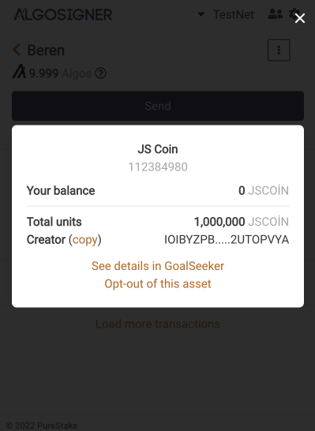

_Şekil 32_


.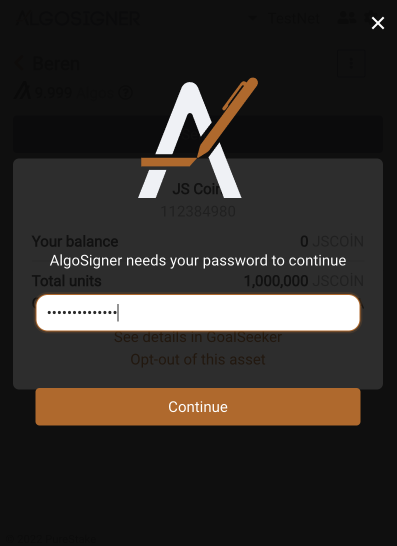

_Şekil 33_

Şekil 32'de ve Şekil 33'de oluşturulan hesapların işlem geçmişlerinin AlgoExplorer sitesi tarafından kontrol edildiği ifade edilmiştir. Görüldüğü üzere Token ve Coin transferleri Amount kısmında farklı olarak ifade edilmiştir.

**Oluşturulan Token'i Ortadan Kaldırma:**

Algorand üzerinde oluşturulan Tokenların bazen ortadan kaldırılması gerekebilir. Bu işlem için birkaç kriterin gerçekleşmiş olması gerekmektedir. İlk olarak bir Token'ın tamamen yok olabilmesi için tüm token sahiplerinin bulundurduğu miktarın Token oluşturucu hesaba göndermesi gerekmektedir. Bu gönderim sağlandıktan sonra tüm hesaplar ve oluşturucu hesap opt-out yaparak Token'ı ortadan kaldırabilirler.

JavaScript üzerinde bu işlemin gerçekleştirilmesi için ilk olarak Beren hesabının tüm Tokenlarını oluşturucu hesap olan İrem hesabına göndermesi ve "opt-out" olması gerekmektedir. Bu işlemi sağlamak için bir transfer fonksiyonu kullanılmaktadır. Transferi gerçekleştirmek için "index.js" dosyasının bulunduğu dosyaya gidilerek "Beren\_opt\_out.js" adlı bir dosya oluşturulur. Bu dosya içerisine normal bir transfer fonksiyonu yazılır.

```JavaScript
 const Algosdk=require('algosdk');require("dotenv").config()
const server="https://testnet-algorand.api.purestake.io/ps2";const port="";const token={"x-api-key": process.env.API};let kullanıcı = new Algosdk.Algodv2(token, server, port);
var beren\_mnemonic = "copy deny kingdom faith need blossom anchor zoo address venue carry rain winter salt rapid infant zero address laptop govern scout rice escape absorb stove"; var berenHesap = Algosdk.mnemonicToSecretKey(beren\_mnemonic);var iremAddress = 'IOIBYZPBAISY636GLWF2PRFXZCPVN2DKXKCCOUCANPA2BROUKV2UTOPVYA';

(async () =\> {let assetID = 112384980; let params = await kullanıcı.getTransactionParams().do();let sender = berenHesap.addr;let recipient = iremAddress;let revocationTarget = undefined;let note = undefined;let closeRemainderTo = iremAddress;let amount = 0;
let txn = Algosdk.makeAssetTransferTxnWithSuggestedParams(sender, recipient, closeRemainderTo, revocationTarget,amount, note, assetID, params);let rawSignedTxn = txn.signTxn(berenHesap.sk)
let tx = (await kullanıcı.sendRawTransaction(rawSignedTxn).do());console.log("Transfer : " + tx.txId);
})().catch(e =\> {console.log(e);}); 
```

_Tablo 107 beren\_opt\_out.js Tamamı_

Tablo 102'de opt-out için özelleştirilmiş bir transfer fonksiyonu ifade edilmiştir. Bu kodun neler yaptığına ve normal bir fonksiyondan nerede ayrılarak opt-out olduğuna bakılacak olunursa:

- İlk olarak gerekli paketleri kod içerisine "require" fonksiyonu kullanarak aktarırız.
- Sonrasında zincir içerisinde işlemlerini gerçekleştirecek değişkenler tanımlanır.
- Bu parametreler yeni bir kullanıcı objesi oluşturularak Algosdk içerisindeki metotlar ile kaydedilir.
- Opt-out yapacak yani tokenları gönderecek hesabın mnemonic anahtarı bir değişken üzerine kaydedilir ve bu değişken ile hesabın kendisi türetilir.
- Alıcı hesabın yani oluşturucu hesabın adresi sonrasında kullanılmak amacıyla kaydedilir.
- Asenkron bir fonksiyon tanımlanır.
- Hesaptan çıkarılmak istenilen Token'ın zincir üzerinde kayıtlı olduğu adres "AssetID" değişkeni üzerinde kaydedilir.
- Transfer parametreleri kullanıcı objesinde "getTransactionParams()" metodu çalıştırılarak bir değişkene kaydedilir.
- Gönderici adres yani Beren hesabının adresi mnemonic anahtardan türetilen hesap objesinin içerisinde bulunan "addr" anahtarına eşitlenerek değişkene kaydedilir.
- Note kısmı ve işlemin gerçekleşmemesi halinde bakiyenin aktarılacağı hesap değişkenleri tanımlanır ve tanımsız (undefined) olarak bırakılır.
- Opt-out işleminin gerçekleşmesi için kalan miktarın nereye gideceğini ifade eden "closeRemainderTo" parametresi İrem hesabının adresine hedeflenir. Bu sayede hesaptaki tüm Tokenlar İrem hesabına transfer edilir.
- Önceki satırda tüm Tokenları gönderdiğimiz için amount değeri 0 olarak tanımlanır.
- Tüm parametreler ham bir transfer değişkeninde kaydedilir.
- Transfer Beren hesabı tarafından imzalanır.
- İmzalanan transfer kullanıcı tarafından zincire gönderilir ve bir geri dönüş beklenir.
- Transfer numarası terminale yazdırılır.
- Olası bir hata asenkron fonksiyonun sonunda ".catch()" yapısı kullanılarak kaydedilir ve terminale yazdırılır.

```JavaScript
 Transfer : CWC5254NALQWH5NWWWCGIWEDEAWR2P2ESCHB3R4BA2LJ2V26AMGA 
```

_Tablo 108_

Opt-out işlemini kodun bulunduğu konumda terminalden "node beren\_opt\_out.js" komutu ile çağırmamız sonrasında Tablo 108'de ifade edildiği gibi bir çıktı oluşmaktadır. Bu çıktı AlgoExplorer ve Goalseeker gibi sitelerde incelenebilir.

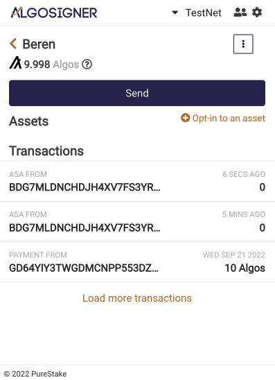

_Şekil 34_

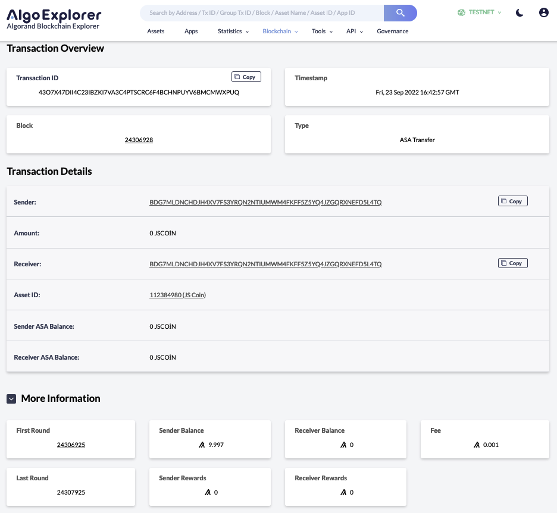

_Şekil 35_

Şekil 34'te bu transferin Goalseeker sitesi üzerinden incelenmesi ifade edilmiştir. Görüldüğü üzere kapanma miktarı 182.000 JSCOIN yani tüm bakiye olurken transfer edilen miktar 0 JSCOIN olmaktadır.

Beren hesabının Opt-out işlemi sonrasında hesabında herhangi bir Asset kalmadığı Şekil 35'de Algosigner üzerinden de görünebilir.

Tüm Token tutucularının oluşturucu hesaba Tokenlarını kalan sistemi ile göndermesi sonrasında İrem hesabı Token'ı ortadan kaldırabilmektedir. Bu işlemi gerçekleştirmek için index.js dosyasının bulunduğu klasöre yeni bir dosya oluşturulması gerekmektedir. Bu dosyaya istenilen isim verilebilir ancak anlatım kolaylığı açısından "irem\_token\_destroy.js" ismi verilecektir.

```JavaScript
 const Algosdk = require('algosdk');require("dotenv").config() 
```

_Tablo 109_

Dosya başlangıcında ilk olarak gerekli paketlerin tanımlanması gerekmektedir. Bu paketler JavaScript içerisinde bulunan "require()" fonksiyonu ile kod içerisine eklenmektedir. Paketlerin sırası ile neler yaptığına bakılacak olunursa:

- **Algosdk:** Algorand blokzinciri ile bağlantı kurulmasını sağlayan pakettir.
- **Dotenv:** Gizli olmasını istediğimiz güvenlik konusunda riskli bilgilerin saklandığı ".env" "dosyasına erişimi sağlayan paket olmaktadır.

```JavaScript
 const port="" 
```

_Tablo 110_

Fonksiyonun içerisine girdiğimizde birkaç değişken tanımlamamız gerekmektedir. Bu değişkenlerden ilki Tablo 110'da ifade edildiği üzere "port" değeri olmaktadır. Port değeri kontrolün gerçekleşeceği bağlantı portunu ifade etmektedir. Bu işlemin için boş bırakılabilir veya 4001 değeri girilebilir.

```JavaScript
 const token={"x-api-key": process.env.API} 
```

_Tablo 111_

Tanımlanması gereken bir sonraki değişken ise Purestake sitesinden elde ettiğimiz API anahtarıdır. Tablo 111'de görüldüğü üzere bu anahtarı kullanarak sorgularımızı gerçekleştireceğiz. Token değeri içerisine anahtarımızı kaydederken obje halinde kaydetmemiz gerekmektedir. Bu objenin içeresine anahtar olarak "x-api-key" string değeri girilmelidir. Bu sayede sonradan çağıracağımız fonksiyon tam olarak hangi değerin anahtar olduğunu anlar. Tanımlamanın diğer tarafına da API anahtarımız gelmektedir. API anahtarımızı ".env" dosyası içerisine kaydettik ancak henüz herhangi bir şekilde dosyaya erişmemiştik. Erişimi gerçekleştirmek için "process.env." metotlarını çağırırız. Son noktadan sonra ".env" dosyasından hangi veriyi elde etmek istiyorsak o verinin kaydederken kullandığımız anahtarını girmemiz gerekmektedir. Biz dosya içerisinden API değerine erişmek istediğimiz için "process.env.API" komutu ile bu işlemi gerçekleştirebiliriz.

```JavaScript
 const Server= "https://testnet-algorand.api.purestake.io/ps2" 
```

_Tablo 112_

Tanımladığımız değişkenleri birleştirmeden önce son bir parametre tanımlaması yapmamız daha gerekmektedir. Bu tanımlama sorguyu gerçekleştireceğimiz testnetin adresi olmaktadır. Şekil 112'de ifade edildiği üzere bu adresi API anahtarını aldığımız Purestake sitesi üzerinden Algorand Testnet başlığı altında görüntülemek mümkündür.

```JavaScript
 let Kullanıcı = new Algosdk.Algodv2(token,Server,port) 
```

_Tablo 113_

Daha öncesinde tanımladığımız parametreler Kullanıcı değişkeni üzerinde birleştirmekteyiz. İlk olarak "let" ile bir değişken tanımlamaktayız. Şekil 113'te gösterildiği üzere bu değişkene kodumuz içerisinde anlaşılırlığın artması amacıyla Kullanıcı adını verdik ancak yabancı kaynaklarda "client" olarak geçtiğini de görebilirsiniz. Devamında tanımın diğer tarafında new anahtar kelimesini görüyoruz. Bu anahtar kelime değişkenin yeni boş bir obje oluşturup içerisine parametreler almasını sağlamaktadır. SDK içerisinden "algosdk.Algodv2()" metodu ile obje oluşturma koduna erişmekteyiz. Bu metot içerisine önceden oluşturduğumuz port, token ve Server değişkenlerini almaktadır. Parametrelerin sıralamasının ifade edildiği düzende olması gerekmektedir. Aksi halde istenilen şekilde çalışmaması söz konusudur.

```JavaScript
 var irem\_mnemonic = "ramp later certain business possible memory cupboard armed truly learn spring you vague vintage nut series curious lonely emerge width patch turtle wool able rice"; var iremHesabı = Algosdk.mnemonicToSecretKey(irem\_mnemonic); 
```

_Tablo 114_

Kullanıcının tanımlanmasından sonra ortadan kaldıracak olan oluşturucu hesabın sonradan kullanılmak üzere bir değişkene kaydedilmesi gerekmektedir. Bu işlemi gerçekleştirmek için kaydettiğimiz mnemonic anahtar kullanılmaktadır. Mnemonic anahtarlar insanlar tarafından rahatça okunabilse de makineler tarafından anlaşılır olmamaktadırlar. Bu nedenle mnemonic anahtarın Algosdk içerisinde bulunan mnemonicToSecretKey() anahtarı kullanılarak Tablo 114'de gösterildiği gibi hesabın kendisine dönüştürülmesi gerekmektedir. Bu sayede "iremHesabı" olarak kaydedilen değişken bir hesap objesi haline gelecektir. İçerisinde hesap adresini, hesabın Secret Key değerini ve mnemonic anahtarını barındıracaktır.

```JavaScript
 (async () =\> {
}) 
```

_Tablo 115_

Token ortadan kaldırma işlemi bir transfer olarak yapılacaktır ve zincire bağlanma gerektirmektedir. Bu işlem zaman almaktadır. Bu nedenle JavaScript yapısının sağladığı nimetlerden biri olan asenkron yapısı kullanılacaktır. Asenkron fonksiyon Tablo 115'de ifade edildiği üzere "async" anahtar kelimesi ile tanımlanmaktadır. Herhangi bir çağırıcı değişkene sahip olmamasından dolayı çalıştırma satırının gelmesi halinde otomatik olarak işleve geçecektir. İçerisine herhangi bir parametre gerektirmemektedir.

```JavaScript
 let assetID = 112384980; let params = await kullanıcı.getTransactionParams().do();let addr = iremHesabı.addr;let note = undefined; 
```

_Tablo 116_

Asenkron fonksiyon içerisine girildiğinde bazı parametrelerin tanımlanması gerektiği Tablo 116'da ifade edilmektedir. Bu parametrelere teker teker bakılacak olunursa:

- **AssetID:** Ortadan kaldırılmak istenilen token veya varlığın zincir üzerindeki tanımlayıcı numarasını ifade etmektedir. Bu değer token oluşurken zincir tarafından otomatik olarak atanmıştır ve oluşturucu tarafından değiştirilemez.

- **Params:** Kullanıcı ile türetilen işlem parametrelerini oluşturan parametredir. "getTransactionParams()" metodu ile çalıştırılır ve fonksiyon olmasından dolayı ".do()" eklentisi ile çalıştırılır. İstenilen isim ile kaydedilebilir.

- **Addr:** Ortadan kaldıracak hesabın adresini ifade etmektedir. Daha önce mnemonic anahtar ile oluşturduğumuz hesap objesi içerisinde bulunan "addr" anahtar kelimesine erişmektedir.
- **Note:** Transferin gerçekleşirken içermesi istenilen not değişkenidir. Undefined yani boş olarak bırakılabilir. İçerisine girilecek değer transfer örneğinde de ifade edildiği üzere "TextEncoder" ile şifrelenmelidir. Bu şifreleme sayesinde zincirde okunabilen bir hal alacaktır. İstenilen isim ile değişken üzerinde kaydedilebilir.

```JavaScript
 let txn = Algosdk.makeAssetDestroyTxnWithSuggestedParams(addr, note, assetID, params);let rawSignedTxn = txn.signTxn(iremHesabı.sk); 
```

_Tablo 117_

Gerekli parametrelerin tanımlanmasından sonra bu parametrelerin bir metotta birleştirilmesi gerekmektedir. Bu işlemi gerçekleştirmek için Algosdk içerisinde yer alan "makeAssetDestroyTxnWithSuggestedParams()" metodu kullanılmaktadır. Bu metot Tablo 117'de ifade edildiği üzere içerisine tanımladığımız değişkenleri verilen sıralama ile almaktadır. Aksi taktirde istenilen şekilde çalışmayacaktır. Txn olarak kaydedilen bu değişken aslında bir transfer olmaktadır ve transfer işlemlerine sokulmalıdır. Bu nedenle transfer oluşturan hesabın Secret Key değeri ile imzalanır ve değişkende kaydedilir. İmzalanmış bu transfer zincire gönderilmek üzere hazır hale gelmiştir.

```JavaScript
 let tx = (await kullanıcı.sendRawTransaction(rawSignedTxn).do());console.log("Transfer : " + tx.txId); 
```

_Tablo 118_

İmzalanan transfer sonrasında asenkron await yapısı ile kullanıcı tarafından "sendRawTransaction()" metodu kullanılarak Tablo 118'de ifade edildiği üzere zincire gönderilir. Bu metot bir obje içerisinde bulunduğu içim ".do()" anahtar kelimesine ihtiyaç duyulmaktadır. Transfer gönderildikten sonra transfer numarası bir değişken üzerinde kaydedilir ve bu numara sonrasında "console.log()" yapısı ile terminale yazdırılır.

```JavaScript
 ().catch(e =\> {console.log(e);}); 
```

_Tablo 119_

Asenkron fonksiyonunun tam çıkış parantezine gelindiğinde Tablo 119'da verildiği üzere bir hata yakalama fonksiyonu eklenir. Bu sayede fonksiyonda oluşabilecek herhangi hatalar ekrana yazdırılır. Bu durumu sağlamak içim "().catch" Arrow Fonksiyonu ile yakaladığımız hatalar "console.log()" fonksiyonu ile terminale yazdırılır.

```JavaScript
 const Algosdk = require('algosdk');require("dotenv").config()
const server="https://testnet-algorand.api.purestake.io/ps2";const port="";const token={"x-api-key": process.env.API};let kullanıcı = new Algosdk.Algodv2(token, server, port);
var irem\_mnemonic = "ramp later certain business possible memory cupboard armed truly learn spring you vague vintage nut series curious lonely emerge width patch turtle wool able rice"; var iremHesabı = Algosdk.mnemonicToSecretKey(irem\_mnemonic);

(async () =\> {let assetID = 112384980; let params = await kullanıcı.getTransactionParams().do();let addr = iremHesabı.addr;let note = undefined;
let txn = Algosdk.makeAssetDestroyTxnWithSuggestedParams(addr, note, assetID, params);let rawSignedTxn = txn.signTxn(iremHesabı.sk);
let tx = (await kullanıcı.sendRawTransaction(rawSignedTxn).do());console.log("Transfer : " + tx.txId);
})().catch(e =\> {console.log(e);}); 
```

_Tablo 120 irem\_token\_destroy.js Kodu Tamamı_

Tablo 120'de Token'i ortadan kaldırmak için gerekli olan kodun tamamı yer almaktadır. Bu kodun işlevine teker teker bakılacak olunursa:

- İlk olarak gerekli paketler tanımlanmaktadır.
- Zincir üzerinde yapılacak sorguyu tanımlayan parametreler değişkenlere aktarılmalıdır.
- Zincir parametreleri bir obje oluşturularak içerisine farklı özellikler beraberinde eklenir.
- Oluşturan ve ortadan kaldıracak hesabın mnemonic anahtarı kaydedilerek bu anahtar üzerinden türetilen hesap bir obje içerisine kaydedilir.
- Asenkron fonksiyon tanımlanır.
- Bu asenkron fonksiyonun içerisinde hangi Token'ın ortadan kaldırılacağı ve transfer parametreleri gibi birçok değişken tanımlanır.
- Tanımlanan değişkenler Algosdk üzerinde bulunan "makeAssetDestroyTxnWithSuggestedParams() metodu ile bir ortadan kaldırma transferinde birleştirilir.
- Transfer oluşturan hesabın Secret Key değeri tarafından imzalanır.
- İmzalanan transfer kullanıcı tarafından zincire gönderilir.
- Transfer sonucu terminale yazdırılır.
- Olası hatalar ".catch()" fonksiyonu tarafından yakalanarak terminale yazdırılır.

```JavaScript
 Transfer : LADSQBXYTNAEHZASOTR7KO3GUPWX6AGFUD46MQQDP7HMEKM3ERIQ 
```

_Tablo 121_


_Şekil 36_

Dosya tamamlandıktan sonra bulunduğu klasörde açılan terminal ile "node irem\_token\_destroy.js" komutu ile çalıştırılacak olunursa Tablo 121'da ifade edilen çıktıyı verecektir. Bu şekilde bir transfer numarası alınmış olunursa işlem başarı ile gerçekleşmiş olacaktır. Bu transfer numarasına Goalseeker ve Algoexplorer gibi sitelerden bakmak mümkündür.

Şekil 36'da gerçekleşen bu ortadan kaldırma işleminin AlgoExplorer'dan göz atılması ifade edilmiştir. "Asset Reason" anahtar kelimesinin karşısına bakılacak olunursa bu işlemin "Destruction" yani imha etme işlemi olduğu ifade edilmektedir.


_Şekil 37_

Yapılan imha işlemine Algosigner üzerinden bakmak mümkündür. Şekil 37'de ifade edildiği üzere her iki hesapta da herhangi bir Asset bulunmuyor olmaktadır. Ayrıca "Opt-in to an asset" sekmesinde öncesinde var olan Token'in artık bulunmuyor olduğu görülmektedir.

Bu şekilde bir ASA Token'ı oluşturulabilir, sorgulanabilir, transfer edilebilir ve yok edilebilir.