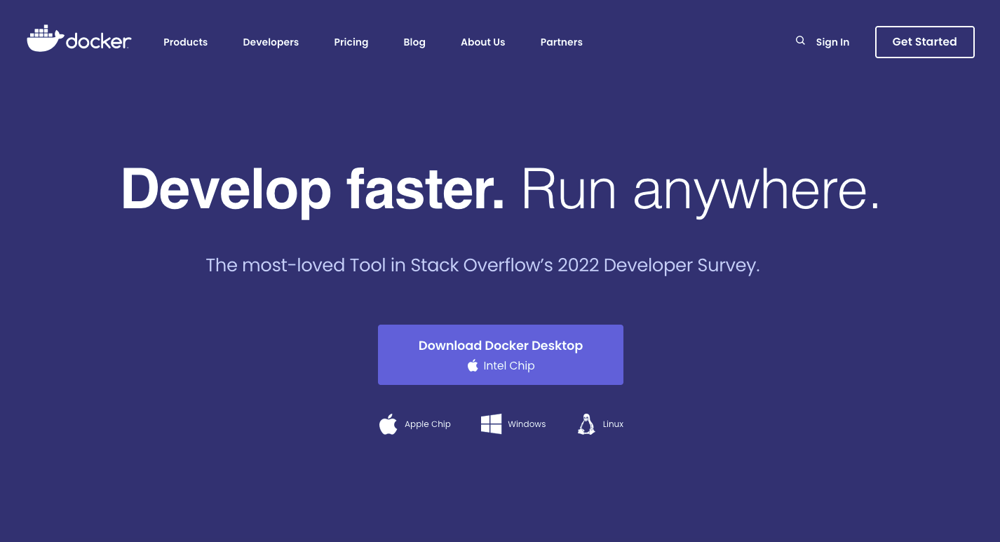
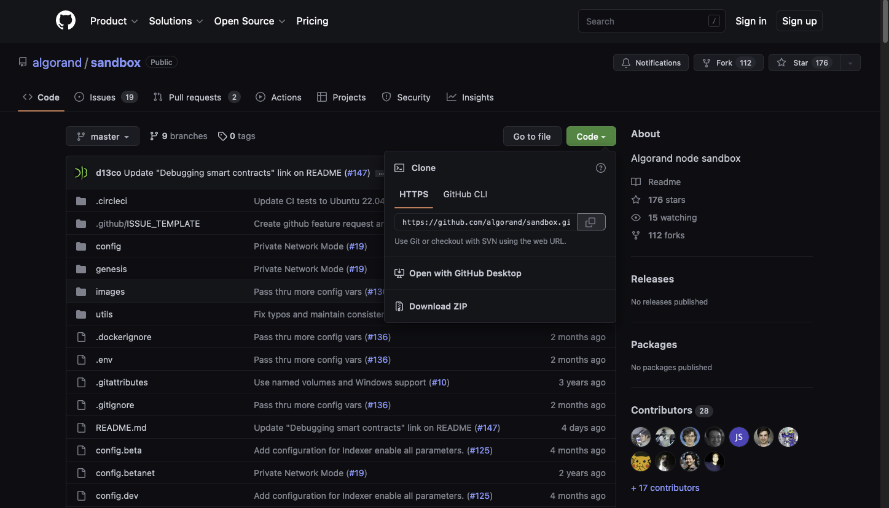
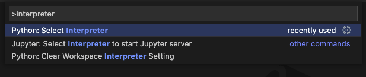

# Docker Kurulumu

Docker, uygulamalarınızı hızla derlemenizi, test etmenizi ve dağıtmanızı sağlayan bir yazılım platformudur. Docker, yazılımları kitaplıklar, sistem araçları, kod ve çalışma zamanı dahil olmak üzere yazılımların çalışması için gerekli her şeyi içeren konteyner adlı standartlaştırılmış birimler halinde paketler. Docker'ı kullanarak her ortama hızla uygulama dağıtıp uygulamaları ölçeklendirebilir ve kodunuzun çalışacağından emin olabilirsiniz.



_Şekil 38_

Projemizde de Sandbox'ın çalışması için sürekli olarak Docker'ın arka planda açık olması gerekmektedir. Bu nedenle Docker kurulumu gerçekleştirilmeden akıllı kontratlarımızı test edemeyiz. Docker'ı [https://www.docker.com/](https://www.docker.com/) adresinden işletim sistemine uygun olarak indirip kurabiliriz.

Şekil 38'de Docker sitesi ifade edilmiştir. Bu site içerisinde de görüldüğü üzere Docker MacOS, Windows ve Linux sistemlerde desteklenmektedir.

**Sandbox Kurulumu:**


_Şekil 39_

Sandbox Algorand akıllı kontratlarının oluşturulmasını ve geliştirilmesini hızlandıran bir ortam olmaktadır. Sandbox Algorand ağının lokal olarak çalışmasını sağlayan Docker konteynerleri bütünüdür. Üzerinde işlemler yapabileceğimiz local bir Algorand ağı oluşturmaktadır. Çalışması için Docker aracının yüklü ve arka planda çalışıyor olması gerekmektedir. Algorand Sandbox ortamının kurulması için Algorand'ın Github sayfası üzerinden Sandbox klasörünün klonlanması gerekmektedir. Bu işlem için [https://github.com/algorand/sandbox](https://github.com/algorand/sandbox) sitesi ziyaret edilmektedir.

Sandbox klasörüne giriş yapıldıktan sonra Şekil 36'da ifade edildiği üzere yeşil renkli "Code" butonuna tıklanmalı ve oradan da "HTTPS" başlığı altında bulunan URL kopyalanmalıdır. Kopyalama işlemi URL'nin yanında bulunan iki iç içe geçmiş kare sembolüne tıklanarak otomatik olarak gerçekleştirilebilir. Bağlantı kopyalandıktan sonra proje içerisine eklenmeye hazır bir hal almaktadır. Kurulum için ilk olarak VS Code editörü açılır. Sonrasında tüm Pyteal kodlarını barındıracak bir klasör oluşturulması beklenir. Hali hazırda bulunan klasörlere de eklenebilse de kullanım kolaylığı ve düzen açısından yeni bir klasörün oluşturulması tavsiye edilmektedir.

```JavaScript
 git clone https://github.com/algorand/sandbox.git 
```

_Tablo 122_

Oluşturulan klasöre cd komutları ile terminalden erişilmesi sonrasında Tablo 112'de ifade edildiği üzere "git clone" komutu ile Github projesi klasörümüze eklenecektir. Klonlama işlemi sonrasında proje klasörü içerisinde Sandbox adlı bir klasör oluşacaktır. Bu klasör Sandbox ortamında erişmek istediğimiz tüm özellikleri barındırmaktadır.

Sandbox ortamı kurulumundan sonra projelerimizin yer alacağı bir iskelet yapısı gerekmektedir. Bu yapı için yine Algorand Github sayfası içerisinde bulunan [https://github.com/algorand-devrel/pyteal-course](https://github.com/algorand-devrel/pyteal-course) linkinden erişilen klasörü klonlamamız gerekmektedir.

```JavaScript
 git clone https://github.com/algorand-devrel/pyteal-course.git 
```

_Tablo 123_

Sandbox dosyasını içerisine oluşturduğumuz klasöre terminalden ulaşarak Tablo 123'de ifade edilen "git clone" kodunu çağırabiliriz. Bu şekilde örnek bir iskelet projemize eklenmiş olacaktır. Oluşacak "pyteal-course" adlı bu klasör VS Code veya dosya yöneticisi üzerinden kullanım kolaylığı amacıyla "project" olarak değiştirilecektir.

Project dosyası içerisinde bazı düzenlemeler yapılması gerekmektedir. Düzenlemeler için ilk olarak "cd" komutu ile proje klasörüne terminalden girilmesi gerekmektedir. Klasör içerisine bir Python Sanal Makinesi kurulması gerekmektedir. Bu şekilde kurduğumuz paketler ve kütüphaneler sadece bu sanal makine üzerinde var olacaktır.

```JavaScript
 python -m venv venv 
```

_Tablo 124_

Sanal ortamı kurmak için Tablo 124'te ifade edildiği üzere "python -m venv" komutu girilmelidir. Bu komuttan sonra tekrarlanan "venv" ibaresi sanal makinenin adını ifade etmektedir ve herhangi bir değer alabilir. Ancak VS Code ve diğer editörlerin daha kolay bir şekilde sanal makineyi tespit etmesi amacıyla "venv" adı tercih edilmiştir.

```JavaScript
 source ./venv/Bin/activate #Mac ve Linux işletim sistemine sahip makinalar içinsource ./venv/Scripts/activate #Windows işletim sistemine sahip makinalar için 
```

_Tablo 125_

Oluşturulan sanal makineyı terminalden erişebilecek şekilde aktif etmemiz gerekmektedir. Bu işlemi gerçekleştirmek için Tablo 125'te ifade edildiği üzere işletim sistemine özgü aktif etme kodunu terminal üzerinden çalıştırmak gerekmektedir. Bu sayede sanal makine aktif hale gelecektir.

Terminal üzerinde bir değişiklik yapsak da bu değişikliği aynı zamanda VS Code için de yapmamız gerekmektedir. Bu işlem için MacOS üzerinde "cmd + shift + p" ile Windows üzerinde "crtl + shift + P" ile eriştiğimiz komut paletine "interpreter" anahtar kelimelerini yazmamız gerekmektedir.


_Şekil 40_

Şekil 40'ta ifade edildiği üzere karşımıza çıkan seçenekler arasından "Python: Select Interpreter" seçeneğini seçmemiz gerekmektedir. Bu kısımda karşımıza öncesinde oluşturduğumuz veya "defult" olarak oluşan sanal makineler gelmektedir. Ancak bu makineler arasında seçmek yerine direkt olarak dosyayı seçtirmemiz gerekmektedir. Bu işlem için en üst kısımda bulunan "Enter interpreter path" seçeneği seçildikten sonra karşımıza çıkan "Find" tuşuna basarak dosya gezgini içerisinde proje klasörünün içerisinde bulunan "venv" klasörünü bulmamız gerekir. Bu klasör içerisinde bulunan bin alt klasörü içerisindeki "Python" adlı dosyayı seçeriz ve "Select Interpreter" butonu ile işlemi tamamlarız. Bu şekilde sanal makine VS Code içerisinde çalışmaya hazır hal alacaktır.

```JavaScript
 pip install -r ./requirements.txt 
```

_Tablo 126_

Aktif edilen sanal makine içerisine bazı paketler eklenmelidir. Bu paketler requirements.txt klasörü içerisinde yer almaktadır. Tablo 126'da ifade edildiği üzere "pip install" komutu ile indirilmekte ve kurulmaktadır. Kurulum bittikten sonra paketler başarılı bir şekilde projemize eklenmiş olur. Bu dosyaların içerisinde Python Algorand SDK ve Pyteal kütüphaneleri de bulunmaktadır.

Son olarak kurulumu tamamlamak için Sandbox klasörü ile Project klasörünü bağlamamız gerekmektedir. Bu işlemi gerçekleştirmek için Sandbox klasörü içerisinde bulunan "docker-compose.yml" dosyası içerisinde bazı değişiklikler yapmamız gerekmektedir. Dosya içerisine girildikten sonra "services" ve sonrasında "algod" anahtarları altına geldiğimizde ekleme yapacak yeri belirlemiş oluruz.

```JavaScript
 ports: …volumes:- type: bind,source: ../projecttarget: /data 
```

_Tablo 127_

Tablo 127'de ifade edildiği üzere "ports" anahtarı hizasında "ports" içerisinde değişiklik yapılmadan yeni bir "volumes" anahtarı eklenir. Bu anahtar içerisine type, source ve data parametreleri eklenmektedir. Bu anahtarlara teker teker bakılacak olunursa:

- **Type** : İşlem türünü ifade eder. Bağlama yapılacağı için bind olarak ifade edilmektedir.
- **Source** : Bağlamanın kaynağının konumu ifade etmektedir. Bir üst klasördeki Project klasörü kaynak olduğu için ../project olarak ifade edilmiştir.
- **Target** : Bağlamanın hedefini ifade etmektedir. Hedefte bulunan /data klasörü ile Sandbox konteynırı tarafından erişilebilir hal alır.

Kurulum sonrası Sandbox çağırılmaya hazır hal alır. Bu işlem için ilk olarak Sandbox klasörüne terminal üzerinden erişilmesi gerekmektedir. Klasör değişimi sağlandıktan sonra test kodları çalıştırılabilir.

```JavaScript
 ./sandbox up 
```

_Tablo 128_

İlk olarak çalıştırılacak test komutu "sandbox up" olmaktadır. Bu sayede Docker konteynerları kurulur ve çalıştırılır. Bu komutun çalışabilmesi için arka planda Docker'ın bilgisayarda çalışıyor olması gerekmektedir. Tablo 128'de ifade edilen bu kod ilk çalışmasında uzun bir süre alabilmektedir. Kodu ilk defa çalıştırdığımızda bizlere birçok bilgi ve örnek olarak çalıştırılabilecek komutları çıktı olarak vermektedir.

```JavaScript
 ./sandbox goal account list 
```

_Tablo 129_

Tablo 129'da ifade edildiği üzere bu komutlardan biri de örneklerimiz içerisinde çokça kullanacak olduğumuz local adres listesini ekrana yazdıran kod parçasıdır. Bu kodu çalıştırabiliyor olmamız doğru bir şekilde kurulum yaptığımızı ifade etmektedir.
