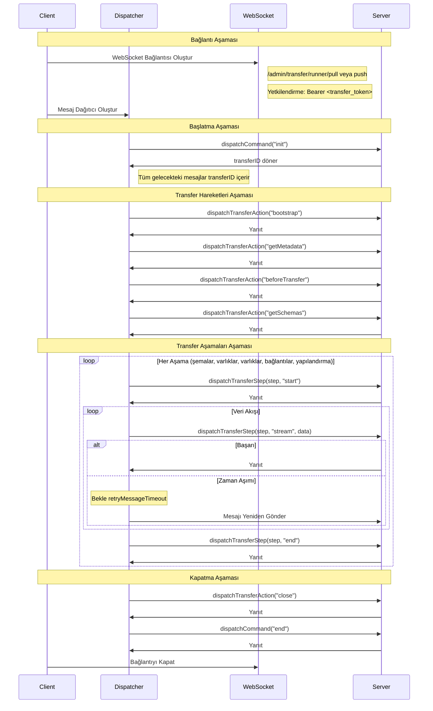
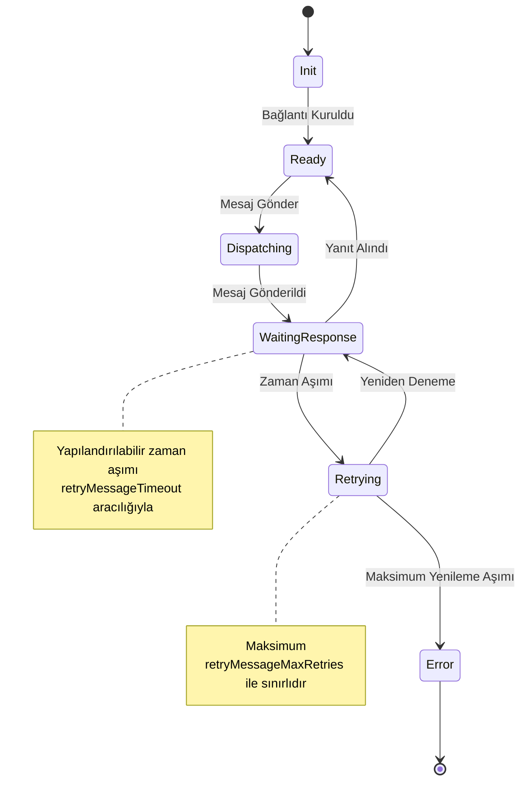

# WebSocket

## Websocket Mesajları / Dağıtıcı

Uzak websocket sunucusu yalnızca transfer komutları adını verdiğimiz belirli websocket mesajlarını kabul eder. Bu komutlar belirli bir sırayla gönderilmeli ve sunucu beklenmedik bir mesaj aldığında bir hata mesajı döndürülecektir.

:::tip
Mesajları sunucuya göndermek için bir **mesaj dağıtıcı nesnesi** oluşturulmalıdır.
:::

Dağıtıcı hakkında daha fazla bilgi için `packages/core/data-transfer/src/strapi/providers/utils.ts` dosyasına bakınız.

Dağıtıcı şunları içerir:

### dispatchCommand

Bir transferi açmak ve kapatmak için kullanılan "komutları" kabul eder.

Aşağıdaki `command` değerlerine izin verir:

- `init`: bir bağlantıyı başlatmak için. Bu transferdeki tüm gelecekteki mesajlarla birlikte gönderilmesi gereken bir **transferID** döner.
- `end`: bir bağlantıyı sonlandırmak için.

### dispatchTransferStep

Bir transferin aşamalarında geçiş yapmak ve real zamanlı transfer verisini akıtmak için kullanılır.

Aşağıdaki `action` değerlerini kabul eder:

- `start`: adım/aşama adını içeren bir `step` değeri ile gönderilir.
  - herhangi bir sayıda `stream`: bir `step` değeri ve gönderilen `data` ile gönderilir (yani, bir varlıklar dizisi).
- `end`: sona erdirilen adım için bir `step` değeri ile gönderilir.

:::info
Gönderilmesi gereken mesajların tam ve kesin tanımları için `packages/core/data-transfer/dist/strapi/remote/handlers/pull.d.ts` ve `packages/core/data-transfer/dist/strapi/remote/handlers/push.d.ts` dosyalarına bakınız.
:::

### dispatchTransferAction

Sunucuda yerel sağlayıcılarla eşdeğer 'hareketleri' tetiklemek için kullanılır.

- `bootstrap`
- `getMetadata`
- `beforeTransfer`
- `getSchemas`
- `rollback` (hedef sadece)
- `close`: bir transferi tamamlamak için (ama bağlantıyı kapatmaz)

## Transfer Yaşam Döngüsü



### 1. Bağlantı Aşaması

Strapi sunucusu için veri transferi işlevi etkinleştirildiğinde (bir `admin.transfer.token.salt` yapılandırma değeri ayarlanmışsa ve `server.transfer.remote.enabled` false olarak ayarlanmamışsa), Strapi `/admin/transfer/runner/pull` ve `/admin/transfer/runner/push` rotalarında erişilebilir websocket sunucuları oluşturacaktır.

**WebSocket Bağlantısı Oluştur**

- Bu rotalarda bir websocket bağlantısı açmak için Yetkilendirme başlığında geçerli bir transfer token'ı gerektiği:
  ```
  Authorization: Bearer <transfer_token>
  ```
- Sunucu token'ı doğrular ve bağlantıyı kurar

Strapi websocket'ine ilk bağlantıyı nasıl yapacağınız konusunda örnek için uzaktan sağlayıcıların `bootstrap()` yöntemine bakınız.

**Olay Dinleyici Ekleme**  
WebSocket oluşturulduktan hemen sonra aşağıdaki dinleyiciler eklenir:

- `'open'`: Başarılı bağlantı kurulumu ile ilgilenir
- `'close'`: Bağlantı sonlandırmasını yönetir
- `'error'`: Bağlantı ve iletim hatalarını ele alır
- `'message'`: Sunucudan gelen mesajları işler

### 2. Başlatma Aşaması

İstemci transferi başlatmak için ilk komutu gönderir, sunucu benzersiz bir transferID ile yanıt verir.

```javascript
const transferID = await dispatcher.dispatchCommand('init');
// Tüm sonraki mesajlar bu transferID'yi içermelidir
```

Tüm sonraki mesajlar bu **transferID'yi** içermelidir.

### 3. Transfer Hareketleri Aşaması

`dispatchTransferAction` aracılığıyla işlenen ardışık hareketler:

1. `bootstrap`: Transfer ortamını başlatır.
2. `getMetadata`: Transfer meta verilerini alır.
3. `beforeTransfer`: Transfer öncesi hazırlıkları yapar.
4. `getSchemas`: İçerik türü şemalarını alır, kaynak ve hedef arasında doğrulama için kullanılır.

### 4. Transfer Aşamaları Aşaması

Gerçek veri transferinin gerçekleştiği ana aşama, ardışık olarak farklı veri türlerini (şemalar, varlıklar, varlıklar, bağlantılar, yapılandırma) işleme:

**Aşama Başlat**

```javascript
dispatchTransferStep(action: "start", step)
```

**Veri Akışı**

```javascript
dispatchTransferStep(action: "stream", step, data)
```

**Aşama Tamamlanması**

```javascript
dispatchTransferStep(action: "end", step)
```

**Yenileme Mekanizması**  
Veri transferi sırasında:

- Eğer sunucu yanıtı `retryMessageTimeout` içinde alınmazsa,
- Sistem, maksimum `retryMessageMaxRetries` sayısı kadar yenilemeyi dener.
- Zaman aşımında otomatik yenileme.
- Maksimum denemeler aşıldığında transfer iptal edilir.

### 5. Kapatma Aşaması

**Temizlik Eylemleri**

1. Kapatma eylemi gönder:
   ```javascript
   dispatchTransferAction('close');
   ```
2. Son komut gönder:
   ```javascript
   dispatchCommand({ command: 'end', params: { transferID } });
   ```

**Bağlantı Sonlandırma**

1. Olay dinleyicilerini ters sırayla kaldır:
   - `message` dinleyicisini kaldır
   - `error` dinleyicisini kaldır
   - `open` dinleyicisini kaldır
   - `close` dinleyicisini kaldır
2. WebSocket bağlantısını kapat

## Mesaj Zaman Aşımı ve Yenileme



Transfer, mesaj->yanıt protokolüne dayanır; bu nedenle, websocket sunucusu bir yanıt gönderemezse, örneğin ağ kararsızlığı nedeniyle, bağlantı durur. Bu nedenle, her sağlayıcının seçenekleri, belirli bir zaman aşımına ulaşıldığında bir mesajı yeniden göndermeye yönelik `retryMessageOptions` içerir ve belirli sayıda başarısız yenileme girişiminden sonra transferi iptal etmek için bir maksimum yenileme seçeneği içerir.