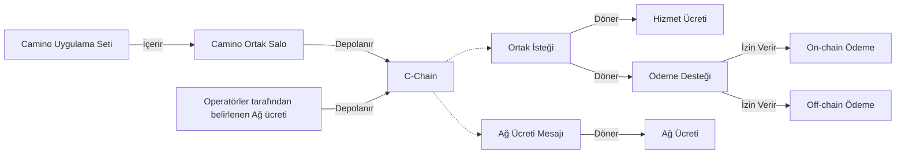
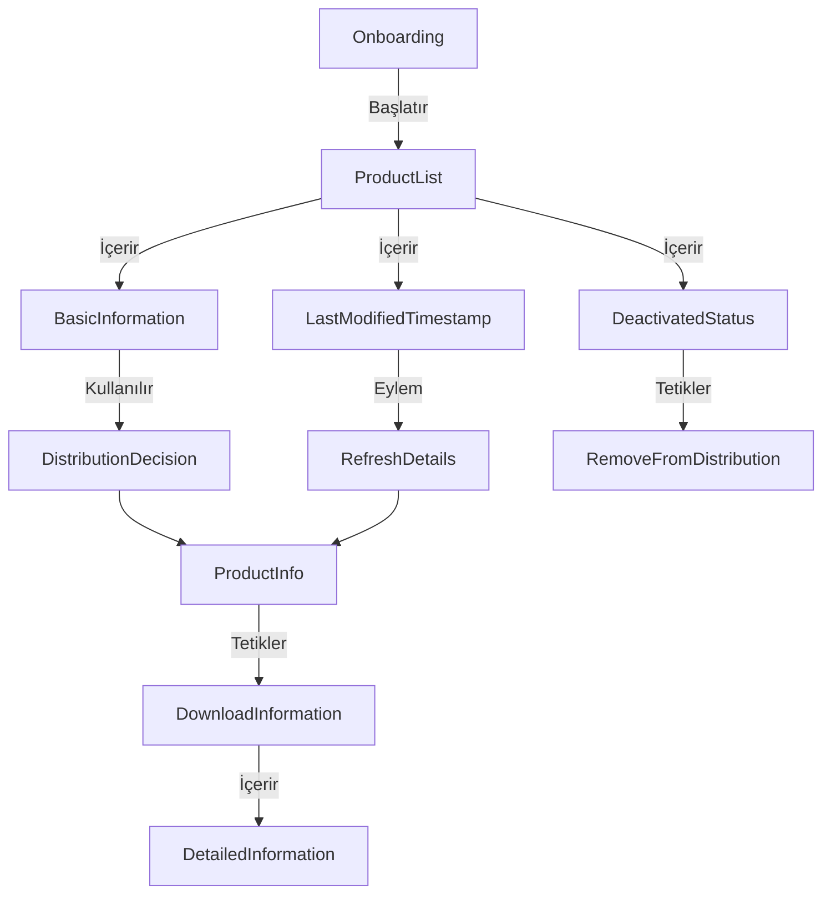
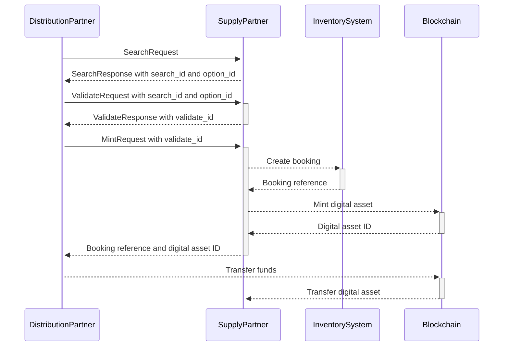
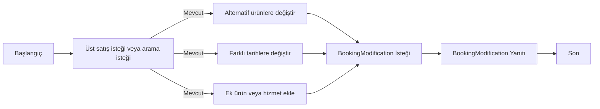

# Camino Messenger Protokolü Dokümantasyonu

:::info TASLAK DOKÜMAN BİLDİRİMİ

İlk üretken Mesaj Türleri versiyonumuzu yayınlamış olsak da, hala erken dönemlerdeyiz ve ortaklar Camino Mesaj Türleri'ne önemli ve sık katkılarda bulunmaktadır. Bu belgenin hala bir taslak olduğunu ve aktif geliştirme aşamasında olduğunu lütfen dikkate alın. İçerik, yönergeler ve talimatlar değişikliklere tabi olabilir.

:::

## Giriş

Camino Mesaj Türleri için resmi belgelere hoş geldiniz. Protokol seti, seyahat dünyası ve bu yolculuğa katılan Camino Ağı Ortakları için geniş bir işlevsellik yelpazesine hitap edecek şekilde tasarlanmıştır.

Genel bir bakışa  web sitesinden ve derinlemesine bilgiye  ulaşabilirsiniz.

Camino Messenger protokolü, her sektörden (uçuşlar, oteller, tatil evleri, transferler, araç kiralama, cruising vb.) ortaklarla birlikte oluşturulmuştur. Hedef, Camino Messenger için basit, verimli, eksiksiz, sağlam ve tüm ortaklar tarafından kolayca entegre edilebilecek bir mesaj standardı oluşturmaktır. Sonuç olarak, bu standart ortaklar tarafından keyifle uygulanacak ve kullanılacaktır. Diğer tüm Camino Ağı bileşenleri gibi, Camino Messenger Protokolü de açık kaynaklıdır. Her yerde kullanılabilir, ancak elbette Camino Messenger ile kullanılmak üzere hedeflenmiştir.

Camino Messenger, Dağıtım ve Tedarik ortakları arasında mesaj iletmek için bir istemci-sunucu çözümüdür. WhatsApp gibi, ortakların çevrelerinde bir istemci kurmaları gerekmektedir; biz buna Messenger Bot diyoruz.

Ortakların Bot ile dağıtım veya envanter sistemleri arasında bir bağlantı kurması gerekmektedir. Buna Ortak Eklentisi diyoruz. Bir örnek uygulama, Go ve Java için github'ımızda sağlanmıştır. SDK'lar, ihtiyaç duyduğunuz dil ve araçlar için doğru kütüphane/eklentilerin indirilebileceği  sayfamızda sağlanmaktadır.

Rezervasyon aşamasında, Bot tüm blockchain etkileşimlerini soyutlar. Ortaklar kullanılabilir ürünleri, fiyat ve mevcudiyeti değiş tokuş ettiğinde ve messenger aracılığıyla belirli bir seçim yapıldığında ve tedarik partnerinin envanterinde güvence altına alındığında, Tedarikçi Bot bir Rezervasyon Token'ı oluşturur ve Dağıtım Bot'u Rezervasyon Token'ını satın alır. Daha fazla detay için aşağıdaki paragraflara bakabilirsiniz.

Ortak Salo'nun gösteriminde, her ortak sunulan veya istenen hizmetleri yapılandırabilir. İstenirse, tedarikçiler bilgi sağlama karşılığında bir mesaj için ücret talep edebilir veya büyük sayıda aramanın işleme maliyetlerini dengeleyebilirler.

Lütfen bu belgedeki gözlemlerinizi, belirsizlikler, hatalar veya eksik açıklamalar gibi, iletmekten çekinmeyin; böylece bu belgeyi sürekli olarak geliştirebiliriz. Herkes, mesaj formatını geliştirmek için resmi Mesaj Türü incelemelerine katılabilir.  bir Messenger Protokolü inceleme kanalı bulunmaktadır. Ağaç ortaklar önerilen değişiklikler üzerinde oylama yaparak karar verirler.

## Messenger

Seyahat endüstrisinde çeşitli ortaklar otel geceleri, uçuş koltukları, transferler veya bir etkinlik için bilet gibi seyahat ürünleri ticareti yapmaktadır. Bir seyahat acentesi, bir tur operatöründen bir paket satın alabilir, bir tur operatörü gelen bir acenteden bir transfer veya bir uçuş brokeri ya da havayolu şirketinden bir uçuş satın alabilir. Alım yapan ortağa "Dağıtıcı", satan ortağa ise "Tedarikçi" diyoruz.

Bir Tedarikçi ile bir Dağıtıcı arasındaki tüm etkileşimlerin sonsuza kadar bir blockchain içinde saklanması gerekmemektedir. Seyahat ürünlerinin fiyatları ve mevcudiyeti giderek daha dalgalı olmakta ve seyahat tarihi geçtikten sonra geçersiz hale gelmektedir.

Bir seyahat ürünü bir dağıtıcı tarafından rezerve edildiğinde, hizmetin rezervasyonu ve ödenecek fiyatın tek bir gerçeği olması için on-chain işlem yapmak istiyoruz.

Sadece rezervasyonu blockchain üzerinde işlem yapmak ve ürünler, fiyatlar ve mevcudiyetler için mevcut kaosu sürdürmek mantıklı olmayacaktır. Seyahat endüstrisindeki herhangi bir orta boy oyuncu için en az 100 API'nin bakım maliyeti önemli bir maliyet etkisi yaratmaktadır.

Messenger, tüm seyahat ürünleri için tek bir bağlantı sağlar; B2B cüzdanınız, herhangi bir bağlantı için ihtiyaç duyduğunuz tek kimlik setidir ve her seyahat ürününde sadece bir kez uygulanmış alt mesajlarla bir Mesaj Standardı vardır. Tedarikçilerin sağlık durumunu gözlemlemekten, fiyat ve mevcut aramalarını araştırmaktan, rezervasyon, çapraz satış ve değişiklik süreçlerine kadar.

Blockchain teknolojisinin büyük bir faydası, ödemenin rezervasyonun aynı işleminde gerçekleşebilmesidir. Partnerin ayın sonunda sizin faturanızı ödeyeceğine güvenmeye gerek yok. Artık kredi riski sigortası ve tahsilat maliyetleri yok. Faturalama ve uzlaştırma prosedürleri yok. Tartışmalar, ödeme gecikmeleri ve kredi notları yok. Bu işlem, Camino Messenger Bot'un işlem bildirimini ödeme platformunuza iletmektedir. Ancak, ilk adımlarınızı Camino Ağı üzerinden ticaret yapmayı birinci aşama, stablecoin ile ticaret yapmayı ikinci aşama olarak bölmek istiyorsanız, bu da sorun değildir. Rezervasyonu temsil eden Dijital varlık, on-chain üzerinde sıfır değerle de ticaret edilebilir ve sağlayıcı tarafından fiat para biriminde normal bir fatura düzenlenebilir.

Camino Messenger, Camino Ağı'nın doğrulayıcıları tarafından barındırılan merkezi olmayan bir messenger sunucular ağını temsil eder. Dağıtım ve tedarik ortakları, Messenger Bot olarak adlandırdığımız bir messenger istemcisini kurarlar. Her ortak kendi sistemlerini Messenger Bot'a bağlamak için tercih ettiği programlama dilinde gRPC SDK'sını kurmak zorundadır. Onboarding, Arama ve Doğrulama mesajları ortaklar arasında şifreli bir şekilde gönderilir. Aynı formatta birçok tedarikçiden bir ürün için, ya da bir çok seyahat ürünü için istek yapılabilir; bu, ürün ve fiyat araştırma süreçlerindeki çoğu kısmın aynı olduğu anlamına gelir. 

Şekil 1: Camino Messenger Teknik Altyapısı

**Performans Göstergeleri**

gRPC metadata'sında her alan ve işleme süresi kaydedilir. İstekleriniz ve yanıtlarınızın bu metadata'sını kaydeden bir betik vardır, bu veriler net bir .csv formatında toplanır. Bu şekilde, Camino Messenger'in ve sağlayıcılarınızın performansı hakkında tam şeffaflık sağlarsınız. gRPC hakkında daha fazla bilgi  bulunabilir.

## Mesaj Türü Standardı

WhatsApp messenger'da, WhatsApp istemcisi yüklü olan herkesle değiş tokuş edebileceğiniz birkaç standartlaşmış Mesaj Türü bulabilirsiniz (metin, konum, ses, video, kişi, belge vb.). Camino Messenger'da da durum aynıdır; tüm ortakların uçuş, otel, araç kiralama, transfer, etkinlikler gibi Mesaj Türlerini tek tip kullanabilmesi gerekmektedir, hangi ortakla bağlantılı olduğuna bakılmaksızın. 

Bir Messenger istemcisinin kullanılması, Mesaj Türü Standardını alan adları ötesinde tanımlamayı da mümkün kılar. Daha geliştirilmiş mesaj doğrulama, alan verisi ve iş akışı standartlaştırması sağlanabilir.

Örneğin, üç ana Mesaj Türü şunlardır:

- **Konaklama**: Otel ve tatil evleri gibi Konaklamalar için Mesaj Türünü tanımlar.
- **Taşımacılık**: Uçuşlar, Demiryolu ve Transferler için Mesaj Türünü tanımlar.
- **Etkinlik**: Bilet ve Turlar için.

Her birinde bir ürün listesi, ürün detayları ve bir arama mesajı bulunur. **`types`** bölümünde, tüm seyahat ürünlerinde kullanılan alt mesajları bulabilirsiniz; örneğin yolcular, seyahat dönemi, konum, coğrafi koordinatlar, para birimleri vb.

### İş Akışı

Bir blockchain, ürün veya hizmetten bağımsızdır. Sonuç olarak, Camino Messenger için iş akışını herhangi bir ürün veya hizmet için aynı tutma stratejimiz vardır.

Web2 döneminden herhangi bir API son noktasında olduğu gibi, Camino ağında bir tedarikçinin mevcudiyetini kontrol etmek için bir Ping İsteği gönderebilirsiniz.

#### Ortaklar

Ortak yapılandırmaları, Camino Ortak Salo'dan yönetilebilir. Bu, Camino Uygulama Setinin bir parçasıdır ve ortakların birbirlerini keşfedebileceği ve sundukları ve almak istedikleri hizmetler hakkında çevrimdışı iletişim başlatabileceği bölümdür. Her iki ortak için yapılandırma ayarlandığında,  detaylı bir şekilde belirtildiği gibi, çevrimiçi iletişim başlatılabilir ve bu sayfanın ilerleyen kısımlarında tarif edileceği gibi gerçekleşir.

### Ücretler

Camino Messenger aracılığıyla mesaj değişimi yapabilmek için aşağıdaki ücretler ödenmelidir:

1. Camino Messenger Ağ Ücreti

   Ağ Ücreti, Messenger Sunucusunun operatörlerine gider. Başlangıçta her mesaj için alınan ücret 0.0003 CAM (şu anda 0.000045 CHF). Ücret, ağdaki her sunucuda tam olarak aynıdır ve sunucu operatörleri tarafından oylama ile kararlaştırılacaktır. Ağ ücreti operatör (yüzde 70) ve Chain4Travel (yüzde 30, daha fazla geliştirme için) arasında bölünür. Anonim bir messenger sunucusu ile çalışmak yerine, tedarikçileri kendi messenger sunucularını barındırmaya teşvik ediyoruz; böylece ağ ücretini kendileri kazanabilirler.

Her mesaj, yani her istek ve her yanıt, ağ ücretini gerektirir. Örneğin, bir OTA (dağıtıcı) 10 Konaklama Tedarikçisine bir mesaj isteği gönderdiğinde, 0.003 CAM (0.0003 CAM her mesaj için) öder. Eğer yedisi yanıt gönderirse, her biri her mesaj için 0.0003 CAM ödeyecektir.

2. Camino Messenger Hizmet Ücreti

   Hizmet Ücreti, tedarikçi tarafından her bir hizmet için belirlenmektedir. CAM ile belirtilir ve 0 dahil herhangi bir değere sahip olabilir. Bu, ek bir gelir akışı sağlamayı, trafik/proses maliyetlerini dengelemeyi, rezervasyon ücretleri için bir değiştirme veya bilgi hizmetlerinin sağlanması için ödeme olarak tasarlanmıştır. Hizmet Ücreti tedarikçi (yüzde 70) ve Chain4Travel (yüzde 30, daha fazla geliştirme için) arasında bölünür.

Ortak ve Ağa ait mesajlar, değişen ortakların, ayarlarının ve ücretlerinin otomatik olarak tespit edilmesini sağlamak için kullanılabilir olacaktır.

Şekil 2: Hizmet Ücreti ve Ağ Ücreti

**Rezervasyon Ücreti**
Bir rezervasyon yapıldığında, Mint mesajından önce bir veya daha fazla doğrulama mesajı değiş tokuş edilmiştir. Ağ Ücreti her biri için gereklidir, bu nedenle bir doğrulama ve rezervasyon döngüsü için, Dağıtıcı 2 isteği için ve tedarikçi 2 yanıtı için ödeme yapar. Mesaj başına 0.0003 CAM ile toplamda 0.0012 CAM, her biri için 0.0006 CAM olur.

Tedarikçi botu, ailesi ve şu anda işlem karmaşıklığına bağlı olarak yaklaşık 0.1 CAM olan rezervasyon token'ını on-chain üzerinden oluşturur. Dağıtıcı botu, dijital varlığın istenen rezervasyonu temsil edip etmediğini kontrol ettikten sonra bir satın alma işlemi başlatır. Bu işlem şu anda yaklaşık 0.03 CAM masrafa mal olmaktadır.

Şekil 3: Bir rezervasyon için 1.000 aramada toplam arama ve rezervasyon ücretleri

Aşağıdaki örnekte, daha fazla aramanın bir rezervasyon oluşturmak için gerektiği bir ortaklık görülmektedir. İşleme ek maliyetlerini dengelemek için, tedarikçi iç maliyetleri dengelemek adına biraz daha yüksek bir Hizmet Ücreti belirlemiştir. Böyle bir Hizmet Ücretini belirlemek, sağlıklı bir rezervasyon oranına sahip ortaklıkları etkilemez; ancak daha az verimli ortaklıklarda optimizasyon teşvikinin önemli hale geldiği durumlarda geçerlidir.

Şekil 4: Bir rezervasyon için 50.000 aramada toplam arama ve rezervasyon ücretleri

#### Onboarding

Camino Ağı üzerinde ticaret yapılabilmesi için, bir havayolu veya uçuş tedarikçisinin sunduğu rotaları ve uçakları, bir konaklama tedarikçisinin sunduğu otelleri ve bir etkinlik tedarikçisinin sunduğu etkinlikleri anlamak için bir onboarding süreci gereklidir. Bu onboarding ve eşleştirme süreci için aşağıdaki mesajlar tasarlanmıştır:

1. Ürün Listesi İsteği: Bir tedarikçinin sunduğu ürün veya hizmetleri keşfetmek için bir Mesaj Türü; bir ürün veya hizmetin dağıtımıyla ilgili karar vermekte ve bunu iç kodlarla eşleştirmekte temel bilgiler sağlar. Bir LastModifiedTimestamp ve "devre dışı" durumu içerir.
2. Ürün Detayları İsteği: Sunulan ürün veya hizmet ile ilgili tüm bilgileri indirin.

Şekil 5: Onboarding İş Akışı

#### Rezervasyon Süreci: Arama, Doğrulama ve Gerçek Zamanlı Mint

Camino Ağı'nda ticaret yapılabilen tüm ürün ve hizmetler, rezervasyon süreci için 3 aşamalı "Ara-Doğrula-Rezervasyon" yaklaşımını takip eder. Bu, adı geçen pull modelidir. Şu anda birçok push model vardır, burada ARI (Müsaitlik, Fiyatlar ve Envanter) dağıtım sistemlerine önceden paketleme, hızlı başlangıç arama sonuçları ve takvim görünümü gibi genişletilmiş işlevsellik için aktarılmaktadır. Bu, mevcut uygulama durumunda halen kapsanmamaktadır.

Durumlu mesaj akışları sadece arama sonuçlarından gelen benzersiz bir search_id ve option_id'ye atıfta bulunarak doğrulama yapar ve daha sonra validate_id'yi kullanarak rezervasyon oluşturur. Bu, yalnızca durumsuz işlemleri destekleyen ortakların, önceki bir mesajın detaylarını yeniden toplamak için Camino Messenger Bot içine geçici bir mesaj depolaması yapılandırmasını gerektirir.

Şekil 6: Stateful mesaj akışı (RQ istek, RS yanıtı anlamına gelir)

1. Arama: İlk aşama, dağıtım partnerinin bir veya daha fazla tedarik partnerine UUID search_id ile bir Arama İsteği göndermesidir. Tedarik partnerleri, her seçenek için sıralı option_id'nin dahil olduğu bir Arama Yanıtı döner. Bu, satın alınabilecek tüm mümkün ürün ve seçenekleri temsil eder.
2. Kontrol: Bir arama seçeneğinin belirli bir süre geçtikten sonra hala mevcut olup olmadığını doğrulamak için Doğrulama İsteği, rezervasyon yapılacak search_id ve option_id'yi belirtir. Doğrulama Yanıtı, bir UUID validation_id, mevcudiyet durumu ve toplam fiyat döner.
3. Rezervasyon: Dağıtıcı, doğrulama_id'ye atıfta bulunan bir Mint İsteği sunar. Tedarikçinin Envanter Sisteminde rezervasyon oluşturulduktan ve tedarikçi referansı alındıktan sonra, messenger istemcisi Camino blockchain üzerinde bir dijital varlık oluşturur ve dağıtıcı için dijital_asset_id döner. Bu, ardından bir işlemde tedarikçiye fon aktarımını ve dijital varlığın dağıtıcıya geçişini başlatır. Eğer işlem on-chain'de başarısız olursa veya çok uzun sürerse, bir sona erme süresi ayarlanabilir ve bu, tedarikçinin envanter sisteminde rezervasyonun geri alınmasına yol açabilir.

Şekil 7: Arama, Doğrulama ve Mint mesajları arasında akış

---
title: Rezervasyonun Alınması, Değiştirilmesi ve İptali
---

#### Rezervasyonun Alınması, Değiştirilmesi ve İptali (uygulama aşamasında)

Bir rezervasyon yapıldıktan sonra, hizmetin veya ürünün tam teslimatına kadar çeşitli olaylar gerçekleşebilir:

1. **RetrieveBooking:** Tedarikçinin blok zinciri, dağıtım sistemi ve envanter sisteminin eşleşen bir rezervasyon durumuna sahip olup olmadığını kontrol etmek için RetrieveBooking isteği tasarlanmıştır. Şu anda, blok zincirindeki tek doğruluk noktasına güvenmek yeterli değildir, çünkü tedarikçilere envanter sistemleri ile blok zinciri arasındaki tutarsızlıkları keşfetmeleri için kolay bir sorun giderme çözümü sağlamak, aynı zamanda ortakların Dağıtım sistemi, Envanter sistemi ve blok zincirinin tutarlılığına duyduğu güveni sağlamak istiyoruz. Sonuç olarak, blok zincir durumunu, tedarikçi durumunu veya her ikisini dahil edecek bir anahtar sağlıyoruz. Ayrıca, iki tarih saat damgası arasındaki rezervasyonların durumunu kontrol etmek için bir BookingList değişkeni ve belirli bir rezervasyona ait tüm ayrıntıları almak için bir BookingDetails değişkeni bulunmaktadır. Bu, zaman aşımında (hayalet rezervasyon süreci) otomatik işlemleri de desteklemektedir.

2. **Upselling:** İlk ürün, hizmet veya paket satıldıktan sonra, bir ürün veya hizmete ek bir ekstra veya hizmet eklenebilir. Bunu sektörde "upselling" olarak adlandırıyoruz. Camino Ağı'nda, rezervasyonun "sahibi" olan her tedarikçiye gönderilebilecek bir Mesaj Türü tasarladık, böylece olası "güncellemeler" veya ekler sunulabilir. AdditionalServices isteği, rezervasyonu tanımlamak için dağıtıcı veya tedarikçi referansı gerektirir. Yanıt içerisinde herhangi bir isteğe bağlı veya alternatif ürün veya hizmet sunulabilir.

3. **BookingModification İsteği** ile zaten onaylanmış bir rezervasyon, daha önce bir Arama İsteği veya Upselling İsteği'nde sunulmuş alternatif ürünlere veya ek hizmetlere ya da farklı tarihlere değiştirilmesine olanak tanır.

4. **CancellationRequest:** Bir ürün veya hizmetin iptali için standart prosedürdür. Her zamanki gibi, iptalin mümkün olup olmadığını ve iptal masrafının ne olacağını doğrulamak için bir CancellationCheck isteği içerir.

Şekil 8: Upselling ve Değiştirme İş Akışı

Yanlış bir şeyler gittiğinde, akışın uygun bir şekilde tasarlanabilmesi için yeterli geri bildirim elde edebilmek adına geniş bir hata mesajları bölümü olacaktır. Aynı zamanda ortakların performansının görünür hale gelmesi ve düşük performans gösteren akışların sorun giderilmesi de kolaylaşacaktır.

## Standartlaşmanın Önemi

Bir Tur Operatörü veya Çevrimiçi Seyahat Acentası'nın farklı ürünler için birden fazla tedarikçisi varsa, tek bir Mesaj Türü uygulaması ile, örneğin "Konaklama", tüm otel tedarikçilerinin aynı uygulama ile bağlanması harika olurdu. Tabii ki bir tedarikçi bir özelliği desteklerken, diğer bir tedarikçi başka bir özelliği destekleyebilir. Örneğin, tedarikçi 1, bir POI'ye olan mesafeye göre sıralamayı desteklerken, tedarikçi 2, ürün seçiminde geo koordinatların bir poligonunu desteklemektedir. Buna rağmen, dağıtıcı tarafında, belirli ürünler için farklı tedarikçiler için kullanılacak veya kullanılmayacak özellikler için kuralların uygulanması gerekecektir. Havayolu endüstrisinde NDC standardının uygulanmasına da bir örnek verilebilir. Tek bir uygulama ile Camino Messenger'da tüm bağlı havayollarından uçuş rezerve edebilmek ne kadar harika olurdu? Ya da bir kanal yöneticisinin otellerini tüm dağıtım ortaklarına yalnızca Camino Messenger'a bir uygulama ile dağıtması?

### Alanlar

Her alanın benzersiz bir sayısal tanımlayıcısı (alan numarası) ve belirli bir veri türü vardır; bu türler tam sayılar, kayan nokta sayıları, boolean'lar ve dizgiler gibi temel türlerden, iç içe mesajlar ve enumerasyonlar gibi daha karmaşık türlere kadar değişiklik gösterebilir. Bu alanlar, değişen taraflar arasındaki veri alışverişinin yapısını belirleyen bir .proto dosyasında tanımlanmıştır.

Alan numarası, mesajın ikili temsilinde bir tanımlayıcı olarak işlev görür ve etkili bir kodlama ve kod çözme sağlar. proto3'te tüm alanlar isteğe bağlıdır ve zorunlu değerleri belirtmek için yerleşik mekanizmalar yoktur. proto3'te, bir alanın yokluğu, alanın ayarlanmadığı anlamına gelir ve varsayılan değeri döndürür. Bu, açıkça ayarlanmış varsayılan bir değer ile ayarlanmamış bir alanı ayırt etmek için uygulama mantığında ek dikkate alınması gerekebilir. proto3'te yeni alanlar eklemek, mevcut kodla geriye dönük uyumluluğu bozmaz. Bilinmeyen alanlar, serileştirmeden sonra göz ardı edilir ve ek alanlarla mesajların nazikçe işlenmesini sağlar.

Protobuf mesaj tanımı, bu tür mesajda dahil edilmek istenen her veri parçası için alanları (isim/değer çiftleri) belirtir. Her alanın bir adı ve türü vardır. Temel veya Ölçeklenebilir türler en sık kullanılanlardır ve  karşılık gelen bir tür tanımı vardır. Ayrıca "İyi Bilinen Türler" olarak adlandırılan geniş bir alan tanımı varyasyonu mevcuttur.

### Değerler

Alanlara atanan değerler, verilerin iletimi ve depolanması için verimli hale getiren ikili bir biçimde serileştirilir. İkili temsil, daha fazla bant genişliği ve depolama gereksinimlerini azaltarak JSON gibi daha ayrıntılı biçimlere göre daha ölçülü hale gelir. Ayrıca, protobuf değerleri güçlü bir şekilde tür belirlenmiş olduğundan, veri bütünlüğü sağlar ve serileştirme ve kod çözme işlemleri sırasında hata olasılığını azaltır.

### Validasyonlar

Proto3, sadeliği ve kullanım kolaylığını korumak için belirli özellikleri bilerek atlar. Proto3, esasen dil-spesifik doğrulama mekanizmalarına dayanırken, protobuf spesifikasyonu içinde kapsamlı doğrulama kuralları yerleştirmekten kaçınır.

Uygulama kodumuzda veya ayrıştırıcılarımızda ek doğrulama mantığı eklemek, değiştirilen verinin bütünlüğünü sağlamakta yardımcı olabilir ve farklı uygulama/sistemler arasındaki tutarsızlıkları yakalamaya da yardımcı olabilir. Veri biçimi ve kısıtlamaları için doğrulama kurallarını dikkate almak da, yanlış veya zararlı verilerin kötü niyetli veya istem dışı olarak eklenmesini önlemek için faydalı olabilir. Doğrulamalar, geliştirme sürecinin başlarında hataları yakalayarak uygulamayı hızlandırabilir.

## Statik Verilerin Önbelleğe Alınması

Camino Messenger Protokolü'nde, bu mesajları mümkün olduğunca küçük ve verimli tutmak için Arama, Doğrulama ve Mint istek/yanıt mesajlarında statik veri dahil edilmez. Statik veriler, harita çıkarımı, ürün seçimi ve açıklayıcı içerik için dağıtıcı tarafında güncellenerek tutulabilir; ayrıca gerektiğinde arama yanıtlarını zenginleştirebilir. Harici bir program aracılığıyla, tedarikçilere her gün veya saat başı yeni, değiştirilen ve durdurulan ürünlerin listesi talep edilebilir, böylece ÜrünDetay hizmetiyle bu bilgilerin güncellenmesi sağlanarak statik veri önbelleğinin geriden gelmesi durumu önlenir. Front-end'ler ve web siteleri, gerçek zamanlı olarak alınan fiyat ve mevcudiyet verilerini statik veri, açıklamalar, görseller vb. ile tamamlayarak arama yanıtı mesajlarını mümkün olduğunca küçültür.

Serileştirilmiş protobuf mesaj formatı kullanımıyla birlikte, gerçek zamanlı mesajlardan statik verilerin kaldırılması, en az %50 daha az trafikle sonuçlanacak ve bu, uygulamalarınızın performansı ve trafik/görüntüleme masrafları üzerinde önemli bir olumlu etkiye sahip olacaktır.

## Sürümleme ve Yayınlar

`v1alpha` versiyonu ilk kez 18 Ocak 2023'te yayınlandı. Camino Ağı Ortakları ile yapılan geri bildirim ve değerlendirmeler, Mesaj Türlerinin iyileştirilmesine ve ilk üretim sürümü olan "v1" in yayınlanmasına yol açtı. Spesifik bir Mesaj Türü ile sistemlerine bağlantı sağlamak için çalışan bir ortak, hatalar keşfettiğinde ya da Camino Mesaj Türü'nde bir konseptin eksik olduğunu fark ettiğinde, Discord Messenger Protokolü kanalımız aracılığıyla önerilerde bulunabilir ve eğer kabul edilirse yeni bir Mesaj Türü yayınında dağıtım yapılabilir. Sonuç olarak, bir Mesaj Türü olgunlaşabilir ve yalnızca kırılmayan iyileştirmeler içerebilir, ancak başka bir Mesaj Türü aktif olarak geliştirilmekte olabilir. "Konaklama" üretim `v1`'deyken, "Araç Kiralama" `v2beta`da olabilir ve "Araç Kiralama" için üretken bir `v2` oluşturmak amacıyla bir veya daha fazla ortak ile aktif olarak çalışmaktadır. Tüm mesaj biçimleri birlikte yayınlandığından, yalnızca sayısal yayınlarımız, bir veya daha fazla özellik dalından ve PR'lerden güncellemeler içeren sayısal yayınlar olacaktır.

### Bot Sürümü

_(Protokol sürümüyle senkronizasyonlu)_

Herhangi bir Mesaj Türü için yeni bir sürüm yayınlandığında, botun yeni bir sürümü de yayınlanır. Camino Messenger Bot'un en son sürümü  indirilebilir. Ana bot sürümü, en son protokol sürümü ile aynıdır. Bot için teknik yayınlar, küçük bir sürüm artışına neden olabilir (örneğin, bot sürümü 6.0.0 ve 6.1.0; her ikisi de en son protokol sürümünü 6 destekliyor, ancak bot sürümü 6.1.0, protokolde bir güncelleme olmaksızın teknik bir iyileştirme içeriyor). Bot sürümü, her mesajın Matrix mesaj başlığında belirtilmiştir.

#### Spesifik Bir Mesaj Türünde Güncelleme Olmadan Bot Sürüm Güncellemesi

Örneğin, Bot v10.0.0'da, etkinlik hizmeti sürümleri 1 ve 2 var. Taşıma ve konaklama hizmetlerini güncelleyerek birçok Bot sürümü yayınlayabiliriz, bu durum mevcut Bot sürümünün v13.0.0 olmasına neden olurken, etkinlik hizmeti 1 ve 2 sürümlerini koruyarak bu belirli hizmet için herhangi bir değişiklik yapılmamıştır.

Sadece etkinlik hizmetini kullanan ortaklar, Bot sürüm 10.0.0'da kalmayı düşünebilir ve 11.0.0 ile 13.0.0 sürümlerine geçiş yapmamayı tercih edebilirler. Ancak bu senaryo pek olası değildir, çünkü yalnızca etkinlik hizmetini kullanan bir örnek ortağın ticaret ortakları, taşıma ve konaklama hizmetlerindeki iyileştirmeleri kullanmak için yükseltecek diğer ortaklarla ticaret yapacaktır. Ayrıca, çoğu Bot sürümü, genellikle performans iyileştirmeleri, başlıklar/günlükleme, doğrulama gibi küçük teknik iyileştirmeler içerir. Şifreleme veya altındaki mesajlaşma protokolünde bir değişiklik gibi kırıcı değişiklikler de olabilir.

### Protokol Yayını

Bir protokol yayını, her mesaj türünün en son sürümünü içerir. Bunlara _"hizmet sürümleri"_ diyoruz. Bot her zaman en son hizmet sürümünü ve önceki hizmet sürümünü destekleyecektir. Bir önceki sürüm, geçiş aşaması boyunca, yeni bir hizmet sürümünün yayınlanmasından sonra kullanımda kalmasını sağlamak için buf.build'deki SDK'da yer alacaktır.

Örneğin: A ve B ortakları hala protokol sürüm 4 üzerinde ticaret yapabilirken (örneğin Bot sürüm 4.0.0 kullanarak), C ve D ortakları da protokol sürüm 4 üzerinde ticaret yapmaktadır (aynı bot sürümünü kullanarak) ve E ve F ortakları zaten bu mesaj türünün protokol sürüm 5'inde en son bot sürümü 5.0.0 ile ticaret yapmaktadır. Yeni Bot sürüm 6.0.0'nın yayınlanmasıyla, mesaj başına sürüm 4 üzerinde ticaret yapan ortaklar, her mesajda "geçersiz" uyarısı alacaklardır.

### Hizmet Sürümleri

Her Mesaj Türünün sürümü, _"hizmet sürümleri"_ olarak adlandırılır ve paket adı içinde belirtilir, protobuf paket adı dosya yapısındaki son klasör sürümü (örneğin, `cmp/services/accommodation/v1`) gösterir. Bu paket adlarını  adresinde kontrol edebilirsiniz.

Ortak yapılandırması için desteklenen yetenekleri tanımlamak amacıyla, bir hizmeti yetenek olarak başvurmak için tüm paket adını kullanırız. Örneğin: `cmp.services.accommodation.v1.AccommodationSearchService`.

Bir protokol yayını içerisinde, her mesaj türü kendi hizmet sürümünde olacaktır. Eğer birçok ortak aktif olarak Konaklama Hizmeti üzerinde işbirliği yapıyorsa, bu, diğer mesaj türlerinden daha fazla güncelleme olmasına yol açacaktır. Semantic versioning'den uzaklaşmaya karar vererek, protokoldaki tüm değişikliklerin kırılma değişiklikleri olarak değerlendirilmesi gerektiğini düşündük.

Tüm yeni dosyalar, her hizmeti ayrı ayrı ve sırasıyla sürümlemeye eklenmek yerine yeni bir paket sürümüne eklenir. Örneğin, türlerde yeni bir dosya varsa ve zaten v1, v2 ve v3 mevcutsa, yeni eklenen dosya v4'te olacaktır. Aynı şey hizmetler için de geçerlidir - eğer zaten v1 ve v2 varsa, yeni dosyalar ve değiştirilmiş dosyalar v3'e eklenir, hangi hizmetin zaten v2, v1 veya hiç olmadığı umursanmaksızın. Bu, dairesel paket bağımlılıklarının önlenmesi içindir; bu, protobuf için sorun yaratmaz fakat örneğin golang için kullanılabilir olmayan bir SDK'ya yol açar.

#### Sürüm Geçişi Örneği

Örnek: Hayali Bot sürümü 10.0.0, protokol yayın 10'da bulunur ve burada Konaklama mesaj türü için SDK'da mevcut olan hizmet sürümleri vardır: konaklama hizmet sürüm 2, 3 ve 4.

Ortak Yapılandırmasında ortak tarafından desteklenen iki sürüm listelenebilir. Hayali ortak, hem sürüm 3 hem de 4'ü desteklemek için belirlemiştir. Messenger Bot, Ortak Yapılandırmasını okuyarak tam olarak bu sürümleri destekler.

Ortak, Messenger Bot Sürüm 11.0.0'a geçiş yapmaya karar verir ve bu sürüm Protokol yayını 11'i destekler. Bu protokol yayınında, konaklama hizmet sürüm 5'in yeni bir sürümü tanıtılmıştır. SDK artık sürüm 3, 4 ve 5'i desteklemektedir ve Ortak Yapılandırması hala konaklama hizmet sürüm 3 ve 4'ü tutmaktadır, bu da güncellenmiş Messenger Bot'un başlatılmasına izin verecektir. Ayrıca, SDK'nın yeteneklerinin karşılaştırılması yoluyla, mevcut desteklenen sürümlerin konaklama hizmeti sürüm 4 ve 5 olduğu tespit edilmektedir. Sonuç olarak, konaklama hizmeti sürüm 3 kullanılarak iletilen her mesaj "kullanımdan kaldırılmış sürüm" uyarısı alacak, ancak ortaklara ticaret yapmasına hala izin verilecektir.

Zaten sürüm 4'te bulunan ticaret ortaklarının hemen sürüm 5'e geçmesi gerekmez; eğer örnek ortak 2 sürümü destekliyorsa. Tüm ticaret ortakları, konaklama hizmeti sürüm 3'ten sürüm 4 veya 5'e geçtikten sonra, örnek ortak, Partner Yapılandırmasını sürüm 4 ve 5'i belirtmek üzere dayanaklandırabilir.

Belirli bir mesaj türü için sürüm yükseltmesini şematik gösterimi:

Şekil 9: Sürüm geçişi

## Neden Protobuf?

Protobuf'un kompakt ikili serileştirme biçimi, insan tarafından okunabilir formatlar (örneğin JSON) ile karşılaştırıldığında daha küçük mesaj boyutları sağlar ve performansa duyarlı uygulamalar için veri iletimi ve depolama açısından verimlidir. Bu, arama yanıtlarında bant genişliği verimliliğinin temel bir öncelik olduğu ve veri içeriğinin, sunulan birçok ürün ve hizmet nedeniyle büyük olduğu durumlarda özellikle faydalıdır. Protobuf, serileştirme ve kod çözme hızında JSON'dan daha iyi bir performans sunar; protokolün doğal kütüphaneleri kullanıldığında. Protobuf şemaları güçlü biçimde tür belirlenmiştir, bu da daha sağlam kod sonucunu doğurur. Protobuf, zamanla veri yapısını geliştirirken, geriye ve ileriye dönük uyumluluğu korumak için yerleşik destek sunar. Protobuf dil bağımsızdır. Protobuf'taki iç içe mesajlar, başka bir Mesaj Türünü başka bir Mesaj Türü içinde tanımlama yeteneği sağlayan güçlü bir özelliktir. Bu, nesne yönelimli programlama dillerinde bir sınıfı başka bir sınıf içinde tanımlamak gibidir. "İyi Bilinen Türler" olarak adlandırılan geniş bir alan tanım varyasyonu mevcuttur. Protobuf belgelerinde, belgeleri ve örnekleri oldukça fazla bulunmaktadır. 

gRPC meta verileri içinde mesajID'nizi, cüzdan adreslerinizi belirtebilir ve böylece payload'un P2P'den etkilenmemesini ve şifrelenmesini sağlayabilirsiniz. Ayrıca, meta verilerdeki farklı geçişlerdeki gecikme ve işleme zaman damgalarını bulacaksınız; bu, şeffaflık sağlar ve sorun giderme ile yardımcı olur. Messenger Bot deposunda ayrıca bir performans raporu betiği mevcuttur.

GitHub'daki "camino-messenger-protocol/proto" altında `cmp` dizini, protokol tanımlarımızın temelini temsil eder ve burada "hizmetlerde" Ana Mesaj Türlerini ve "tiplerde" İç içe Mesajları bulacaksınız.

## Ana Mesaj Türleri

Bu alt küme, Camino Ağı'nda ticareti yapılabilecek tüm ürünler ve hizmetler için yüksek seviyeli iletişim yardımcıları ve etkileşim şemaları sunar.
Her dikey için özel bir arama isteği ve yanıtı bulacaksınız. Satın alma akışı durum bilgisindedir ve bu, arama sonuçlarının validate isteği ve yanıtı kullanılarak kontrol edilebilen search_option_id'leri ile numaralandırıldığı anlamına gelir. Doğrulandıktan sonra, bir ürün veya hizmet, validate_id ile mint isteği ve yanıtı aracılığıyla rezerve edilebilir.

Çoğu ürün ve hizmet için, "açıklayıcı bilgi" veya politikalar biçiminde indirilebilir statik veri mesajları da olacaktır. Bunlar, her bir ögenin ayrıntıları için bir "son güncelleme tarih/saat damgası" ve "detayları al" işlevi ile her zaman bir liste işlevselliği ile çalışır.

Mesaj Türü Standartında daha genel ayrıntıları yukarıda görebilir veya her Mesaj Türüsü'nün girişinde, bu özel mesajla ilgili daha fazla ayrıntıya girebiliriz.

- **ping:** Sağlık kontrolü ve hizmet kullanılabilirliği doğrulamaları için gerekli olan basit bir yardımcı Mesaj Türü.
- **partners:** Camino Ağı'nda ticaret yapan tüm ortakları keşfeder.
- **network_fee:** Ağ işlem ücretleriyle ilgili spesifikasyonları içerir.
- **product_list:** Her ürün türü için tedarikçiden temin edilebilecek ürün veya hizmetlerin listesi.
- **product_info:** Her ürün türü için tedarikçiden temin edilebilecek ürün veya hizmetlerin açıklaması.
- **accommodation:** Otel ve tatil evleri gibi Konaklamalar için Mesaj Türünü tanımlar.
- **transport:** Uçuşlar, Demiryolu ve Transferler için Mesaj Türünü tanımlar.
- **activity:** Biletler ve Turlar için.
- **seatmap:** Uçaklar, trenler, mekanlar vb. için belirli koltukların mevcudiyetini ve fiyatını sunmak amacıyla düzeni belirten bir mesaj.
- **info:** Seyahat bilgilerini elde etmek için bir dizi mesaj; ilk mesaj, Giriş Gereksinimleri ve Hedef Bilgisi.
- **insurance:** Sigortaları satmak ve hasar talepleri oluşturmak için bir dizi mesaj.
- **cruise:** Gemide seyahat (başlamadı).
- **vehicle:** Bisiklet, motosiklet, araba veya karavan kiralamak (başlanmadı).
- **insurance:** Sigortalar (başlamadı).
- **camping:** Kamp (başlamadı).
- **package:** Paketler, dahil olan ürün/hizmetlerin yapısını içeren yerleşik bir biçimdeki format (başlamadı).

## İç İçe Mesajlar - Veri Türleri

Veri yapıları ve bileşenlerine daha derinlemesine bakıldığında, protobuf, **"tipler"** olarak adlandırdığımız iç içe mesajlar için paylaşılan yapılar kullanır. Örneğin, traveller.proto dosyasındaki gezgin detayları. Yerel mantığınıza dönüşüm, uygulanacak tüm ana Mesaj Türleri için yalnızca bir kez geliştirme gerektirir. İç içe mesajlar, anlaşılması, gözden geçirilmesi ve Camino Ağı Ortakları ile Mesaj standardında iyileştirmeleri tartışmayı kolaylaştıran açık, hiyerarşik bir yapı sağlar. Protobuf'un iç içe yapısının diğer faydaları arasında, daha temiz ve bakımı daha kolay kod sağlayan kapsülleme ve entegrasyon sürecinin başlarında hataları yakalamaya yardımcı olan tür güvenliği bulunmaktadır.

Bazı örnekler:

- **coordinate.proto**: Coğrafi koordinatları tanımlar.
- **currency.proto**: Farklı para birimi türleri ve ilişkili özellikleri işlemler.
- **date.proto**: Tarihle ilgili verileri yönetmek için esnek bir şema.
- **distance.proto**: Mesafeleri miktarlandırır ve kategorize eder, çeşitli birimler ve yorumlar için uyum sağlar.
- **filter.proto**: Dinamik ve statik filtreleme yetenekleri sunar.
- **geo_location.proto**: Çeşitli coğrafi parametreleri birleştiren kapsamlı bir protokoldür.
- **traveller.proto**: Gezginlerin profilleri, tercihler ve detayları.
- **travel_period.proto**: Seyahat planları, tatiller veya ilgili herhangi bir zaman dilimi için zamanı belirtiler.

Camino Mesaj Türlerini platformunuza entegre ediyorsanız, yeteneklerini genişletiyorsanız veya dijital seyahat çözümleri konusundaki yaklaşımımızı daha fazla öğreniyorsanız, bu belgeler kapsamlı kılavuzunuz olmayı hedeflemektedir. Geliştiricileri ve meraklıları keşfetmeye ve katkıda bulunmaya teşvik ediyoruz; böylece Camino Mesaj Türlerinin yeniliklerin öncüsü olmasını sağlıyoruz.

## Camino Messenger Protokolü API Belgelendirmesi

Camino Messenger Protokolü,  üzerinde yayımlanmıştır. Aşağıda, Camino Messenger Protokolü tanımındaki farklı paketlere doğrudan bağlantılar bulabilirsiniz.

:::info İLERİ ADIMLAR

Aşağıda sağlanan bağlantılar, Camino Messenger için protokol tanımına erişim sağlar.
Sizin incelemeniz ve geri bildiriminiz, şeffaf gelişim sürecimizin temel bir parçasıdır ve seyahat endüstrisi tarafından oluşturulan, sürdürülen ve desteklenen en iyi standartları yaratma yönünde ortak çabamızın vazgeçilmez bir parçasıdır. Geri bildiriminiz her zaman hoş karşılanmakta ve takdir edilmektedir.

Teknik belgeleri gözden geçirdikten sonra, herhangi bir sorunuz varsa sormak veya geri bildirimde bulunmak için  üzerinden iletişime geçmeyi unutmayın. Mesajları yönlendirme, arama ve teklifleri doğrulamak için  yükleyin ve yapılandırın.

:::

|          Paket          |                                                         Belgelendirme Linki                                                          |                                                                Github Linki                                                                |
| :---------------------: | :----------------------------------------------------------------------------------------------------------------------------------: | :----------------------------------------------------------------------------------------------------------------------------------------: |
| Ana Modül Belgelendirmesi |                                          |                                                         |
|   Konaklama Servisi    |  |  |
|     Aktivite Servisi    |            |                  |
|       Kitap Servisi     |                    |                          |
|       Bilgi Servisi     |                    |                          |
|      Ağ Servisi        |              |                    |
|      Ortak Servisi      |              |                    |
|       Ping Servisi      |                    |                          |
|      Koltuk Haritası Servisi      |             |                   |
|     Ulaşım Servisi      |          |                |
|  İç İçe Mesajlar (tipler)  |                     |                       |

## Dallar

Geliştirme aşamasında sıkça kullanacağımız birkaç dalımız var.

| Dal       | Amaç                                                                                                                                                  |
|-----------|-------------------------------------------------------------------------------------------------------------------------------------------------------|
| `c4t/main`| GitHub'daki ana dal `c4t` olarak adlandırılmıştır. Bu dal yalnızca en son yayımlanan kodu içerecek şekilde düzenlenmiştir. Bu aynı zamanda buf.build’in `main` dalına etikete alınmış ve yüklenmiştir. |
| `dev`     | Bu dal, sürekli geliştirme için kullanılır ve PR'ler bu dal üzerinde oluşturulur. Yeni bir sürüm etiketlendiğinde, `c4t` dalına birleştirilir.                |
| `draft`   | Fikirleri taslamak ve ortaklardan geribildirim almak, buf.build üzerindeki API belgelendirmesini test etmek için kullanılır.                                    |