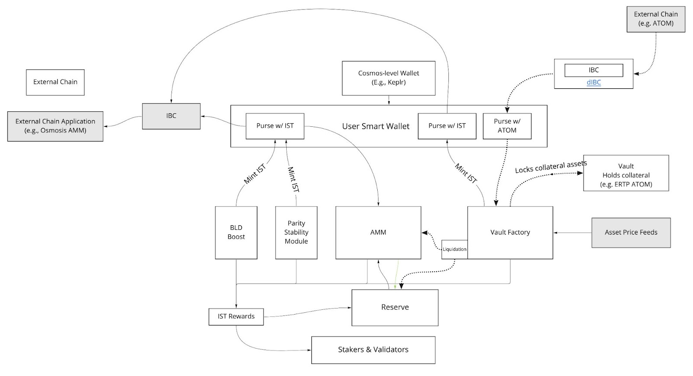

# Protokoller Arası Sisteme Genel Bakış

Inter Stable Token (IST), Agoric zincirindeki zincirler arası ekosistem için gelişen, tamamen teminatlandırılmış, kripto para birimi destekli, merkezi olmayan, istikrarlı bir belirteçtir. IST'yi basan Inter Protokolü, daha önce hiç var olmayan dinamik, istikrarlı bir token modeli yaratan granüler basım limitleriyle kontrol edilen çeşitli basım mekanizmalarını kapsayacak şekilde büyüyecek.

IST, geniş erişilebilirlik için ABD doları (USD) ile pariteyi korumak ve Agoric ile zincirler arası ekosistem kullanıcılarına minimum fiyat oynaklığı olan bir varlık sağlamak üzere tasarlanmıştır. Ayrıca IST, Agoric platformu için yerel ücret belirtecidir ve Agoric kripto ekonomisi için bazı temel işlevsellik ve istikrar sağlar.

Inter Protokolü, Agoric blok zincirinde dağıtılan ve IST'nin basımını, yazılmasını, kararlılık mekanizmalarını ve yönetişimini yöneten bir dizi sözleşmeden oluşur. Aşağıda beklenen temel sözleşmelerin ve bunların ilişkilerinin örnek bir diyagramına bakın. Bu model, BLD topluluğunun isteklerine dayalı olarak Inter Protocol ile gelişecektir.

Bu bölüm, Inter Protokolüne bir sistem perspektifinden yaklaşacak ve sonraki sayfalar, aşağıdakiler de dahil olmak üzere protokolün çeşitli yönleri hakkında ayrıntılara girecektir:

1. IST nasıl yönetilir?
2. IST istikrarını nasıl koruyor?
3. Koda bağlantılar ile her bir sözleşme nasıl çalışır?

Inter Protokolüne hoş geldiniz!