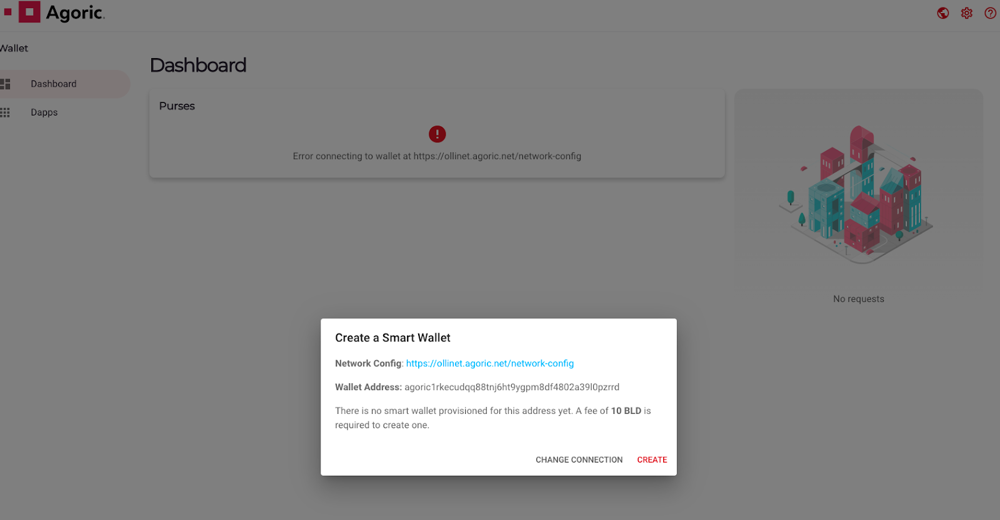
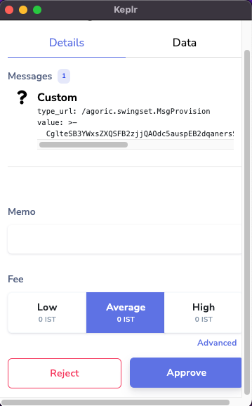

# Agoric Hesabınızı ve Akıllı Cüzdanınızı oluşturun

## Agoric Akıllı Cüzdanınızı/Hesabınızı Nasıl Hazırlarsınız?

> Not: Devam etmeden önce tarayıcınıza (Chrome, Brave vb.) Keplr cüzdan uzantısını eklemiş olmanız gerekir. Bununla ilgili talimatlar için bkz.

__Bir Agoric Akıllı Cüzdan kurmak için 10 BLD jetonuna ihtiyaç vardır. İlk giriş, bunların nasıl elde edileceğini detaylandırır ve zaten 10 BLD'ye sahipse atlanabilir.__

1. Keplr Cüzdanınızda en az 10 BLD jetonunuz olduğundan emin olun (Bu nominal miktar, kötü aktörleri Hizmet Reddi (DOS) saldırıları yapmaktan caydırır). Bu, bir sonraki adımda Agoric Akıllı Cüzdanınızı hazırlamak için gerekli olacaktır. Ayrıca, sabit jetonunuzu IST ile değiştirirken ücretler için kullanılabilecek 0,25 IST alacaksınız. BLD şu anda Huobi veya DEX Crescent veya Osmosis gibi CEX'lerde listelenmektedir - BLD'nin nasıl edinileceği hakkında daha fazla bilgi için bkz.

2. Agoric Smart Wallet'ı başlatın: . Sizden 'Akıllı Cüzdan Oluşturun' istenecektir:
​
3. 

4. Network Config'in ana ağa -> ve Cüzdan Adresinin Keplr'deki Agoric Zincir Hesap adresinizle eşleştiğinden emin olun.

5. 'Oluştur'a basın

6. Keplr cüzdanınızdaki (veya Defterinizdeki) işlemi onaylayın:
​
7. 

8. Akıllı cüzdanınız sağlandıktan sonra, tüm cüzdanları ve desteklenen sabit tokenleri (Axelar-bridged USDC (USDC__axl), Gravity-bridged USDC (USDC__grv), Axelar-bridged USDT (USDT_axl), Gravity) içeren çanta miktarlarını içeren cüzdan kontrol panelinizi göreceksiniz. -Köprülü USDT (USDT_grv)) ve Keplr cüzdanınızda tuttuğunuz BLD:

9. 
​

PSM'yi kullanarak IST basmayı denemeden önce USDC veya USDT gibi harici belirteçleri Agoric zincirine nasıl bağlayacağınızı öğrenmek için devam edin.

PSM kullanarak IST'nin nasıl basılacağına ilişkin talimatları okumak için ile devam edin.