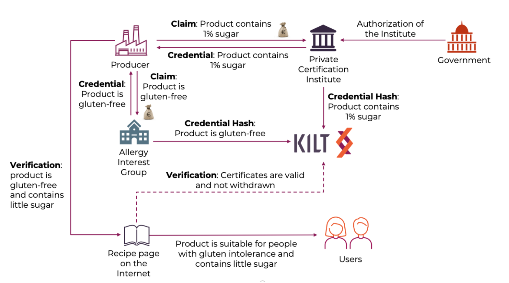
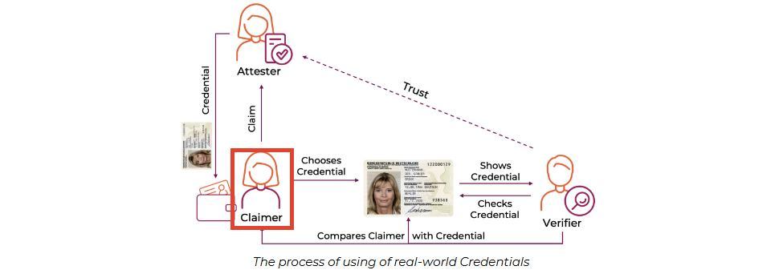
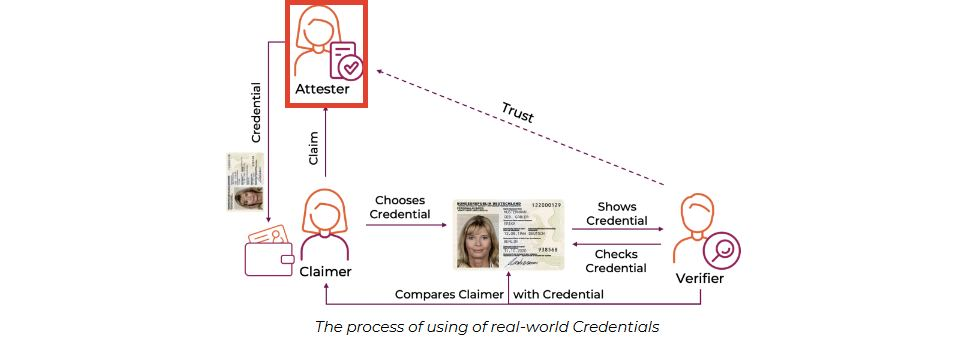
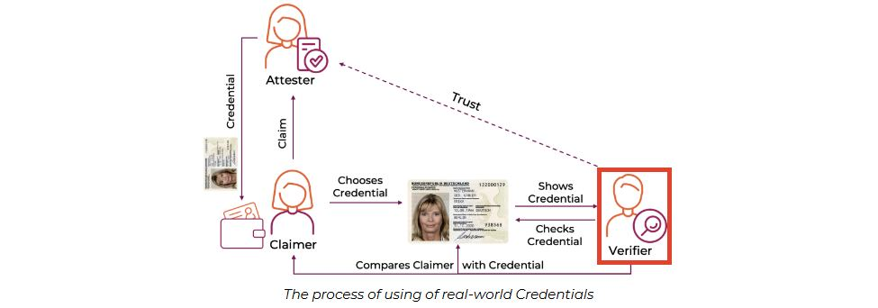

# Getting Started Guide 🚀

Welcome aboard! Are you ready to dive deep into the exciting world of the KILT Protocol? 🤓 In this tutorial, we'll comprehensively explore a claim's journey in KILT.

## 🎭 Main Actors: Who's Who? 🎭

We have three essential characters in our hero story:
1. **Claimer** 🦸‍♀️
2. **Attester** 🕵️‍♂️
3. **Verifier** 🧐

We'll see this trio in the workshop, creating separate folders for each. In real life, these three can be different individuals or organizations.

---

## 🌐 Distributed Trust 🌐

The primary goal of KILT is to establish "Distributed Trust." But what lies behind these words? Let's take a look.

### 🦸‍♀️ Claimer: Your Superhero 🦸‍♀️

- **Who are they?** The superheroes claiming themselves! 🌟
  
- **What do they do?** They craft their story by documenting their credentials or abilities! 📜

- **Why are they important?** Because they are the masters of their own identities! 🗝️
  
- **Do they need a DID?** No, they're independent superheroes! 🚫⛓️

### 🕵️‍♂️ Attester: The Guardian of Trust 🕵️‍♂️

- **Who are they?** The guy stamping your ID card! 👮‍♂️
  
- **What do they do?** They recognize you, validate your claim, and stamp your ID card! 🌐
  
- **Do they need a DID?** Yes, they are official agents and are registered on the KILT Blockchain! ✅⛓️
  
- **Why are they important?** They provide trust, so you can get things done! 🤝

### 🧐 Verifier: Sherlock Holmes 🧐

- **Who are they?** The detective trying to figure out who you are! 🔍
  
- **What do they do?** They ask you for your ID card and proof that it's genuine. 📜🔐
  
- **Do they need a DID?** No, but they trust their sources. 📚
  
- **Why are they important?** Because they confirm that everything is in order! ✅

---

:::info 🤔 Details 🤔
The Claimer might never interact with the KILT Blockchain. 😌 But both the Attester and Verifier must use the KILT Blockchain. Only the Attester has to pay for the transaction. The Verifier checks. 🕵️‍♂️
:::

That's it! Are you ready to get to know these superheroes up close? 🚀🌟

---
Tabii ki! İşte metni emojilerle daha ilgi çekici hale getirilmiş hali:

## Requesting Attestation 📜

Before the Claimer sends a credential for attestation, they must create a `Light DID` 🌟. Light DIDs allow us to perform transactions entirely off-chain.

On the other hand, the attester must create a DID registered on the chain 📲. This is because the Attester uses KILT Coins 💰 for the attestation process.

After both the `Attester` and `Claimer` individuals create their DIDs, the `Claimer` can initiate the attestation process by requesting attestation from the `Attester` 🔄.

Let's examine the above step by step from top to bottom:

:::note
In this structure, we can only see the `Claimer` and `Attester` mechanisms. Let's say you are the Claimer, and the Attester is the bank 🏦. In this case, the Credential you want to get attested is the bank statement, and the attestation is the verified bank statement.
:::

- First, the `Claimer` (us) prepares the Credential they want to get attested, along with some proofs 📁. For example, let's say we'll get a bank statement. We should bring the bank statement we want to be attested by the bank. Along with this document, we should bring our ID to prove we meet the requirements 🆔.
- Then, the document is sent to the `Attester` for `Attestation` 📩.
- Upon receiving the credential, the Attester decides whether the claim is valid by examining the proofs ✅. If it's true, they store the `Attestation` document's hash value on the chain, which is a non-functional copy of the document.
- Finally, the Attester sends this `hash` value to the `Claimer` (us). This way, we receive the document proving that our verified file is genuinely verified 📬.

:::caution
The hash value is stored on the chain by itself 🔗. Even if a malicious person steals this data, it doesn't mean anything and poses no threat 🚫. Like a key-lock pair 🔐, the hash value is only valuable with the original data. Neither the key nor the lock is sufficient on its own.
:::

### Verifying the Attestation Process 🔍

The `Verifier` requests a specific CType from the `Claimer` (details will be explained later). With this specific CType presentation, the other documents of the Claimer are meaningful. Therefore, it is of great importance 🌟. After the request, the `Claimer` can hide the documents in the `credential` they will present. Only the `Verifier` must see the documents. This is one of KILT's most significant features. The `Claimer` can only show the documents the `Verifier` must check. They can hide the rest. You can hide your salary if the Verifier is only interested in your employment status 🙈.

Now, let's examine the verification processes we saw above from top to bottom:

:::note
In this structure, we can only see the `claimer` and `Verifier` mechanisms. The `attester`, or bank, is excluded. No matter which verifier we go to, the attester won't know. Thus, we achieve privacy 🤫.
:::

- First, the `Embassy` (analogous to the `Verifier`) asks us, the traveler (analogous to the claimer), for a specific document or `CType` 📄. For example, it could be a bank statement. They say, "Provide proof of financial stability, and we'll grant you a visa." We then obtain the bank statement from our bank, get it attested by the bank (i.e., attester), and prepare the document 🌐.
- Our document is ready, but we don't have to show all the information in this document. The embassy wants to know if we have sufficient funds, but they don't need to know our transaction details. So, we redact or hide these details while presenting 🙈.
- We presented our document to the embassy 🏢.
- The embassy verified the document's authenticity by comparing its hash value with the one on their internal system or a decentralized ledger ✅.
- Since they trust the `Attester` (in this case, the bank that attested our bank statement), they approved our visa application, and voilà! We are ready to travel internationally ✈️.

:::caution
As you can see, the embassy didn't need to trust us directly in this system. They trusted the `Attester`, whom they had previously worked with or respected due to their position 🤝. And with that trust, they granted us the visa.

Even though this process emerged due to the trust in the `Attester`, the `Attester` was not involved in the second stage, so they were unaware of it. Privacy was achieved with trust 🛡️.
:::

### Attestation Verification 🔍

The `Verifier` asks the `Claimer` for a specific CType (details will be explained later). With presenting this specific CType, the other documents of the Claimer are meaningful. Therefore, it is of great importance 🌟. After the request, the `Claimer` can only show the documents in the `credential` they will present. They can hide the rest. This is one of KILT's most significant features. The `Claimer` can only show the documents the `Verifier` must check. They can hide the rest. You can hide your salary if the Verifier is only interested in your employment status 🙈.

Now, let's examine the verification processes we saw above from top to bottom:

:::note
In this structure, we can only see the `claimer` and `Verifier` mechanisms. The `attester`, or bank, is excluded. No matter which verifier we go to, the attester won't know. Thus, we achieve privacy 🤫.
:::

- First, the `Embassy` (analogous to the `Verifier`) asks us, the traveler (analogous to the claimer), for a specific document or `CType` 📄. For example, it could be a travel insurance document. They say, "Provide proof of travel insurance, and we'll grant you a visa." We then obtain the travel insurance document, get it attested by the insurance company (i.e., attester), and prepare the document 🌐.
- Our document is ready, but we can show only some of the information in this document. The embassy wants to know if we have travel insurance, but they don't need to know our policy details. So, we hid these details while presenting 🙈.
- We then presented our document to the embassy 🏢.
- The embassy verified the document's authenticity by comparing its hash value with the one on the chain ✅.
- Since they trust the `Attester` (in this case, the insurance company that attested our travel insurance), they approved our visa application, and voilà! We are ready to travel internationally ✈️.

:::caution
As you can see, the embassy could have trusted us directly in this system. They trusted the `Attester`, whom they had previously worked with or respected due to their position 🤝. And with that trust, they granted us the visa.

Even though this process emerged due to the trust in the `Attester`, the `Attester` was not involved in the second stage, so they were unaware of it. Privacy was achieved with trust 🛡️.
:::

This concludes our deep dive into the world of KILT Protocol. With the knowledge gained, you're now equipped to navigate the intricate processes of claims, attestations, and verifications. Happy exploring! 🚀🌟