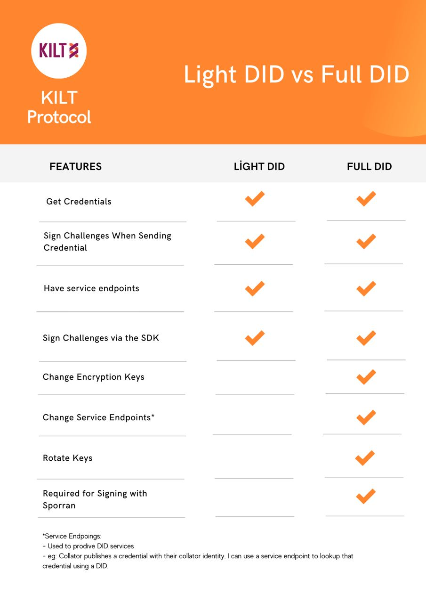

## Claimer Light DID 🌟

Now, let's begin creating a light DID for the `Claimer`. 🚀

:::caution Here comes an other Challenger: Light DID!
Light DID refers to DIDs that aren't stored on the chain. Since they aren't stored on the chain, there's no need to pay an additional transaction fee when creating them. 🎉

Light DIDs can:

- Sign verification requests and presentations with authentication keys. 🖋️
- Encrypt messages with an encryption key. 🔒 
:::



## Generating the Necessary Keys 🔑

As with the `Attester`, the `Claimer` also needs to generate DID keys. 🛠️

### Adding Packages 📦

```typescript title="claimer/generateKeypairs.ts"
import * as Kilt from '@kiltprotocol/sdk-js'
import {
  blake2AsU8a,
  keyExtractPath,
  keyFromPath,
  mnemonicGenerate,
  mnemonicToMiniSecret,
  sr25519PairFromSeed
} from '@polkadot/util-crypto'
import { generateAccount } from '../attester/generateAccount'
```

We start by importing our necessary packages. 🌈 We've previously detailed these imports when creating the `Attester DID`, but to recap:

- We're importing the KILT SDK and Polkadot's crypto helper functions. 📚
- Then, we import the `generateAccount` function. 🗂️

:::danger 🚨 generateAccount 

Since creating an account is the same for every individual, we can access the `generateAccount()` function from the `attester` folder, avoiding the need to rewrite the code. 🎉 
:::

### `generateKeyAgreement` Function

```typescript title="claimer/generateKeypairs.ts"
function generateKeyAgreement(mnemonic: string) {
  const secretKeyPair = sr25519PairFromSeed(mnemonicToMiniSecret(mnemonic))
  const { path } = keyExtractPath('//did//keyAgreement//0')
  const { secretKey } = keyFromPath(secretKeyPair, path, 'sr25519')
  return Kilt.Utils.Crypto.makeEncryptionKeypairFromSeed(blake2AsU8a(secretKey))
}
```

:::tip 🎓 Does it look familiar? 
This function is identical to the `generateKeyAgreement()` function we wrote when creating the `Attester DID`. If you understand that section, you can skip the following and proceed to the next function. 🏃‍♀️ 
:::

Like with the Attester, we first need to generate the key arguments to create the key pairs. For this, we'll use the `generateKeyAgreement()` function. This function takes a `mnemonic` key in `string` format as an argument and outputs the key ideas. Delving into its content:

- Using the `sr25519PairFromSeed` and `mnemonicToMiniSecret` functions, a secret key pair is generated.
- With the `keyExtractPath` and `keyFromPath` functions, the key's path and secret key are extracted.
- Finally, the encryption key pair is created using the `Kilt.Utils.Crypto.makeEncryptionKeypairFromSeed` function.

### `generateKeypairs` Function

```typescript title="claimer/generateKeypairs.ts"
export function generateKeypairs(mnemonic = mnemonicGenerate()) {
  const { account } = generateAccount(mnemonic)
  const authentication = {
    ...account.derive('//did//0'),
    type: 'sr25519'
  } as Kilt.KiltKeyringPair
  const keyAgreement = generateKeyAgreement(mnemonic)
  return {
    authentication: authentication,
    keyAgreement: keyAgreement
  }
}
```

After producing the key arguments, we can generate the key pairs using these arguments. For this, we'll use the `generateKeypairs()` function. Looking at the function's operation:

- This function takes a mnemonic (if none is provided, it generates a new mnemonic) and creates authentication and key agreement key pairs.
- Using the `generateAccount()` function, an account is created from the `mnemonic` passphrase.
- The authentication key is created using `account.derive`.
	- `account.derive('//did//0')`: Derives an authentication pair from the account.
	- `type: 'sr25519'`: Specifies the type of the key pair.
	- `as Kilt.KiltKeyringPair`: Specifies that the key pair type is Kilt's key pair type.
- The key agreement key is created using the `generateKeyAgreement` function.
- Finally, these generated keys are returned.

:::caution A Few Differences
Even though we performed similar operations for the Attester, you might have noticed a few differences. One of the main differences is that while we used four keys for the `attester` DID, we only generated 2 for the `claimer`. Since the `claimer` won't be stored on the chain and won't perform signing operations, these two keys are sufficient.
:::

:::info Complete Code
We've written the code necessary to generate key arguments. You can view the entire code as follows:
```typescript title="claimer/generateKeypairs.ts"
import * as Kilt from '@kiltprotocol/sdk-js'
import {
  blake2AsU8a,
  keyExtractPath,
  keyFromPath,
  mnemonicGenerate,
  mnemonicToMiniSecret,
  sr25519PairFromSeed
} from '@polkadot/util-crypto'
import { generateAccount } from './generateAccount'

function generateKeyAgreement(mnemonic: string) {
  const secretKeyPair = sr25519PairFromSeed(mnemonicToMiniSecret(mnemonic))
  const { path } = keyExtractPath('//did//keyAgreement//0')
  const { secretKey } = keyFromPath(secretKeyPair, path, 'sr25519')
  return Kilt.Utils.Crypto.makeEncryptionKeypairFromSeed(blake2AsU8a(secretKey))
}

export function generateKeypairs(mnemonic = mnemonicGenerate()) {
  const { account } = generateAccount(mnemonic)

  const authentication = {
    ...account.derive('//did//0'),
    type: 'sr25519'
  } as Kilt.KiltKeyringPair

  const keyAgreement = generateKeyAgreement(mnemonic)

  return {
    authentication: authentication,
    keyAgreement: keyAgreement
  }
}
```

:::

:::info
The Claimer should have `authentication key` and `encryption key` values. While these keys can be produced using the same mnemonic passphrase, different mnemonic passphrases can also be used.
:::
## Creating a Light DID

After generating the `keypair` values, we can produce the `light DID`. Since it's not stored on the chain, we can create a new DID object every time without the need to save it each time. However, we will still save the `mnemonic` passphrase in the `.env` file.


### Adding Packages

```typescript title="claimer/generateLightDid.ts"
import { config as envConfig } from 'dotenv'
import { mnemonicGenerate } from '@polkadot/util-crypto'
import * as Kilt from '@kiltprotocol/sdk-js'
import { generateKeypairs } from './generateKeypairs'
```

We import our packages into the `generateLightDid.ts` file. In addition to these packages, we can see the structure of `generateKeypairs`. This structure allows us to access the `generateKeypairs()` function we exported in the previous code file.

### `generateLightDid` Function

```typescript title="claimer/generateLightDid.ts"
export function generateLightDid(mnemonic: string): Kilt.DidDocument {
  const { authentication, keyAgreement } = generateKeypairs(mnemonic)
  return Kilt.Did.createLightDidDocument({
    authentication: [authentication as Kilt.NewLightDidVerificationKey],
    keyAgreement: [keyAgreement]
  })
}
```

Now, we can write the function that will produce the DID for the `Claimer` individual. This function will take the `mnemonic` key and return the `Claimer DID` value. If we look at what the code does line by line:

- First, the `authentication` and `keyAgreement` variables are created by running the `generateKeypairs()` function with the `mnemonic` passphrase.
- Then, the `Light DID` is created using the `Kilt.Did.createLightDidDocument()` method and returned.

### Main Code Block

```typescript title="claimer/generateLightDid.ts"
if (require.main === module) {
  ;(async () => {
    envConfig()
    try {
      await Kilt.init()
      const mnemonic = mnemonicGenerate()
      console.log('\nsave following to .env to continue\n')
      console.log(`CLAIMER_DID_MNEMONIC="${mnemonic}"`)
    } catch (e) {
      console.log('Error while setting up claimer DID')
      throw e
    }
  })()
}
```

This code block is the function that will run if the `generateLightDid.ts` file is executed directly. Entering this function, the first thing is to access the information in the `.env` file with the `envConfig` function. Continuing within the `try` `catch` structure, the following steps are taken:

- `Kilt.init()` starts the KILT SDK.
- A new mnemonic is generated and printed to the console. This mnemonic should be saved in the `.env` file.
- If an error occurs, the error message is printed to the console and the error is thrown.

---

After completing all the processes, we have produced the mnemonic key to be used for Light DID. As you may have noticed, the `Claimer` does not have any account address or account. The reason for this is that the `Claimer` does not have to hold any balance and there is no obligation to create an account on the chain.

:::tip It's Actually a Nice Feature
The fact that the `Claimer` individual does not have an obligation to create an account on the chain provides us with many conveniences in various areas. For example, since any individual can be a `Claimer`, a user who doesn't even know about blockchain can perform these operations from the interface without having to open an account or understand what they are facing.
:::

:::info General Operation
To better understand the operations we have done by looking at the entire `generateLightDid.ts` code we wrote:

```typescript title="claimer/generateLightDid.ts"
import { config as envConfig } from 'dotenv'
import { mnemonicGenerate } from '@polkadot/util-crypto'
import * as Kilt from '@kiltprotocol/sdk-js'
import { generateKeypairs } from './generateKeypairs'

export function generateLightDid(mnemonic: string): Kilt.DidDocument {
  const { authentication, keyAgreement } = generateKeypairs(mnemonic)
  return Kilt.Did.createLightDidDocument({
    authentication: [authentication as Kilt.NewLightDidVerificationKey],
    keyAgreement: [keyAgreement]
  })
}

if (require.main === module) {
  ;(async () => {
    envConfig()
    try {
      await Kilt.init()
      const mnemonic = mnemonicGenerate()
      console.log('\nsave following to .env to continue\n')
      console.log(`CLAIMER_DID_MNEMONIC="${mnemonic}"`)
    } catch (e) {
      console.log('Error while setting up claimer DID')
      throw e
    }
  })()
}
```

- We added our packages and the generateKeypairs.ts file to our file.
- We created the Light DID creation function by calling the key arguments.
- We set up a function structure that will run the `generateLightDid()` function if the code is run on its own and will print the `mnemonic` key of the Light DID to the screen.
:::

## Running the Code

After writing the 2 interconnected codes, to run them, make sure you are in the `kilt-rocks` folder and then you can run the code below.

```terminal
yarn ts-node ./claimer/generateLightDid.ts
```

:::danger Don't Forget!
After running the code, a `CLAIMER_DID_MNEMONIC` value will be given to us. We must definitely save this value in our `.env` file.


:::

:::tip
You're awesome! You've created a Light DID and Full DID 😎
:::